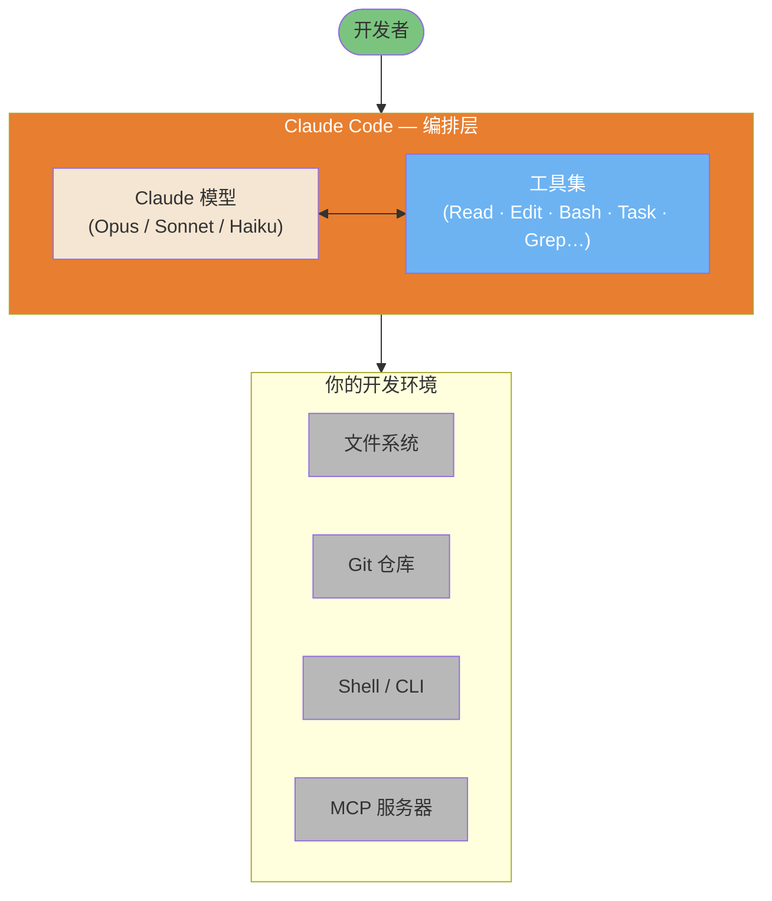

> 📚 **AI Spark Wiki** · Claude Code 知识库

---
title: "Claude Code 工作原理：架构与内部机制"
description: "深入剖析 Claude Code 内部机制与架构的技术文档"
tags: [architecture, guide, performance]
---

# Claude Code 工作原理：架构与内部机制

> 基于 Anthropic 官方文档和经社区验证的分析，对 Claude Code 内部机制进行技术层面的深度剖析。

**阅读时间**：完整版约 25 分钟 | 仅 TL;DR 约 5 分钟

**最后核实**：2026 年 2 月（Claude Code v2.1.34）

---

## 来源透明度说明

本文档综合了三类来源：

| 级别 | 描述 | 置信度 | 示例 |
|------|------|--------|------|
| **Tier 1** | Anthropic 官方文档 | 100% | anthropic.com/engineering/* |
| **Tier 2** | 经核实的逆向工程分析 | 70-90% | PromptLayer 分析、code.claude.com 行为观察 |
| **Tier 3** | 社区推断 | 40-70% | 有观察依据但未经官方确认 |

每项信息均标注置信度。**有官方文档时，优先参考官方文档。**

---

## TL;DR — 5 条要点

1. **简单循环**：Claude Code 运行的是 `while(tool_call)` 循环——没有 DAG、没有分类器、没有 RAG。所有决策均由模型自主做出。

2. **八个核心工具**：Bash 工具（万能适配器）、读取工具、编辑工具、写入工具、搜索工具、文件匹配工具、任务工具（子智能体）、TodoWrite。这就是全部工具集。

   **搜索策略演变**：早期 Claude Code 版本曾尝试使用 Voyage 嵌入实现语义代码搜索的 RAG。Anthropic 内部基准测试显示，基于 ripgrep 的 agentic 搜索表现更优、运维复杂度更低——无需索引同步，也不存在外部嵌入提供商的安全风险——因此切换至此方案。这一"搜索而非索引"的哲学以简单性和安全性换取了延迟和 Token 成本。社区插件（用于 AST 模式的 ast-grep）和 MCP 服务器（用于符号的 Serena、用于 RAG（检索增强生成）的 grepai）可满足专业化需求。

   *来源*：[Latent Space 播客](https://www.latent.space/p/claude-code)（2025 年 5 月）、ast-grep 文档

3. **200K Token（词元）预算**：上下文窗口由系统提示、历史记录、工具结果和响应缓冲区共享。容量达到 ~75-92% 时自动压缩。

4. **子智能体 = 隔离**：任务工具派生的子智能体拥有独立的上下文窗口。子智能体不能再派生子子智能体（深度=1）。仅摘要文本返回主上下文。

5. **设计哲学**："少框架，重模型"——信任 Claude 的推理能力，而非围绕它构建复杂的编排系统。

---

## 总体架构图

Claude Code 并非新的 AI 模型，而是一个编排层，它将 Claude（Opus/Sonnet/Haiku）包装为可读取文件、执行 shell 命令、导航代码库、派生子智能体的系统——一切在一个持续循环中运行，直到任务完成。



*参考 [Mohamed Ali Ben Salem 的架构图](https://www.linkedin.com/posts/mohamed-ali-ben-salem-2b777b9a_en-ce-moment-je-vois-passer-des-posts-du-activity-7420592149110362112-eY5a)——更深入的分解见[架构内部图表](../diagrams/04-architecture-internals.md)。*

---

## 目录

- [总体架构图](#总体架构图)

1. [主循环](#1-主循环)
2. [工具集](#2-工具集)
3. [上下文管理内部机制](#3-上下文管理内部机制)
4. [子智能体架构](#4-子智能体架构)
5. [权限与安全模型](#5-权限与安全模型)
6. [MCP 集成](#6-mcp-集成)
7. [高级工具调用模式（API）](#7-高级工具调用模式api)
8. [编辑工具：实际工作原理](#8-编辑工具实际工作原理)
9. [会话持久化](#9-会话持久化)
10. [设计哲学：少框架，重模型](#10-设计哲学少框架重模型)
11. [Claude Code 与竞品对比](#11-claude-code-与竞品对比)
12. [来源与参考](#12-来源与参考)
13. [附录：尚不明确的内容](#13-附录尚不明确的内容)


---

## 1. 主循环

**置信度**：100%（Tier 1 - 官方）
**来源**：[Anthropic 工程博客](https://www.anthropic.com/engineering/claude-code-best-practices)

Claude Code 的核心机制出奇简单：

```
┌─────────────────────────────────────────────────────────────┐
│                    CLAUDE CODE MASTER LOOP                  │
├─────────────────────────────────────────────────────────────┤
│                                                             │
│   ┌──────────────┐                                          │
│   │  你的提示词  │                                          │
│   └──────┬───────┘                                          │
│          │                                                  │
│          ▼                                                  │
│   ┌──────────────────────────────────────────────────────┐  │
│   │                                                      │  │
│   │                  CLAUDE 推理                         │  │
│   │        （无分类器，无路由层）                        │  │
│   │                                                      │  │
│   └────────────────────────┬─────────────────────────────┘  │
│                            │                                │
│                            ▼                                │
│                   ┌────────────────┐                        │
│                   │  工具调用？    │                        │
│                   └───────┬────────┘                        │
│                           │                                 │
│              是           │           否                    │
│         ┌─────────────────┴─────────────────┐               │
│         │                                   │               │
│         ▼                                   ▼               │
│  ┌────────────┐                      ┌────────────┐         │
│  │  执行工具  │                      │  文本响应  │         │
│  │            │                      │  （完成）  │         │
│  └─────┬──────┘                      └────────────┘         │
│        │                                                    │
│        ▼                                                    │
│  ┌─────────────┐                                            │
│  │ 将结果返回  │                                            │
│  │  给 Claude  │──────────────────┐                         │
│  └─────────────┘                  │                         │
│                                   │                         │
│                                   ▼                         │
│                          ┌────────────────┐                 │
│                          │    循环继续    │                 │
│                          │  （下一轮次）  │                 │
│                          └────────────────┘                 │
│                                                             │
└─────────────────────────────────────────────────────────────┘
```

### 这意味着什么

整个架构就是一个简单的 `while` 循环：

```
while (claude_response.has_tool_call):
    result = execute_tool(tool_call)
    claude_response = send_to_claude(result)
return claude_response.text
```

**不存在：**
- 意图分类器
- 任务路由器
- RAG（检索增强生成）/嵌入流水线
- DAG 编排器
- 规划/执行拆分

模型自行决定何时调用工具、调用哪个工具、以及何时完成。这就是 Anthropic 工程博客中描述的"智能体循环"模式。

### 为何采用此设计？

1. **简单性**：组件越少，故障点越少
2. **模型驱动**：Claude 的推理能力优于人工编写的启发式规则
3. **灵活性**：无刚性流水线限制 Claude 的能力
4. **可调试性**：出问题时，有清晰的排查路径

### 智能体循环 API 词汇表

上述主循环图从概念层面展示了流程，而 Anthropic API 通过具体的 `stop_reason` 值将其暴露出来。每个 API 响应都包含 `stop_reason` 字段——这是 Claude 发出的"下一步应做什么"信号。理解这三个值对于在 Anthropic SDK 上构建自定义智能体至关重要。

| `stop_reason` | 含义 | 循环动作 |
|---------------|------|----------|
| `tool_use` | Claude 希望调用一个或多个工具 | 执行工具，将结果回传，继续循环 |
| `end_turn` | Claude 判断任务已完成 | 退出循环，返回文本响应 |
| `max_tokens` | 在完成前已达上下文限制 | 重新考虑上下文策略，可能需要摘要处理 |

结合这些名称，伪代码变得更加精确：

```python
messages = [{"role": "user", "content": user_prompt}]

while True:
    response = client.messages.create(model=model, messages=messages, tools=tools)

    if response.stop_reason == "end_turn":
        return response.content[0].text  # 完成

    if response.stop_reason == "tool_use":
        # 处理响应中的每个 tool_use 块
        tool_results = []
        for block in response.content:
            if block.type == "tool_use":
                result = execute_tool(block.name, block.input)
                tool_results.append({
                    "type": "tool_result",
                    "tool_use_id": block.id,
                    "content": result
                })
        messages.append({"role": "assistant", "content": response.content})
        messages.append({"role": "user", "content": tool_results})
        # 循环继续
```

`response.content` 中的 `tool_use` 块包含三个需要操作的字段：`id`（用于匹配结果）、`name`（要调用的函数）和 `input`（参数字典）。回传的结果必须引用 `tool_use_id`，以便模型将调用和响应关联起来。

**`fork_session`（分叉会话）** 是在此循环之上构建的高层概念：它从当前对话创建一个独立分支，两个分支共享分叉点之前的消息历史。两个分支可以同时探索不同的方法或配置，类似于 `git branch` 但作用于智能体会话。每个分叉独立运行自己的智能体循环——适合在不同工具配置或提示变体下比较响应，而无需从头重新运行完整对话。

#### 用 max_turns 控制循环深度

`max_turns` 限制编排器退出前的助手/工具迭代次数。没有明确限制时，失控的循环可能耗尽预算或上下文窗口，且事后难以诊断。

各任务类型的实际范围：

| 任务类型 | 推荐 `max_turns` |
|---------|----------------|
| 简单检索（单次查找） | 5 |
| 研究或多步骤编码 | 20-30 |
| 扩展自主工作流 | 50 |

达到 `max_turns` 时，循环以最后写入的状态退出，任务可能未完成。务必检查最终 `stop_reason` 并实现回退路径：

```python
result = agent.run(task, max_turns=20)
if result.stop_reason == "max_turns":
    # 升级处理或汇总部分进度
    handle_incomplete(result)
```

按任务类型而非全局设置 `max_turns`，可防止单个慢任务在多智能体流水线中"饿死"其他任务。一个合理需要 50 轮次的夜间批处理作业，不应继承只需 5 轮次即可完成的快速查询的相同上限。

### 原生能力审查

使用以下清单验证你是否了解 Claude Code 的全部功能。每项能力在本指南的其他部分均有详细文档。

**11 项原生能力**：

- [ ] **事件钩子（Hooks）** — 由工具执行触发的 Bash/PowerShell 脚本
  - 工具前钩子（PreToolUse）、工具后钩子（PostToolUse）、用户提交钩子（UserPromptSubmit）、通知
  - 参见：[第 5 节 Hooks](#5-权限与安全模型)

- [ ] **技能作用域 Hooks** — 特定于技能执行上下文的事件钩子
  - 按技能管理生命周期
  - 参见：[终极指南第 5.11 节](#51-understanding-skills)

- [ ] **后台智能体** — 异步任务执行（测试套件、长时操作）
  - 非阻塞智能体派生
  - 参见：[第 4.2 节 子智能体架构](#4-子智能体架构)

- [ ] **探索子智能体** — `/explore` 用于代码库分析
  - 只读代码库探索
  - 参见：[第 4.2 节 子智能体](#4-子智能体架构)

- [ ] **计划子智能体** — `/plan` 用于只读计划模式（计划模式）
  - 安全的架构探索
  - 参见：[终极指南第 2.3 节](#23-plan-mode)

- [ ] **任务工具** — 向专业化智能体进行层级任务委托
  - 并行任务执行，深度=1 的子智能体
  - 参见：[第 4.2 节 子智能体架构](#4-子智能体架构)

- [ ] **智能体团队** — 多智能体并行协调（实验性，v2.1.32+）
  - 基于 Git 的协调，自主任务认领
  - 参见：[终极指南第 9.20 节](#920-agent-teams-multi-agent-coordination)

- [ ] **按任务选择模型** — 动态模型切换，在会话中途按需切换
  - 在任务边界执行 `/model opus|sonnet|haiku`
  - 参见：[第 10 节 成本优化](#10-claude-code-与竞品对比)

- [ ] **MCP（模型上下文协议）集成** — 用于工具扩展的 MCP 协议
  - Context7、Sequential、Serena、Playwright 等
  - 参见：[第 6 节 MCP 集成](#6-mcp-集成)

- [ ] **权限模式** — 对工具执行的细粒度控制
  - 默认、自动接受、计划模式、自定义规则
  - 参见：[第 5 节 权限与安全模型](#5-权限与安全模型)

- [ ] **会话记忆** — 跨会话的持久上下文
  - CLAUDE.md、记忆文件、项目状态
  - 参见：[第 8 节 会话持久化](#8-会话持久化)

**入门提示**：如果你还没有探索全部 11 项能力，你很可能错过了提升生产力的机会。重点关注上面未勾选的项目。

**来源**：综合自 [Gur Sannikov 分析](https://www.linkedin.com/posts/gursannikov_claudecode-embeddedengineering-aiagents-activity-7423851983331328001-DrFb)

---

## 2. 工具集

**置信度**：100%（Tier 1 - 官方）
**来源**：[code.claude.com/docs](https://code.claude.com/docs/en/setup)

Claude Code 共有 8 个核心工具：

| 工具 | 用途 | 关键行为 | Token 成本 |
|------|------|----------|------------|
| `Bash` | 执行 shell 命令 | 万能适配器，功能最强 | 低（命令）+ 可变（输出） |
| `Read` | 读取文件内容 | 最多 2000 行，自动处理截断 | 大文件成本高 |
| `Edit` | 修改现有文件 | 基于 diff，要求精确匹配 | 中等 |
| `Write` | 创建/覆盖文件 | 若文件已存在必须先读取 | 中等 |
| `Grep` | 搜索文件内容 | 基于 ripgrep（正则），替代了 RAG（检索增强生成）/嵌入方案。如需结构化代码搜索（基于 AST），参见 ast-grep 插件。权衡：Grep（快速、简单）vs ast-grep（精确、需配置）vs Serena MCP（语义、符号感知） | 低 |
| `Glob` | 按模式查找文件 | 路径匹配，按修改时间排序 | 低 |
| `Task` | 派生子智能体 | 独立上下文，深度=1 限制 | 高（新上下文） |
| `TodoWrite` | 跟踪进度 | 结构化任务管理 | 低 |

### Bash 万能适配器

**核心洞见**：Bash 工具是 Claude 的瑞士军刀，它可以：

- 运行任意 CLI 工具（git、npm、docker、curl…）
- 执行脚本
- 通过管道链接命令
- 访问系统状态

模型经过海量 shell 数据训练，在专用工具不够用时，能非常高效地将 Bash 工具用作万能适配器。

### 工具选择逻辑

Claude 根据任务决定使用哪个工具，没有硬编码的路由规则：

```
┌─────────────────────────────────────────────────────┐
│              工具选择（模型驱动）                   │
├─────────────────────────────────────────────────────┤
│                                                     │
│  "读取 auth.ts"           → 读取工具                │
│  "找出所有测试文件"        → 文件匹配工具            │
│  "搜索 TODO"              → 搜索工具                 │
│  "运行 npm test"          → Bash 工具               │
│  "探索代码库"             → 任务工具（子智能体）     │
│  "跟踪我的进度"           → TodoWrite 工具          │
│                                                     │
│  模型在训练时学习这些模式，                         │
│  而非通过显式规则。                                 │
│                                                     │
└─────────────────────────────────────────────────────┘
```

### 扩展工具生态系统

除 8 个核心工具外，Claude Code 还可以利用：

**MCP 服务器**（MCP（模型上下文协议））：
- **Serena**：符号感知代码导航 + 会话记忆
- **grepai**：语义搜索 + 调用图分析（基于 Ollama）
- **Context7**：官方库文档查询
- **Sequential**：结构化多步推理
- **Playwright**：浏览器自动化和端到端测试
- **claude-code-ultimate-guide**：12 个工具——指南搜索、发布跟踪、`compare_versions`、安全威胁查询（`get_threat`、`list_threats`，含 28 个 CVE + 655 个恶意技能）、模板搜索（`search_examples`）——`npx -y claude-code-ultimate-guide-mcp`

**社区插件**：
- **ast-grep**：基于 AST 的结构化代码搜索（需显式调用）

### 搜索工具选择矩阵

Claude Code 提供多种代码搜索方式，各有其优势：

| 搜索需求 | 原生工具 | MCP/插件替代方案 | 何时升级 |
|---------|---------|----------------|---------|
| 精确文本 | `Grep`（ripgrep） | - | 永不（最快） |
| 函数名 | `Grep` | Serena `find_symbol` | 多文件重构 |
| 按含义搜索 | - | grepai `search` | 不知道确切文本 |
| 调用图 | - | grepai `trace_callers` | 依赖分析 |
| 结构化模式 | - | ast-grep | 大规模迁移（>5 万行） |
| 文件结构 | - | Serena `get_symbols_overview` | 需要符号上下文 |

**性能对比**：

| 工具 | 速度 | 配置 | 适用场景 |
|------|------|------|---------|
| Grep（ripgrep） | ⚡ ~20ms | ✅ 无需 | 90% 的搜索场景 |
| Serena | ⚡ ~100ms | ⚠️ MCP | 重构、符号 |
| grepai | 🐢 ~500ms | ⚠️ Ollama + MCP | 语义搜索、调用图 |
| ast-grep | 🕐 ~200ms | ⚠️ 插件 | AST 模式、迁移 |

**决策原则**：从 Grep（最快）开始，仅在必要时升级到专用工具。

> **📖 深度阅读**：完整的多工具组合工作流，参见[搜索工具精通](../workflows/search-tools-mastery.md)。

---

## 3. 上下文管理内部机制

**置信度**：80%（Tier 2 - 部分官方）
**来源**：
- [platform.claude.com/docs](https://platform.claude.com/docs/en/build-with-claude/context-windows)（Tier 1）
- 观察到的行为（Tier 2）

Claude Code 在固定的上下文窗口内运行（约 200K Token（词元），因模型而异）。

### 上下文预算分解

```
┌─────────────────────────────────────────────────────────────┐
│               上下文预算（约 200K Token（词元））            │
├─────────────────────────────────────────────────────────────┤
│                                                             │
│  ┌──────────────────────────────────────────────────────┐   │
│  │ 系统提示                              (~5-15K)        │   │
│  │ • 工具定义                                           │   │
│  │ • 安全指令                                           │   │
│  │ • 行为准则                                           │   │
│  │ • 详细分解见下方 ↓                                   │   │
│  ├──────────────────────────────────────────────────────┤   │
│  │ CLAUDE.md 文件                       (~1-10K)        │   │
│  │ • 全局 ~/.claude/CLAUDE.md                           │   │
│  │ • 项目 /CLAUDE.md                                    │   │
│  │ • 本地 /.claude/CLAUDE.md                            │   │
│  ├──────────────────────────────────────────────────────┤   │
│  │ 对话历史                              （可变）        │   │
│  │ • 你的提示词                                         │   │
│  │ • Claude 的响应                                      │   │
│  │ • 工具调用记录                                       │   │
│  ├──────────────────────────────────────────────────────┤   │
│  │ 工具结果                              （可变）        │   │
│  │ • 读取工具读取的文件内容                              │   │
│  │ • Bash 工具的命令输出                                 │   │
│  │ • 搜索工具的搜索结果                                  │   │
│  ├──────────────────────────────────────────────────────┤   │
│  │ 响应保留空间                         (~40-45K)        │   │
│  │ • Claude 的深度思考                                  │   │
│  │ • 生成的代码/文本                                    │   │
│  └──────────────────────────────────────────────────────┘   │
│                                                             │
│  可用 = 总量 - 系统 - 保留 ≈ 140-150K Token（词元）         │
│                                                             │
└─────────────────────────────────────────────────────────────┘
```

### 系统提示内容

**置信度**：100%（Tier 1 - 官方 Anthropic 文档）
**来源**：
- [Anthropic 系统提示发布说明](https://platform.claude.com/docs/en/release-notes/system-prompts)
- [Anthropic 工程：Claude Code 最佳实践](https://www.anthropic.com/engineering/claude-code-best-practices)

Claude 系统提示（约 5-15K Token（词元））由 Anthropic **公开发布**，作为其透明度承诺的一部分。这些提示定义了：

**核心组件**：
- **工具定义**：Bash 工具、读取工具、编辑工具、写入工具、搜索工具、文件匹配工具、任务工具、TodoWrite
- **安全指令**：内容政策、拒绝模式（参见[安全加固](../security/security-hardening.md)）
- **行为准则**：任务优先方法、MVP 优先、避免过度工程化
- **上下文指令**：如何收集和使用项目上下文

**重要区别**：
- **Claude.ai/移动端**：公开发布的提示词可公开查阅
- **Anthropic API**：不同的默认指令，可由开发者配置
- **Claude Code CLI**：具有上下文收集行为的 agentic 编码助手

**社区分析**（供深入理解）：
- **Simon Willison 的 Claude 4 分析**（2025 年 5 月）：[深度解析思考块、搜索规则、安全护栏](https://simonwillison.net/2025/May/25/claude-4-system-prompt/)
- **PromptHub 技术分解**（2025 年 6 月）：[提示词工程模式详细分析](https://www.prompthub.us/blog/an-analysis-of-the-claude-4-system-prompt)

→ **交叉参考**：安全影响见[第 5 节：权限与安全模型](#5-权限与安全模型)

**注**：Claude Code 系统提示可能与 Claude.ai/移动端版本不同。上述来源涵盖 Claude 系列；Code 专用提示已集成到 CLI 工具行为中。

---

### 自动压缩

**置信度**：75%（Tier 2 - 社区验证，有研究支持）

上下文使用率超过阈值时，Claude Code 会自动摘要旧的对话轮次：

| 来源 | 报告的阈值 | 备注 |
|------|-----------|------|
| VS Code 扩展 | ~75% 使用率（剩余 25%） | [GitHub #11819](https://github.com/anthropics/claude-code/issues/11819)（2025 年 11 月） |
| CLI 版本 | 剩余 1-5% | 比 VS Code 更保守 |
| PromptLayer 分析 | 92% | 历史观测 |
| Steve Kinney | 95% | [会话管理指南](https://stevekinney.com/courses/ai-development/claude-code-session-management)（2025 年 7 月） |
| 用户触发的 `/compact` | 随时 | 手动控制 |

**压缩期间发生了什么：**

1. 旧的对话轮次被摘要
2. 工具结果被压缩
3. 近期上下文完整保留
4. 模型收到"上下文已压缩"信号

**性能影响**（有研究支持）：

近期研究和从业者观察证实了**自动压缩会导致质量下降**：

- **上下文从 1K 增长到 32K Token（词元）时，LLM 在复杂任务上的性能下降 50-70%**（[上下文退化研究](https://research.trychroma.com/context-rot)，2025 年 7 月）
- **12 个模型中有 11 个在 32K Token（词元）时跌破其短上下文性能的 50%**（NoLiMa 基准测试）
- **自动压缩通过反复压缩循环会丢失细节并破坏引用**（[Claude 节省 Token 却遗忘一切](https://golev.com/post/claude-saves-tokens-forgets-everything/)，2026 年 1 月）
- **注意力机制在高上下文场景下难以承受检索负担**

**社区共识**：在逻辑断点处手动 `/compact` > 等待自动压缩触发。

**推荐策略**（[Lorenz，2026](https://www.linkedin.com/posts/robin-lorenz-54055412a_claudecode-contextengineering-aiengineering-activity-7425136701515251713)）：

| 上下文百分比 | 操作 | 理由 |
|------------|------|------|
| **70%** | 警告 - 计划清理 | 提前感知 |
| **85%** | 建议手动交接 | 防止自动压缩质量下降 |
| **95%** | 强制交接 | 严重质量下降 |

**用户控制**：使用 `/compact` 在逻辑断点处手动触发摘要，或使用**会话交接**（参见[会话交接](#会话交接)）在压缩历史上保留意图。

### 上下文保留策略

| 策略 | 使用时机 | 方法 |
|------|---------|------|
| 子智能体 | 探索性任务 | 使用任务工具进行隔离搜索 |
| 手动压缩 | 主动清理 | `/compact` 命令 |
| 清除会话 | 需要全新开始 | `/clear` 命令 |
| 精确读取 | 知道需要什么 | 读取特定文件，不读整个目录 |
| CLAUDE.md | 持久上下文 | 将规范存入记忆文件 |

### 会话质量下限

**置信度**：70%（Tier 2 - 从业者研究、arXiv 研究）

Claude Code 在某些条件下性能会可预测地下降：

| 条件 | 观察到的阈值 | 症状 |
|------|------------|------|
| 对话轮次 | **15-25 轮** | 丢失对早期约束的追踪 |
| Token 累积 | **80-100K Token（词元）** | 忽略会话早期声明的需求 |
| 问题范围 | **同时超过 5 个文件** | 变更不一致、文件遗漏 |

**按范围划分的成功率**（来自从业者研究）：

| 范围 | 成功率 | 示例 |
|------|--------|------|
| 1-3 个文件 | ~85% | 修复单模块 bug |
| 4-7 个文件 | ~60% | 跨组件重构特性 |
| 8+ 个文件 | ~40% | 代码库范围的全局改动 |

**缓解策略**：

1. **检查点提示**："继续之前，请总结当前需求和约束条件。"
2. **会话重置**：新任务时全新开始（`/clear`）
3. **收紧范围**：将大任务分解为专注的子任务
4. **使用子智能体**：将探索委托给任务工具以保留主上下文

### 失败触发的上下文漂移

与上下文大小无关的另一种退化模式：重复的工具失败。工具调用失败且 Claude 重试时，错误输出在上下文窗口中积累。堆栈跟踪、重试噪声和错误消息稀释了原始意图——后续尝试会跟随错误叙述而非任务目标。上下文窗口并未满，但信噪比已经下降。

这与压缩漂移不同。压缩解决的是上下文*大小*问题；失败重注解决的是有限窗口内的上下文*质量*问题。

**模式**：每次命令失败时都重新注入核心任务指令，而不仅仅是 `/compact` 之后。`PostToolUse` 工具后钩子可以在重试提示中添加原始任务和约束的精简版本：

```bash
# PostToolUse 工具后钩子：失败后重新注入意图
if [[ "$CLAUDE_TOOL_EXIT_CODE" != "0" ]]; then
  echo "提醒：当前任务是：$ORIGINAL_TASK_SUMMARY。如果上述错误不影响进程，请忽略并继续完成目标。"
fi
```

来源：[Nick Tune — 工作流 DSL：领域驱动的 Claude Code 工作流](https://nick-tune.me/blog/2026-03-01-workflow-dsl-domain-driven-claude-code-workflows/)（2026-03-01）

---

## 4. 子智能体架构

**置信度**：100%（Tier 1 - 已记录行为）
**来源**：[code.claude.com/docs](https://code.claude.com/docs/en/setup) + 系统提示（工具定义中可见）

任务工具派生子智能体，用于并行或隔离工作。

### 隔离模型

```
┌─────────────────────────────────────────────────────────────┐
│                          主智能体                           │
│                                                             │
│  ┌───────────────────────────────────────────────────────┐  │
│  │ 上下文：完整对话 + 所有文件读取                        │  │
│  │                                                       │  │
│  │         Task("探索身份认证模式")                      │  │
│  │                        │                              │  │
│  │                        ▼                              │  │
│  │  ┌─────────────────────────────────────────────────┐  │  │
│  │  │             子智能体（已派生）                  │  │  │
│  │  │                                                 │  │  │
│  │  │  • 独立的全新上下文窗口                         │  │  │
│  │  │  • 接收：仅任务描述                             │  │  │
│  │  │  • 可使用：相同工具（除任务工具外）              │  │  │
│  │  │  • 不能派生子子智能体（深度 = 1）               │  │  │
│  │  │  • 返回：仅摘要文本                             │  │  │
│  │  │                                                 │  │  │
│  │  └─────────────────────────────────────────────────┘  │  │
│  │                        │                              │  │
│  │                        ▼                              │  │
│  │         结果："发现 3 种认证模式：JWT 在..."          │  │
│  │         （只有这段文本进入主上下文）                  │  │
│  │                                                       │  │
│  └───────────────────────────────────────────────────────┘  │
│                                                             │
└─────────────────────────────────────────────────────────────┘
```

### 为何深度 = 1？

将子智能体限制在一个层级可以防止：

1. **递归爆炸**：智能体套娃会消耗无限资源
2. **上下文污染**：每层都会积累上下文
3. **调试噩梦**：追踪多层智能体链非常困难
4. **不可预测的成本**：嵌套智能体 = 不可预测的 Token（词元）消耗

### 子智能体类型

Claude Code 通过 `subagent_type` 参数提供专用子智能体类型：

| 类型 | 用途 | 可用工具 |
|------|------|---------|
| `Explore` | 代码库探索 | 所有只读工具 |
| `Plan` | 架构规划 | 除编辑工具/写入工具外的所有工具 |
| `Bash` | 命令执行 | 仅 Bash 工具 |
| `general-purpose` | 复杂多步骤 | 所有工具 |

### 何时使用子智能体

| 使用场景 | 子智能体的优势 |
|---------|--------------|
| 搜索大型代码库 | 保持主上下文干净 |
| 并行探索 | 同时进行多个搜索 |
| 风险性探索 | 错误不污染主上下文 |
| 专项分析 | 针对不同任务有不同的"思维模式" |

### 轮辐式编排

生产中最主流的多智能体模式是**轮辐式**：一个协调者智能体居中，管理 N 个工作智能体，是唯一持有全局视图的实体。

```
                    ┌─────────────────────┐
                    │      协调者         │
                    │  （中心 / 编排者）  │
                    │                     │
                    │  • 分解目标         │
                    │  • 传递上下文       │
                    │  • 汇总结果         │
                    │  • 解决冲突         │
                    └──┬──────┬──────┬───┘
                       │      │      │
            ┌──────────┘      │      └──────────┐
            │                 │                 │
     ┌──────▼──────┐  ┌───────▼─────┐  ┌───────▼─────┐
     │   工作者 A  │  │   工作者 B  │  │   工作者 C  │
     │             │  │             │  │             │
     │  特定任务   │  │  特定任务   │  │  特定任务   │
     └─────────────┘  └─────────────┘  └─────────────┘
           │                 │                 │
           └────────────────►│◄────────────────┘
                     （结果仅流向协调者）
```

**关键规则：上下文从不自动继承。** 协调者派生工作者 A 分析文件 X 时，工作者 B 对该分析一无所知，除非协调者在任务描述中明确传递。工作者之间的隔离是设计使然——它们只接收任务字符串，不接收任何其他内容。

这是多智能体设计中最常见的错误：假设子智能体共享上下文。它们不共享。

**显式上下文传递模式：**

```python
# 错误——工作者 B 不知道工作者 A 的发现
task_a = Task("分析 auth.py 并找到会话 token 逻辑")
task_b = Task("找出会话 token 逻辑的所有调用者")  # 不知道在哪里

# 正确——协调者显式传递发现
result_a = run_task("分析 auth.py 并返回处理会话 token 的确切函数名")
task_b = Task(f"在代码库中找出 {result_a} 的所有调用者")  # 显式上下文
```

**协调者的职责：**

1. **分解**：将目标拆分为边界清晰的独立子任务
2. **显式传递上下文**：每个工作者的任务描述必须自包含
3. **汇总**：收集所有工作者的文本结果，合并为连贯输出
4. **决策跨领域问题**：只有协调者能做出跨工作者的决策

工作者之间永远不应需要相互通信。如果需要，说明分解方案有误，该任务应属于协调者。

---

## 5. 权限与安全模型

**置信度**：100%（Tier 1 - 官方）
**来源**：
- [code.claude.com/docs/en/hooks](https://code.claude.com/docs/en/hooks)
- [code.claude.com/docs/en/sandboxing](https://code.claude.com/docs/en/sandboxing)

Claude Code 采用分层安全模型：

```
┌─────────────────────────────────────────────────────────────┐
│                        权限层级                             │
├─────────────────────────────────────────────────────────────┤
│                                                             │
│  第 1 层：交互式提示                                        │
│  ┌────────────────────────────────────────────────────────┐ │
│  │ Claude 想要运行：rm -rf node_modules                   │ │
│  │ [本次允许] [始终允许] [拒绝] [编辑命令]               │ │
│  └────────────────────────────────────────────────────────┘ │
│                          │                                  │
│                          ▼                                  │
│  第 2 层：允许/拒绝规则（settings.json）                    │
│  ┌────────────────────────────────────────────────────────┐ │
│  │ {                                                      │ │
│  │   "permissions": {                                     │ │
│  │     "allow": ["Bash(npm *)", "Read"],              │ │
│  │     "deny": ["Bash(rm -rf *)"]                         │ │
│  │   }                                                    │ │
│  │ }                                                      │ │
│  └────────────────────────────────────────────────────────┘ │
│                          │                                  │
│                          ▼                                  │
│  第 3 层：Hooks（执行前/后）                                │
│  ┌────────────────────────────────────────────────────────┐ │
│  │ 工具前钩子（PreToolUse）：执行前验证                   │ │
│  │ 工具后钩子（PostToolUse）：执行后审计                  │ │
│  │ PermissionRequest：覆盖权限提示                        │ │
│  └────────────────────────────────────────────────────────┘ │
│                          │                                  │
│                          ▼                                  │
│  第 4 层：沙箱模式（可选隔离）                              │
│  ┌────────────────────────────────────────────────────────┐ │
│  │ 文件系统隔离 + 网络限制                                │ │
│  └────────────────────────────────────────────────────────┘ │
│                                                             │
└─────────────────────────────────────────────────────────────┘
```

### 危险模式检测

**置信度**：80%（Tier 2 - 有观察依据但不完整）

Claude Code 似乎会对某些模式进行额外审查：

| 模式 | 风险 | 行为 |
|------|------|------|
| `rm -rf` | 破坏性删除 | 始终提示 |
| `sudo` | 权限提升 | 始终提示 |
| `curl \| sh` | 远程代码执行 | 始终提示 |
| `chmod 777` | 不安全权限 | 始终提示 |
| `git push --force` | 历史破坏 | 始终提示 |
| `DROP TABLE` | 数据破坏 | 始终提示 |

这不是完整的黑名单——模式检测很可能通过模型训练而非显式规则实现。

### 原生沙箱（v2.1.0+）

**置信度**：100%（Tier 1 - 官方）
**来源**：[code.claude.com/docs/en/sandboxing](https://code.claude.com/docs/en/sandboxing)

Claude Code 包含基于 OS 层原语的内置**原生沙箱**，实现进程级隔离：

```
┌──────────────────────────────────────────────────────┐
│               原生沙箱架构                           │
├──────────────────────────────────────────────────────┤
│                                                      │
│  Bash 命令请求                                       │
│       │                                              │
│       ▼                                              │
│  沙箱包装器（Seatbelt/bubblewrap）                   │
│       │                                              │
│       ├─ 文件系统：全部可读，仅 CWD 可写             │
│       ├─ 网络：SOCKS5 代理 + 域名过滤               │
│       ├─ 进程：隔离环境                              │
│       │                                              │
│       ▼                                              │
│  OS 内核强制执行                                     │
│       │                                              │
│       ├─ 允许：边界内的操作                          │
│       ├─ 阻止：在系统调用层面拦截违规               │
│       └─ 通知：违规时向用户发出警报                  │
│                                                      │
└──────────────────────────────────────────────────────┘
```

**OS 原语**：

| 平台 | 机制 | 备注 |
|------|------|------|
| **macOS** | Seatbelt（TrustedBSD MAC） | 内置，内核级系统调用过滤 |
| **Linux/WSL2** | bubblewrap（命名空间 + seccomp） | 需要：`sudo apt-get install bubblewrap socat` |
| **WSL1** | ❌ 不支持 | bubblewrap 需要不可用的内核特性 |
| **Windows** | ⏳ 计划中 | 尚不可用 |

**隔离模型**：

1. **文件系统**：
   - **读取**：整台电脑（拒绝路径除外）
   - **写入**：仅当前工作目录（可配置）
   - **阻止**：CWD 外的修改，凭证目录（`~/.ssh`、`~/.aws`）

2. **网络**：
   - **代理**：所有连接通过 SOCKS5 代理路由
   - **域名过滤**：允许列表/拒绝列表模式
   - **默认阻止**：私有 CIDR、localhost 范围

3. **进程**：
   - **共享内核**：易受内核漏洞攻击（不同于 Docker 微虚拟机）
   - **子进程**：继承相同的沙箱限制
   - **逃生出口**：`dangerouslyDisableSandbox` 参数，用于不兼容的工具

**沙箱模式**：

- **自动允许模式**：沙箱化的 Bash 命令自动批准（推荐日常开发使用）
- **常规权限模式**：所有命令需要明确批准（高安全性）

**安全权衡**：

| 方面 | 原生沙箱 | Docker 沙箱（微虚拟机） |
|------|---------|----------------------|
| **内核隔离** | ❌ 共享内核 | ✅ 每个虚拟机独立内核 |
| **配置** | 0 依赖（macOS），2 个包（Linux） | Docker Desktop 4.58+ |
| **开销** | 极低（~1-3% CPU） | 中等（~5-10% CPU） |
| **适用场景** | 日常开发、受信任代码 | 不受信任代码、最高安全性 |

**安全限制**：

⚠️ **域名前置**：CDN（Cloudflare、Akamai）可绕过域名过滤
⚠️ **Unix 套接字**：错误配置的 `allowUnixSockets` 会带来权限提升
⚠️ **文件系统**：过于宽泛的写权限会使 `$PATH` 目录面临攻击

**使用时机**：

- ✅ **原生沙箱**：日常开发、受信任团队、轻量级配置
- ✅ **Docker 沙箱**：不受信任代码、内核漏洞防护、需要 Docker-in-Docker

**深度阅读**：完整技术参考、配置示例和故障排除，参见[原生沙箱指南](../security/sandbox-native.md)。

### Hooks 系统

Hooks 允许通过编程方式控制 Claude 的操作：

```json
{
  "hooks": {
    "PreToolUse": [
      {
        "matcher": "Bash",
        "hooks": [{
          "type": "command",
          "command": "/path/to/validate-command.sh"
        }]
      }
    ],
    "PostToolUse": [
      {
        "matcher": "*",
        "hooks": [{
          "type": "command",
          "command": "/path/to/audit-log.sh"
        }]
      }
    ]
  }
}
```

**Hook 能力：**

| 能力 | 支持 | 方式 |
|------|------|------|
| 阻止执行 | 是 | 退出码 2 |
| 修改参数 | 是 | 返回修改后的 JSON |
| 记录操作 | 是 | 在 hook 中写入文件 |
| 异步处理 | 是 | 在 hook 配置中设置 `async: true`（v2.1.0+） |

**Hook JSON 载荷**（通过 stdin 传入）：

```json
{
  "session_id": "abc123",
  "transcript_path": "/home/user/.claude/projects/.../transcript.jsonl",
  "cwd": "/path/to/project",
  "permission_mode": "default",
  "hook_event_name": "PreToolUse",
  "tool_name": "Bash",
  "tool_input": {
    "command": "npm install lodash"
  }
}
```

所有事件均发送的公共字段：`session_id`、`transcript_path`、`cwd`、`permission_mode`、`hook_event_name`。特定事件的字段（如工具前钩子的 `tool_name`/`tool_input`）在此基础上追加。

→ **交叉参考**：完整示例见主指南[第 7 节 - Hooks](#7-hooks)。

---

## 6. MCP 集成

**置信度**：100%（Tier 1 - 官方）
**来源**：[code.claude.com/docs/en/mcp](https://code.claude.com/docs/en/mcp)

MCP（模型上下文协议）服务器通过附加工具扩展 Claude Code 的能力。

### MCP 架构概览

> **💡 可视化指南**：下图展示 MCP 如何在 LLM 和真实系统之间创建安全控制层。LLM 层**无法直接访问数据**——MCP 服务器在工具与数据库、API 或文件交互之前执行安全策略。


*图 1：MCP 架构，展示思考层（LLM）、控制层（MCP 服务器）和执行层（工具）之间的分离。设计参考 [Dinesh Kumar 的 LinkedIn 可视化](https://www.linkedin.com/posts/dinesh-kumar-6b0528b4_model-context-protocol-mcp-why-it-came-activity-7419969525795782656-VoFh)，在 Apache-2.0 许可证下重新创建。*

**关键安全边界**：
- **黄色层（LLM）**：仅推理——**无数据访问权限**
- **橙色层（MCP 服务器）**：安全控制点（策略、验证、日志）
- **灰色层（真实系统）**：受保护的数据——**对 AI 不可见**

### MCP 工作原理（技术细节）

```
┌─────────────────────────────────────────────────────────────┐
│                    MCP 集成                                 │
├─────────────────────────────────────────────────────────────┤
│                                                             │
│  ┌─────────────────────────────────────────────────────┐    │
│  │                  CLAUDE CODE                        │    │
│  │                                                     │    │
│  │   原生工具            MCP 工具                      │    │
│  │   ┌─────────┐        ┌─────────────────────────┐    │    │
│  │   │ Bash    │        │ mcp__serena__*          │    │    │
│  │   │ Read    │        │ mcp__context7__*        │    │    │
│  │   │ Edit    │        │ mcp__playwright__*      │    │    │
│  │   │ ...     │        │ mcp__custom__*          │    │    │
│  │   └─────────┘        └───────────┬─────────────┘    │    │
│  │                                  │                  │    │
│  └──────────────────────────────────┼──────────────────┘    │
│                                     │                       │
│                           JSON-RPC 2.0                      │
│                                     │                       │
│                                     ▼                       │
│  ┌─────────────────────────────────────────────────────┐    │
│  │                  MCP 服务器                         │    │
│  │                                                     │    │
│  │   stdio/HTTP 传输                                   │    │
│  │   工具定义（JSON Schema）                           │    │
│  │   工具实现                                          │    │
│  │                                                     │    │
│  └─────────────────────────────────────────────────────┘    │
│                                                             │
└─────────────────────────────────────────────────────────────┘
```

### MCP 关键事实

| 方面 | 行为 |
|------|------|
| 协议 | JSON-RPC 2.0，通过 stdio 或 HTTP |
| 工具命名 | `mcp__<服务器>__<工具>` 约定 |
| 上下文共享 | 仅通过工具参数和返回值 |
| 生命周期 | 首次使用时启动服务器，会话期间保持运行 |
| 权限 | 与原生工具相同的系统 |

### MCP 不能做什么

| 限制 | 说明 |
|------|------|
| 访问对话历史 | 只能看到工具参数，不能看到完整上下文 |
| 跨调用维护状态 | 每次调用都是独立的（除非服务器实现了缓存） |
| 修改 Claude 的系统提示 | 只有工具，不能注入提示词 |
| 绕过权限 | 与原生工具相同的安全层 |

→ **交叉参考**：安全考量见[第 8.6 节 - MCP 安全](#86-mcp-security)。

### MCP 扩展：Apps（SEP-1865）

**状态**：稳定（2026 年 1 月 26 日）
**规范**：[GitHub 上的 SEP-1865](https://github.com/modelcontextprotocol/ext-apps)
**联合作者**：OpenAI、Anthropic、MCP-UI 创建者

#### 什么是 MCP Apps？

MCP Apps 是 MCP（模型上下文协议）的**第一个官方扩展**，允许 MCP 服务器在传统工具响应的同时提供**交互式用户界面**。

**解决的问题**：传统的纯文本响应在需要探索的工作流中产生摩擦。每次交互（排序、过滤、下钻）都需要一个新的提示周期。MCP Apps 通过直接在对话中渲染交互式 UI 消除了这一"上下文差距"。

#### 技术架构

**两个核心原语**：

1. **带 UI 元数据的工具**：
   ```json
   {
     "name": "query_database",
     "description": "查询客户数据库",
     "_meta": {
       "ui": {
         "resourceUri": "ui://dashboard/customers"
       }
     }
   }
   ```

2. **UI 资源**（`ui://` 协议）：
   - 服务器端 HTML/JavaScript 包
   - 在宿主的沙箱 iframe 中渲染
   - 通过 `postMessage` 进行双向 JSON-RPC 通信

**通信流程**：

```
┌─────────────────────────────────────────────────────────┐
│                  MCP APPS 架构                          │
├─────────────────────────────────────────────────────────┤
│                                                         │
│  ┌──────────────┐         ┌──────────────┐             │
│  │  MCP 客户端  │◄───────►│  MCP 服务器  │             │
│  │（Claude/IDE）│ JSON-RPC│  （你的应用）│             │
│  └──────┬───────┘         └──────────────┘             │
│         │                                               │
│         │ 获取 ui:// 资源                              │
│         ▼                                               │
│  ┌─────────────────────────────────────────┐            │
│  │     沙箱 Iframe（UI 渲染）              │            │
│  │  ┌───────────────────────────────────┐  │            │
│  │  │  来自服务器的 HTML/JS 包           │  │            │
│  │  │  - 交互式仪表盘                   │  │            │
│  │  │  - 带验证的表单                   │  │            │
│  │  │  - 实时数据可视化                 │  │            │
│  │  └───────────────────────────────────┘  │            │
│  │                                          │            │
│  │  postMessage ◄─────► JSON-RPC           │            │
│  └─────────────────────────────────────────┘            │
│                                                         │
└─────────────────────────────────────────────────────────┘
```

#### 安全模型

**多层保护**：

| 层级 | 保护措施 |
|------|---------|
| **Iframe 沙箱** | 受限权限（无直接系统访问） |
| **预声明模板** | 宿主在渲染前审查 HTML/JS |
| **可审计的消息传递** | 所有 UI 到宿主的通信均通过 JSON-RPC 日志 |
| **用户同意** | UI 发起的工具调用可选要求用户确认 |
| **内容拦截** | 宿主可在渲染前拒绝可疑资源 |

→ **交叉参考**：更广泛的 MCP 安全考量见[第 8.6 节 - MCP 安全](#86-mcp-security)。

#### SDK：@modelcontextprotocol/ext-apps

**安装**：
```bash
npm install @modelcontextprotocol/ext-apps
```

**核心 API**（框架无关）：

```typescript
import { App } from '@modelcontextprotocol/ext-apps';

const app = new App();

// 1. 与宿主建立通信
await app.connect();

// 2. 从宿主接收工具结果
app.ontoolresult = (result) => {
  // 用工具执行结果更新 UI
  updateDashboard(result.data);
};

// 3. 从 UI 调用服务器工具
await app.callServerTool('fetch_analytics', {
  timeRange: '7d',
  metrics: ['users', 'revenue']
});

// 4. 异步更新模型上下文
await app.updateModelContext({
  selectedFilters: ['region:EU', 'status:active']
});

// 其他能力：
app.logDebug('用户操作', { filter: 'applied' });
app.openBrowserLink('https://docs.example.com');
app.sendFollowUpMessage('已应用过滤器：EU、Active');
```

**标准通信**：所有功能均通过 `postMessage` 运作（无框架锁定）。

#### 平台支持

| 平台 | MCP Apps 支持 | 备注 |
|------|--------------|------|
| **Claude Desktop** | ✅ 现已可用 | claude.ai/directory（Pro/Max/Team/Enterprise） |
| **Claude Cowork** | 🔄 即将推出 | 计划集成 agentic 工作流 |
| **VS Code** | ✅ Insiders 版本 | [官方博客文章](https://code.visualstudio.com/blogs/2026/01/26/mcp-apps-support) |
| **ChatGPT** | 🔄 推出中 | 2026 年 1 月 26 日当周 |
| **Goose** | ✅ 现已可用 | 支持 UI 的开源 CLI |
| **Claude Code CLI** | ❌ 不适用 | 终端纯文本（无法渲染 iframe） |

#### 对 Claude Code 用户的意义

**直接使用**：无（CLI 仅支持文本，无法渲染 iframe）

**间接收益**：

1. **生态系统理解**：MCP Apps 代表 agentic 工作流的未来
2. **MCP 服务器开发**：如果你在构建自定义 MCP 服务器，Apps 现在是一个设计选项
3. **混合工作流**：
   - 使用 Claude Desktop 配合 Apps 探索数据（仪表盘、可视化）
   - 切换到 Claude Code CLI 进行实现（脚本、自动化）
4. **配置参考**：MCP 服务器可能在元数据中声明 UI 能力

#### 示例实现

**官方示例服务器**（在 [`ext-apps` 仓库](https://github.com/modelcontextprotocol/ext-apps)中）：

- **threejs-server**：3D 可视化和操作
- **map-server**：交互式地理数据探索
- **pdf-server**：带内联高亮的文档查看
- **system-monitor-server**：实时指标仪表盘
- **sheet-music-server**：乐谱渲染

**生产采用**（2026 年 1 月）：

| 工具 | 提供商 | 能力 |
|------|--------|------|
| Asana | Asana | 项目时间线、任务看板 |
| Slack | Salesforce | 带格式预览的消息起草 |
| Figma | Figma | FigJam 中的流程图、甘特图 |
| Amplitude | Amplitude | 带交互过滤的分析图表 |
| Box | Box | 文件搜索、文档预览 |
| Canva | Canva | 带实时自定义的演示设计 |
| Clay | Clay | 公司研究、联系人发现 |
| Hex | Hex | 带交互查询的数据分析 |
| monday.com | monday.com | 工作管理看板 |

**即将推出**：Salesforce（Agentforce 360）

#### 与先前工作的关系

MCP Apps 将以下先驱项目的模式标准化：
- **MCP-UI**：MCP 的早期 UI 扩展（社区项目）
- **OpenAI Apps SDK**：用于交互式工具的并行工作

两个框架继续获得支持。MCP Apps 提供了一个**统一规范**（SEP-1865），由两个生态系统的维护者加上 Anthropic 和 OpenAI 联合编写。

**迁移路径**：对现有 MCP-UI 和 Apps SDK 实现而言非常直接。

#### 何时使用 MCP Apps

**MCP 服务器开发者的决策树**：

```
正在构建自定义 MCP 服务器？
├─ 用户需要从 50+ 选项中选择？→ MCP Apps（下拉菜单、多选 UI）
├─ 用户需要可视化数据模式？→ MCP Apps（图表、地图、图形）
├─ 用户需要带条件逻辑的多步骤工作流？→ MCP Apps（向导表单）
├─ 用户需要实时更新？→ MCP Apps（实时仪表盘）
└─ 仅需简单数据检索或操作？→ 传统 MCP 工具（足够了）
```

**权衡**：UI 复杂性和实现成本 vs. 用户体验提升。

#### 资源

- **规范**：[GitHub 上的 SEP-1865](https://github.com/modelcontextprotocol/ext-apps)
- **SDK**：[`@modelcontextprotocol/ext-apps`（npm）](https://www.npmjs.com/package/@modelcontextprotocol/ext-apps)
- **示例服务器**：[modelcontextprotocol/ext-apps 仓库](https://github.com/modelcontextprotocol/ext-apps)
- **博客文章（MCP）**：[MCP Apps 公告](https://blog.modelcontextprotocol.io/posts/2026-01-26-mcp-apps/)
- **博客文章（Claude）**：[Claude 中的交互式工具](https://claude.com/blog/interactive-tools-in-claude)
- **VS Code**：[MCP Apps 支持公告](https://code.visualstudio.com/blogs/2026/01/26/mcp-apps-support)

---

### MCP 工具搜索（懒加载）

**置信度**：100%（Tier 1 - 官方）
**来源**：[anthropic.com/engineering/advanced-tool-use](https://www.anthropic.com/engineering/advanced-tool-use)

自 v2.1.7（2026 年 1 月）起，Claude Code 使用**懒加载**加载 MCP 工具定义，而不是预加载所有工具到上下文中。这由 Anthropic 的[高级工具调用](https://www.anthropic.com/engineering/advanced-tool-use) API 特性驱动。

**解决的问题：**
- MCP 工具定义消耗大量上下文（例如，GitHub MCP 单独就有 93 个工具，约 46K Token（词元））
- 开发者 Scott Spence 记录了在输入第一个提示词之前就已消耗 66,000+ Token（词元）的情况
- 这种"上下文污染"限制了 MCP 的实际采用

**工具搜索的工作原理：**

```
┌─────────────────────────────────────────────────────────────┐
│                   MCP 工具搜索流程                           │
├─────────────────────────────────────────────────────────────┤
│                                                             │
│  未使用工具搜索（预先加载）：                               │
│  ┌──────────────────────────────────────────────────────┐   │
│  │ 所有 100+ 工具定义预先加载（~55K Token（词元））      │   │
│  └──────────────────────────────────────────────────────┘   │
│                                                             │
│  使用工具搜索（懒加载）：                                   │
│  ┌──────────────────────────────────────────────────────┐   │
│  │ 步骤 1：仅加载搜索工具（~500 Token（词元））          │   │
│  │ 步骤 2：Claude 判断所需能力                          │   │
│  │ 步骤 3：工具搜索找到匹配工具（正则/BM25）             │   │
│  │ 步骤 4：仅加载匹配的工具（每个约 600 Token（词元））  │   │
│  │ 步骤 5：正常调用工具                                 │   │
│  └──────────────────────────────────────────────────────┘   │
│                                                             │
│  结果：55K Token（词元）→ ~8.7K Token（词元）（减少 85%）    │
│                                                             │
└─────────────────────────────────────────────────────────────┘
```

**测量到的改善**（Anthropic 基准测试）：

| 指标 | 之前 | 之后 | 改善 |
|------|------|------|------|
| Token（词元）开销（5 服务器配置） | ~55K | ~8.7K | **减少 85%** |
| Opus 4 工具选择准确率 | 49% | 74% | +25 个百分点 |
| Opus 4.5 工具选择准确率 | 79.5% | 88.1% | +8.6 个百分点 |
| Opus 4.6 自适应思考 | N/A | 自动校准 | 动态深度 |

**配置**（v2.1.9+）：

```bash
# 环境变量
ENABLE_TOOL_SEARCH=auto      # 默认（10% 上下文阈值）
ENABLE_TOOL_SEARCH=auto:5    # 激进（5% 阈值）
ENABLE_TOOL_SEARCH=auto:20   # 保守（20% 阈值）
ENABLE_TOOL_SEARCH=true      # 始终启用
ENABLE_TOOL_SEARCH=false     # 禁用（预先加载）
```

| 阈值 | 推荐使用场景 |
|------|------------|
| `auto:20` | 轻量级配置（5-10 个工具） |
| `auto:10` | 均衡默认（20-50 个工具） |
| `auto:5` | 高级用户（100+ 个工具） |

→ 正如 Simon Willison 指出的："上下文污染是我很少使用 MCP（模型上下文协议）的原因。现在这个问题解决了，没有理由不把几十甚至几百个 MCP 接到 Claude Code 上。" — [X/Twitter，2026 年 1 月 14 日](https://twitter.com/simonw)

---

## 7. 高级工具调用模式（API）

**置信度**：90%（Tier 1 - 官方 Anthropic 工程）
**来源**：[Anthropic 工程：高级工具调用](https://www.anthropic.com/engineering/advanced-tool-use) | [程序化工具调用文档](https://platform.claude.com/docs/en/agents-and-tools/tool-use/programmatic-tool-calling)

四项 API 层面的特性于 2026 年 2 月 18 日正式发布（随 Opus/Sonnet 4.6 一起）。这些特性适用于在 Anthropic API 或 Agent SDK 上构建智能体的开发者——无法直接在 Claude Code CLI 中使用。

| 特性 | 解决的问题 | 可用范围 |
|------|----------|---------|
| 程序化工具调用（PTC） | 智能体循环在往返中消耗 Token（词元） | API + Foundry |
| 动态过滤 | 网页搜索用噪声膨胀上下文 | API + Foundry |
| 工具搜索工具 | 过多工具定义膨胀上下文 | API + Foundry |
| 工具调用示例 | 仅凭 Schema 无法表达使用模式 | API + Foundry |

**战略分层** — 先解决你最大的瓶颈：
- 上下文因工具定义膨胀 → 工具搜索工具
- 中间结果过大 → 程序化工具调用
- 网页研究返回噪声 → 动态过滤
- 尽管 Schema 正确仍有参数错误 → 工具调用示例

### 程序化工具调用（PTC）

**范式转变**：不再每次工具调用都进行完整的模型往返，而是 Claude 编写 Python 代码在内部编排所有工具调用。只有最终的 `stdout` 进入上下文窗口。

```
传统方式：提示词 → Claude → 工具1 → 响应1 → Claude → 工具2 → 响应2 → Claude → 答案
          （3 个工具 = 3 次推理，上下文中有 3 倍的中间结果）

PTC：      提示词 → Claude → 编写 Python → 代码调用工具1、2、3 → stdout → Claude → 答案
          （3 个工具 = 1 次推理，上下文中只有最终输出）
```

**配置** — 用 `allowed_callers` 标记可从代码执行沙箱调用的工具：

```json
{
  "tools": [
    { "type": "code_execution_20250825", "name": "code_execution" },
    {
      "name": "query_database",
      "description": "执行 SQL。以 JSON 格式返回行：id（str）、name（str）、revenue（float）。",
      "input_schema": {
        "type": "object",
        "properties": { "sql": { "type": "string" } },
        "required": ["sql"]
      },
      "allowed_callers": ["code_execution_20250825"]
    }
  ]
}
```

| `allowed_callers` 值 | 行为 |
|---------------------|------|
| 省略 / `["direct"]` | 仅传统调用 |
| `["code_execution_20250825"]` | 仅从 Python 沙箱调用 |
| `["direct", "code_execution_20250825"]` | 两种模式——不推荐（会让 Claude 困惑） |

**模式**（均在 1 次推理中完成）：
- 批处理：遍历 N 个项目，汇总，打印摘要
- 提前终止：一旦满足成功条件即中断
- 条件工具选择：根据中间结果选择轻量或重量工具
- 数据过滤：减少 Claude 看到的内容（`errors = [l for l in logs if "ERROR" in l]`）

**Token（词元）效率**：程序化调用的工具结果从不进入 Claude 的上下文——只有最终 `stdout` 进入。10 次程序化工具调用 ≈ 10 次直接调用 Token（词元）消耗的 1/10。约 37% 的整体 Token（词元）减少是社区报告数据（Shayan Tabe 的分析），未经 Anthropic 官方确认。

**限制**：仅限 API 和 Foundry（不支持 Bedrock/Vertex）。不支持 MCP 工具、网页搜索/抓取、`strict: true` 工具。容器生命周期约 4.5 分钟。不在零数据保留范围内。

### 网页搜索/抓取的动态过滤

网页搜索和抓取工具会将完整 HTML 倒入上下文——包括导航、广告、模板。动态过滤允许 Claude 编写 Python 预处理并过滤结果，然后再进入其上下文窗口。

**配置** — 使用更新版本的工具类型并添加 beta 头：

```json
{
  "tools": [
    { "type": "web_search_20260209", "name": "web_search" },
    { "type": "web_fetch_20260209", "name": "web_fetch" }
  ]
}
```

需要的请求头：`anthropic-beta: code-execution-web-tools-2026-02-09`。使用这些工具类型版本配合 Sonnet 4.6 或 Opus 4.6 时，默认启用过滤。

**官方基准测试结果**（Anthropic，BrowseComp 数据集）：

| 模型 | 未过滤 | 过滤后 | 改善 |
|------|--------|--------|------|
| Sonnet 4.6 | 33.3% | 46.6% | +13.3 pp |
| Opus 4.6 | 45.3% | 61.6% | +16.3 pp |

平均输入 Token（词元）减少约 24%。最适合多步骤研究、引用验证和从大型页面提取特定数据点。

### 工具调用示例

JSON Schema 定义了结构，但无法表达何时应包含可选参数、哪些组合有意义或格式约定。向工具定义添加 `input_examples` 以展示具体使用模式：

```json
{
  "name": "create_ticket",
  "input_schema": { ... },
  "input_examples": [
    { "title": "登录页面 500 错误", "priority": "critical", "assignee": "oncall-team", "labels": ["bug", "auth"] },
    { "title": "添加暗色模式", "priority": "low", "labels": ["feature-request"] },
    { "title": "更新 v2 的 API 文档" }
  ]
}
```

在 Anthropic 基准测试中，复杂参数处理的准确率从 72% 提升至 90%。每个工具使用 1-5 个真实示例，涵盖最小化、部分化和完整规格。

### 与 Claude Code 的相关性

| 特性 | Claude Code CLI | CLI 用户的操作 |
|------|----------------|--------------|
| 工具搜索（MCP 懒加载） | 自 v2.1.7 起内置为 MCPSearch 自动模式 | 调整 `ENABLE_TOOL_SEARCH=auto:N`——已记录在上方第 6 节 |
| 工具调用示例 | 无法从 CLI 配置 | 与自定义 MCP 服务器作者相关——在工具 Schema 中添加 `input_examples` |
| 程序化工具调用 | CLI 中不可用 | 与构建自定义智能体的 Agent SDK 开发者相关 |
| 动态过滤 | CLI 中不可用 | 与进行网页研究流水线的 Agent SDK 用户相关 |

---

## 8. 编辑工具：实际工作原理

**置信度**：90%（Tier 2 - 通过行为验证）
**来源**：
- 观察到的行为
- [github.com/cline/cline/issues/2909](https://github.com/cline/cline/issues/2909)（类似实现）

编辑工具比表面看起来更复杂。

### 编辑算法

```
┌─────────────────────────────────────────────────────────────┐
│                     编辑工具流程                            │
├─────────────────────────────────────────────────────────────┤
│                                                             │
│  输入：old_string、new_string、file_path                    │
│                                                             │
│         ┌──────────────────────────────────────┐            │
│         │ 步骤 1：精确匹配                     │            │
│         │ 按字面搜索 old_string                │            │
│         └────────────────┬─────────────────────┘            │
│                          │                                  │
│              找到？  ────┴────  未找到？                    │
│                │                     │                      │
│                ▼                     ▼                      │
│         ┌──────────┐         ┌──────────────────┐           │
│         │  替换    │         │ 步骤 2：模糊      │           │
│         │ （完成） │         │ 匹配              │           │
│         └──────────┘         └────────┬─────────┘           │
│                                       │                     │
│                           找到？  ────┴────  未找到？       │
│                             │                     │         │
│                             ▼                     ▼         │
│                      ┌──────────┐         ┌──────────────┐  │
│                      │  替换    │         │    错误      │  │
│                      │ + 警告   │         │  （不匹配）  │  │
│                      └──────────┘         └──────────────┘  │
│                                                             │
└─────────────────────────────────────────────────────────────┘
```

### 模糊匹配详情

精确匹配失败时，编辑工具会尝试：

1. **空白规范化**：忽略尾随空格，规范化缩进
2. **行尾规范化**：处理 CRLF 与 LF 的差异
3. **上下文扩展**：使用周围行定位正确位置

如果模糊匹配也失败，工具返回错误，要求 Claude 验证 old_string。

### 编辑验证

应用更改之前，编辑工具会检查：

| 检查 | 目的 |
|------|------|
| 文件存在 | 防止通过编辑工具创建文件 |
| 找到 old_string | 确保正在编辑正确的位置 |
| 唯一匹配 | old_string 必须唯一（或使用 `replace_all`） |
| 内容有变化 | 防止无效编辑 |

### 编辑失败时

| 错误 | 原因 | Claude 的响应 |
|------|------|--------------|
| "old_string not found" | 内容在上次读取后已更改 | 重新读取文件，再次尝试 |
| "Multiple matches" | old_string 不唯一 | 使用更多上下文行 |
| "File not found" | 路径错误 | 搜索正确路径 |

---

## 9. 会话持久化

**置信度**：100%（Tier 1 - 官方）
**来源**：[code.claude.com/docs](https://code.claude.com/docs/en/setup)

会话可跨终端会话恢复。

### 恢复机制

| 命令 | 行为 |
|------|------|
| `claude --continue` / `claude -c` | 恢复最近的会话 |
| `claude --resume <id>` / `claude -r <id>` | 通过 ID 恢复特定会话 |

### 什么被持久化

| 持久化 | 不持久化 |
|--------|---------|
| 对话历史 | 实时工具状态 |
| 工具调用结果 | 待处理操作 |
| 会话 ID | 文件锁 |
| 工作目录上下文 | 环境变量 |

### 存储格式

**置信度**：50%（Tier 3 - 推断）

会话似乎以 JSON/JSONL 文件格式存储在 `~/.claude/` 中，但：

- 格式未公开记录
- 不打算作为稳定 API
- 版本之间可能更改

**不要依赖会话文件格式**进行外部工具开发。

---

## 10. 设计哲学：少框架，重模型

**置信度**：100%（Tier 1 - 官方）
**来源**：Daniela Amodei（Anthropic 联合创始人兼总裁）- 公开声明

Claude Code 背后的核心哲学：

> "用更少做更多。聪明的架构选择、更好的训练效率和专注的问题解决，可以与原始规模竞争。"

### 实践中意味着什么

| 传统方式 | Claude Code 方式 |
|---------|----------------|
| 意图分类器 → 路由器 → 专家 | 单一模型决定一切 |
| 带嵌入的 RAG（检索增强生成） | Grep + 文件匹配（正则搜索） |
| DAG 任务编排 | 简单 while 循环 |
| 工具专用规划器 | 模型驱动的工具选择 |
| 复杂状态机 | 对话即状态 |
| 提示词工程框架 | 信任模型 |

### 为何有效

1. **模型能力**：Claude 4+ 足够强大，可以处理路由决策
2. **降低延迟**：组件越少，响应越快
3. **调试更简单**：出问题时只有一处需要排查
4. **更好的泛化**：没有边缘情况会破坏的硬编码规则

### 权衡

| 优势 | 劣势 |
|------|------|
| 简单性 | 细粒度控制较少 |
| 灵活性 | 难以强制执行严格行为 |
| 错误更少 | 模型错误影响全局 |
| 快速迭代 | 需要良好的模型质量 |

### 社区验证

"原生能力优先"的方法正越来越多地被外部从业者验证。嵌入式工程团队（包括以前的 Cursor 重度用户）在外部编排框架之上选择了 Agent Skills（技能模块）标准，证明了信任 Claude 原生推理而非叠加框架层的可行性。

**示例**：[Gur Sannikov](https://www.linkedin.com/posts/gursannikov_claudecode-embeddedengineering-aiagents-activity-7423851983331328001-DrFb)（嵌入式工程）采用了仅使用 Claude Code 原生能力（Hooks（钩子）、Skills（技能模块）、任务工具）的 ADR 驱动工作流，不依赖外部框架——验证了本指南中记录的架构哲学。

这一趋同表明，"少框架，重模型"的方法超出了最初的预期，即使在嵌入式系统开发这样的复杂工程领域也能扩展。

---

## 11. Claude Code 与竞品对比

**置信度**：80%（Tier 2 - 基于 2026 年 3 月经过事实核查的数据）
**来源**：官方文档、Perplexity 研究（2026 年 3 月）、各厂商变更日志

| 维度 | Claude Code | GitHub Copilot | Cursor | Amazon Q Developer |
|------|-------------|----------------|--------|-------------------|
| **架构** | while(tool) 循环 | IDE 智能体 + 云编码智能体 | 事件驱动 + 云 | AWS 集成智能体 |
| **执行** | 本地终端 | 本地（智能体模式）+ 云虚拟机 | 本地 + 云 | 云/本地混合 |
| **模型** | Claude（单一提供商） | GPT、Claude、Codex（可选） | 多模型（自适应） | Amazon Titan + 其他 |
| **上下文** | ~200K Token（词元） | 全代码库（智能体模式） | 代码库感知（Composer） | 可变（AWS 范围） |
| **透明度** | 高（可见推理过程） | 中 | 中 | 低 |
| **定制化** | CLAUDE.md + Hooks + MCP | AGENTS.md、MCP（GA）、自定义智能体 | MCP Apps、.cursorrules | MCP（原生）、AWS 集成 |
| **MCP 支持** | 原生 | 是（GA，自动批准） | 是（MCP Apps v2.6） | 是（原生） |
| **定价** | Pro $20 / Max $100-200 | Free / Pro $10 / Pro+ $39 / Biz $19/人 | Free / Pro $20 / Biz $40/人 | Free / Pro $19/人 / Enterprise |

### 何时选择 Claude Code

| 场景 | Claude Code | 替代方案 |
|------|-------------|---------|
| 深度代码库探索 | 出色 | 良好 |
| 终端原生工作流 | 出色 | 有限 |
| 自定义自动化（Hooks） | 出色 | 有限 |
| 团队标准化 | 良好（CLAUDE.md） | 各异 |
| IDE 集成 | 有限（VS Code 扩展） | Cursor/Copilot 更好 |
| 企业合规 | 通过 Anthropic 企业 | 各异 |

---

## 12. 来源与参考

### Tier 1 - Anthropic 官方

| 来源 | URL | 主题 |
|------|-----|------|
| 工程博客 | anthropic.com/engineering/claude-code-best-practices | 主循环、设计哲学 |
| 配置文档 | code.claude.com/docs/en/setup | 工具、命令 |
| 上下文窗口 | platform.claude.com/docs/en/build-with-claude/context-windows | Token（词元）限制 |
| Hooks 参考 | code.claude.com/docs/en/hooks | Hook 系统 |
| Hooks 指南 | code.claude.com/docs/en/hooks-guide | Hook 示例 |
| MCP 文档 | code.claude.com/docs/en/mcp | MCP 集成 |
| 沙箱 | code.claude.com/docs/en/sandboxing | 安全模型 |
| llms.txt（索引） | code.claude.com/docs/llms.txt | LLM 优化文档索引，约 65 页 |
| llms-full.txt | code.claude.com/docs/llms-full.txt | 完整文档（约 98 KB 文本） |

### Tier 2 - 经验证的分析

| 来源 | URL | 主题 |
|------|-----|------|
| PromptLayer 分析 | blog.promptlayer.com/claude-code-behind-the-scenes-of-the-master-agent-loop/ | 内部架构 |
| Steve Kinney 课程 | stevekinney.com/courses/ai-development/claude-code-* | 权限、会话 |

### Tier 3 - 社区资源

| 来源 | 主题 |
|------|------|
| GitHub Issues（anthropics/claude-code） | 边缘案例、bug、功能讨论 |
| Reddit r/ClaudeAI | 用户体验、变通方案 |
| YouTube 教程 | 可视化演示 |

---

## 13. 附录：尚不明确的内容

关于我们理解中的空白，保持透明：

### 未知或未确认

| 主题 | 未知内容 | 当前理解的置信度 |
|------|---------|----------------|
| **精确的压缩阈值** | 是 75%？85%？92%？因模型而异？ | 40% |
| **系统提示内容** | 完整文本未公开，因模型版本而异 | 30% |
| **Token（词元）计算方式** | 确切的分词器、工具 Schema 的开销 | 50% |
| **模型降级** | Claude Code 在模型失败时是否降级？ | 20% |
| **内部缓存** | 会话之间是否有结果缓存？ | 20% |
| **速率限制逻辑** | 每个工具的速率限制应用方式 | 40% |

### 明确未文档化

这些内容是 Anthropic 有意不记录的：

- 会话文件格式（内部实现细节）
- 模型之间的系统提示变化
- 内部组件名称/架构
- 每个组件的 Token（词元）使用量分解
- 确切的权限评估顺序

### 如何保持更新

1. **官方变更日志**：关注 anthropic.com/changelog
2. **GitHub 发布**：github.com/anthropics/claude-code/releases
3. **社区 Discord**：各种以 Claude 为中心的服务器
4. **本指南**：根据经验证的信息定期更新

---

## 贡献

发现错误？有经过验证的新信息？欢迎贡献：

1. **官方事实**：引用 Anthropic 来源
2. **观察结果**：描述你如何验证该行为
3. **纠错**：解释什么是错误的以及原因

---

**最后更新**：2026 年 2 月
**Claude Code 版本**：v2.1.34
**文档版本**：1.1.0

---

## 面向架构师的 Anthropic API 模式

架构师必须了解的三项 API 层面特性：用于成本优化批量处理的 Message Batches API、用于保证结构化输出的 `tool_choice`，以及严格模式 JSON Schema 强制执行。

---

### Message Batches API

Batches API 在单个 HTTP 请求中提交最多 100 条消息，并在 24 小时窗口内异步处理。费用是同步速率的 50%——质量相同，价格减半，代价是延迟。

**使用时机：**

| 使用场景 | 同步 API | 流式 API | Batch API |
|---------|---------|---------|---------|
| 交互式聊天 | 是 | 是 | 否 |
| 实时分析 | 是 | 是 | 否 |
| 批量文档处理 | 否 | 否 | 是（便宜 50%） |
| 多轮工具循环 | 是 | 是 | 否（不支持） |
| 夜间分类流水线 | 否 | 否 | 是 |
| 大规模数据提取 | 否 | 否 | 是 |

Batches API 不支持多轮对话或跨轮次的 `tool_use` 延续。批次中的每个请求都是单次无状态调用。

**提交、轮询、获取：**

```python
import anthropic
import time

client = anthropic.Anthropic()

batch = client.messages.batches.create(
    requests=[
        {
            "custom_id": f"doc-{i}",
            "params": {
                "model": "claude-opus-4-5",
                "max_tokens": 1024,
                "messages": [
                    {"role": "user", "content": f"对此文档进行分类：{doc}"}
                ]
            }
        }
        for i, doc in enumerate(documents)
    ]
)

# 轮询直到完成（processing_status："in_progress" | "ended"）
while batch.processing_status == "in_progress":
    time.sleep(60)
    batch = client.messages.batches.retrieve(batch.id)

# 流式获取结果——每个条目有 custom_id 和结果
for result in client.messages.batches.results(batch.id):
    match result.type:
        case "succeeded":
            output = result.message.content[0].text
            process(result.custom_id, output)
        case "errored":
            log_error(result.custom_id, result.error.error.message)
        case "expired":
            requeue(result.custom_id)
```

结果在批次结束后保留 29 天，之后自动删除。

**大规模错误处理：**

单个请求的错误不会使整个批次失败。一个有 100 个请求、其中 3 个失败的批次仍会返回 97 个成功结果。弹性流水线的模式：

1. 立即处理所有 `succeeded` 结果。
2. 收集 `errored` 的 custom_id，用指数退避重试。
3. 将 `expired` 视为软性失败——请求从未运行，因此将其重新排队。

**重试经济学：**

同步重试单个失败项的成本是批次费率的 2 倍。如果错误率低于 5%，同步重试仍然整体更划算。错误率超过 10% 时，在重试之前先检查提示词。

---

### tool_choice：控制工具触发时机

`tool_choice` 控制模型是否以及调用哪个工具。四种模式：

| 值 | 行为 |
|---|---|
| `{"type": "auto"}` | 模型自行决定；可能调用也可能不调用工具（默认） |
| `{"type": "any"}` | 模型必须至少从提供的列表中调用一个工具 |
| `{"type": "tool", "name": "X"}` | 模型必须专门调用工具 `X` |
| `{"type": "none"}` | 不允许工具调用；模型以文字形式响应 |

`any` 和特定工具模式将 `stop_reason` 从 `"end_turn"` 更改为 `"tool_use"`。这足够可靠，可以用作守卫：如果 `stop_reason != "tool_use"`，则模型违反了约束，你可以重试。

**通过工具强制结构化输出：**

将输出 Schema 定义为工具的 `input_schema`，然后强制使用它。模型不能以文字形式响应——它必须填充你的 Schema。

```python
response = client.messages.create(
    model="claude-opus-4-5",
    max_tokens=1024,
    tools=[{
        "name": "extract_invoice",
        "description": "从发票文档中提取结构化字段",
        "input_schema": {
            "type": "object",
            "properties": {
                "vendor_name": {"type": ["string", "null"]},
                "invoice_date": {
                    "type": ["string", "null"],
                    "description": "ISO 8601 日期"
                },
                "total_amount": {"type": ["number", "null"]},
                "line_items": {
                    "type": "array",
                    "items": {
                        "type": "object",
                        "properties": {
                            "description": {"type": "string"},
                            "amount": {"type": "number"}
                        },
                        "required": ["description", "amount"]
                    }
                }
            },
            "required": ["vendor_name", "invoice_date", "total_amount", "line_items"]
        }
    }],
    tool_choice={"type": "tool", "name": "extract_invoice"},
    messages=[{"role": "user", "content": f"从以下内容提取字段：\n\n{invoice_text}"}]
)

# 结果始终是 tool_use，从不是文字形式
fields = response.content[0].input
```

这种模式适用于任何需要机器可读输出的提取、分类或分析任务。不需要 beta 请求头。

---

### 结构化输出：strict 模式

`output-schema-2025-02-19` beta 版启用受约束解码。模型生成的 Token（词元）在构造上不可能违反 JSON Schema。它绝不会产生无效 JSON、绝不会省略必填字段、绝不会使用错误的类型。

**激活 strict 模式：**

```python
client = anthropic.Anthropic()

response = client.beta.messages.create(
    model="claude-opus-4-5",
    max_tokens=1024,
    betas=["output-schema-2025-02-19"],
    tools=[{
        "name": "classify_document",
        "description": "将文档分类到一个类别",
        "input_schema": {
            "type": "object",
            "strict": True,
            "properties": {
                "category": {
                    "type": "string",
                    "enum": ["invoice", "contract", "report", "memo", "other"]
                },
                "category_detail": {
                    "type": ["string", "null"],
                    "description": "当类别为 'other' 时必填的自由文本说明"
                },
                "confidence": {"type": "number"},
                "summary": {"type": "string"}
            },
            "required": ["category", "category_detail", "confidence", "summary"]
        }
    }],
    tool_choice={"type": "tool", "name": "classify_document"},
    messages=[{"role": "user", "content": doc_text}]
)
```

**`strict: true` 保证的内容：**
- 语法上合法的 JSON
- 所有 `required` 字段均存在
- 字段类型与 Schema 完全匹配
- 没有超出声明范围的额外属性

**`strict: true` 不保证的内容：**
- 语义准确性（`confidence` 字段对于错误分类可能是 0.99）
- 真实值（`vendor_name` 字段会被填充，但如果文档含糊，可能是错的）

对于语义准确性，可将 strict 模式与验证重试循环配合使用。

**可空字段防止默认值幻觉：**

没有可空设置时，模型必须填充每个必填字段，并会编造一个值而不是留空。可空字段给了模型一个明确的选项：

```json
"vendor_name": {"type": ["string", "null"]}
```

当无法找到该字段时，模型返回 `null`，而不是猜测。

**带伴随字段的可扩展枚举：**

封闭枚举在输入不符合任何类别时会中断。解决方案：将 `"other"` 添加为最后一个枚举值，并添加一个伴随详情字段：

```json
{
    "document_type": {
        "type": "string",
        "enum": ["invoice", "purchase_order", "receipt", "credit_note", "other"]
    },
    "document_type_detail": {
        "type": ["string", "null"],
        "description": "当 document_type 为 'other' 时填充；描述实际的文档类型"
    }
}
```

这为 95% 的情况保留了枚举的类型安全，同时优雅地捕获了 5% 的例外情况。

**`detected_pattern` 用于误报分析：**

在分类流水线中，`detected_pattern` 字段展示了模型使用的证据。这将不透明的分类转变为可调试的决策：

```json
{
    "is_complaint": {"type": "boolean"},
    "detected_pattern": {
        "type": ["string", "null"],
        "description": "引用触发分类的具体短语或模式"
    },
    "confidence": {"type": "number"}
}
```

当 `is_complaint: true` 且 `detected_pattern: "your service is terrible"` 时，人工审核员可以在几秒内验证分类。当 `detected_pattern: null` 且 `confidence: 0.6` 时，这是一个信号，应升级为人工审核而非自动处理。
