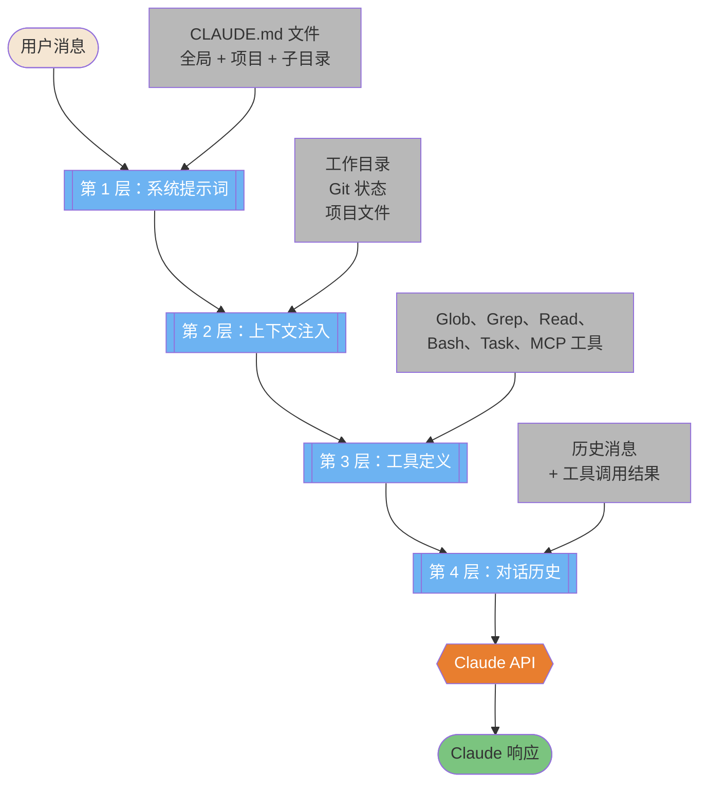
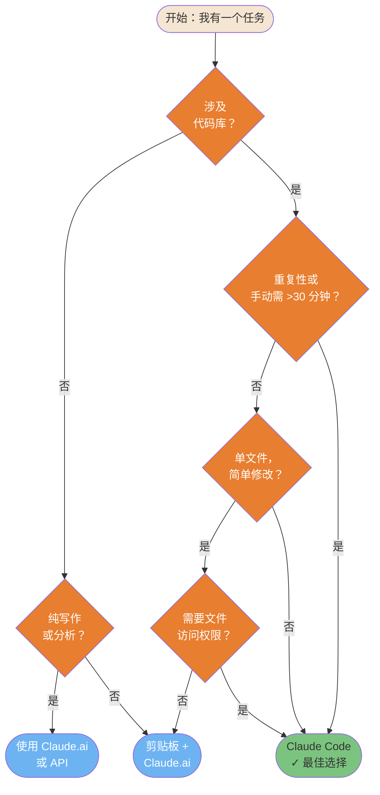

> 📚 **AI Spark Wiki** · Claude Code 知识库

---
title: "Claude Code — 基础概念图表"
description: "核心概念：4层模型、工作流流水线、决策树、5种权限模式"
tags: [基础, 架构, 入门]
---

# 基础概念

解释 Claude Code 是什么以及其基本运作原理的核心概念。

---

### "从聊天机器人到上下文系统" — 4层模型

Claude Code 不是聊天机器人——它是一个上下文系统，在调用 API 前会将你的消息转化为丰富的多层提示词。此图展示了每次请求背后隐式发生的 4 层增强过程。



<details>
<summary>ASCII 版本</summary>

```
用户消息
     │
     ▼
┌─────────────────────────────────┐
│ 第 1 层：系统提示词             │ ← CLAUDE.md 文件
│ 第 2 层：上下文注入             │ ← 工作目录、git 状态
│ 第 3 层：工具定义               │ ← 所有可用工具
│ 第 4 层：对话历史               │ ← 历史消息
└─────────────────┬───────────────┘
                  │
                  ▼
           Claude API 调用
                  │
                  ▼
           Claude 响应
```

</details>

> **来源**：[Claude Code 工作原理](../ultimate-guide.md#how-claude-code-works) — 第 ~2360 行

---

### 9 步工作流流水线

每次对 Claude Code 的请求都会经历这条流水线——从解析你的意图到展示最终响应。理解这个循环有助于你写出更好的指令，并更快地定位问题。

```mermaid
flowchart LR
    A([用户消息]) --> B(解析意图)
    B --> C(加载上下文)
    C --> D(规划操作)
    D --> E(执行工具)
    E --> F{需要更多<br/>工具调用？}
    F -->|是| G(收集结果)
    G --> E
    F -->|否| H(更新上下文)
    H --> I(生成响应)
    I --> J([展示给用户])

    style A fill:#F5E6D3,color:#333
    style B fill:#6DB3F2,color:#fff
    style C fill:#6DB3F2,color:#fff
    style D fill:#E87E2F,color:#fff
    style E fill:#E87E2F,color:#fff
    style F fill:#E87E2F,color:#fff
    style G fill:#B8B8B8,color:#333
    style H fill:#B8B8B8,color:#333
    style I fill:#6DB3F2,color:#fff
    style J fill:#7BC47F,color:#333

    click A href "https://github.com/claude-code-ultimate-guide/claude-code-ultimate-guide/blob/main/guide/ultimate-guide.md#12-first-workflow" "首次工作流"
    click B href "https://github.com/claude-code-ultimate-guide/claude-code-ultimate-guide/blob/main/guide/core/architecture.md#1-the-master-loop" "解析意图 — 主循环"
    click C href "https://github.com/claude-code-ultimate-guide/claude-code-ultimate-guide/blob/main/guide/ultimate-guide.md#22-context-management" "加载上下文"
    click D href "https://github.com/claude-code-ultimate-guide/claude-code-ultimate-guide/blob/main/guide/ultimate-guide.md#23-plan-mode" "规划操作 — 计划模式"
    click E href "https://github.com/claude-code-ultimate-guide/claude-code-ultimate-guide/blob/main/guide/core/architecture.md#2-the-tool-arsenal" "执行工具"
    click F href "https://github.com/claude-code-ultimate-guide/claude-code-ultimate-guide/blob/main/guide/core/architecture.md#1-the-master-loop" "需要更多工具？— 主循环"
    click G href "https://github.com/claude-code-ultimate-guide/claude-code-ultimate-guide/blob/main/guide/core/architecture.md#1-the-master-loop" "收集结果"
    click H href "https://github.com/claude-code-ultimate-guide/claude-code-ultimate-guide/blob/main/guide/ultimate-guide.md#22-context-management" "更新上下文"
    click I href "https://github.com/claude-code-ultimate-guide/claude-code-ultimate-guide/blob/main/guide/core/architecture.md#1-the-master-loop" "生成响应"
    click J href "https://github.com/claude-code-ultimate-guide/claude-code-ultimate-guide/blob/main/guide/ultimate-guide.md#12-first-workflow" "展示给用户"
```



<details>
<summary>ASCII 版本</summary>

```
用户消息 → 解析意图 → 加载上下文 → 规划操作
                                        │
                     ┌──────────────────┘
                     ▼
               执行工具 ◄──────────────────┐
                     │                     │
               需要更多工具？── 是 ── 收集结果
                     │ 否
                     ▼
              更新上下文 → 生成响应 → 展示
```

</details>

> **来源**：[快速入门](../ultimate-guide.md#getting-started) — 第 ~277 行

---

### 快速决策树 — "我该使用 Claude Code 吗？"

并非所有任务都需要 Claude Code。这个决策树帮助你将正确的任务路由到正确的工具——Claude Code CLI、Claude.ai 还是剪贴板方式。



<details>
<summary>ASCII 版本</summary>

```
任务涉及代码库？
├── 否 → 纯写作/分析？ → 是 → Claude.ai
│                      → 否  → 剪贴板 + Claude.ai
└── 是 → 重复性或 >30 分钟？
          ├── 是 → ✓ Claude Code
          └── 否  → 单文件，简单修改？
                    ├── 是 → 需要文件访问？ → 否 → 剪贴板
                    │                        → 是 → Claude Code
                    └── 否  → ✓ Claude Code
```

</details>

> **来源**：[快速入门决策](../ultimate-guide.md#quick-start) — 另见 `machine-readable/reference.yaml`（decide 部分）

---

### 权限模式对比

Claude Code 有 5 种权限模式，控制哪些操作可以自动执行，哪些需要你的审批。选错模式是第 #1 安全错误。

```mermaid
flowchart TD
    subgraph DEFAULT["🔒 默认模式（推荐）"]
        D1(文件读取) --> D2([自动批准])
        D3(文件写入) --> D4([需要确认])
        D5(Shell 命令) --> D6([需要确认])
        D7(高危操作) --> D8([需要确认])
    end

    subgraph ACCEPT["✏️ acceptEdits 模式"]
        A1(文件读取) --> A2([自动批准])
        A3(文件写入) --> A4([自动批准])
        A5(Shell 命令) --> A6([需要确认])
        A7(高危操作) --> A8([需要确认])
    end

    subgraph BYPASS["⚠️ bypassPermissions 模式"]
        B1(所有操作) --> B2([自动批准])
        B3["仅限以下场景使用：<br/>CI/CD、沙盒<br/>环境"] --> B2
    end

    subgraph PLAN["🔍 计划模式（只读）"]
        PL1(文件读取) --> PL2([自动批准])
        PL3(文件写入) --> PL4([已阻止])
        PL5(Shell 命令) --> PL6([已阻止])
        PL7["通过 /execute<br/>或 Shift+Tab 退出"] --> PL2
    end

    subgraph DONTASK["🚫 dontAsk 模式"]
        DA1(所有操作) --> DA2([自动拒绝])
        DA3["除非通过 /permissions add<br/>预先批准"] --> DA2
    end

    style D2 fill:#7BC47F,color:#333
    style D4 fill:#E87E2F,color:#fff
    style D6 fill:#E87E2F,color:#fff
    style D8 fill:#E87E2F,color:#fff
    style A2 fill:#7BC47F,color:#333
    style A4 fill:#7BC47F,color:#333
    style A6 fill:#E87E2F,color:#fff
    style A8 fill:#E87E2F,color:#fff
    style B2 fill:#E85D5D,color:#fff
    style B3 fill:#F5E6D3,color:#333
    style PL2 fill:#7BC47F,color:#333
    style PL4 fill:#E85D5D,color:#fff
    style PL6 fill:#E85D5D,color:#fff
    style DA2 fill:#E85D5D,color:#fff
    style DA3 fill:#F5E6D3,color:#333

    click D1 href "https://github.com/claude-code-ultimate-guide/claude-code-ultimate-guide/blob/main/guide/ultimate-guide.md#14-permission-modes" "默认模式 — 权限模式"
    click D2 href "https://github.com/claude-code-ultimate-guide/claude-code-ultimate-guide/blob/main/guide/ultimate-guide.md#14-permission-modes" "自动批准"
    click D3 href "https://github.com/claude-code-ultimate-guide/claude-code-ultimate-guide/blob/main/guide/ultimate-guide.md#14-permission-modes" "文件写入"
    click D4 href "https://github.com/claude-code-ultimate-guide/claude-code-ultimate-guide/blob/main/guide/ultimate-guide.md#14-permission-modes" "需要确认"
    click D5 href "https://github.com/claude-code-ultimate-guide/claude-code-ultimate-guide/blob/main/guide/ultimate-guide.md#14-permission-modes" "Shell 命令"
    click D6 href "https://github.com/claude-code-ultimate-guide/claude-code-ultimate-guide/blob/main/guide/ultimate-guide.md#14-permission-modes" "需要确认"
    click D7 href "https://github.com/claude-code-ultimate-guide/claude-code-ultimate-guide/blob/main/guide/ultimate-guide.md#14-permission-modes" "高危操作"
    click D8 href "https://github.com/claude-code-ultimate-guide/claude-code-ultimate-guide/blob/main/guide/ultimate-guide.md#14-permission-modes" "需要确认"
    click A1 href "https://github.com/claude-code-ultimate-guide/claude-code-ultimate-guide/blob/main/guide/ultimate-guide.md#14-permission-modes" "acceptEdits 模式"
    click A2 href "https://github.com/claude-code-ultimate-guide/claude-code-ultimate-guide/blob/main/guide/ultimate-guide.md#14-permission-modes" "自动批准"
    click A3 href "https://github.com/claude-code-ultimate-guide/claude-code-ultimate-guide/blob/main/guide/ultimate-guide.md#14-permission-modes" "文件写入 — 自动"
    click A4 href "https://github.com/claude-code-ultimate-guide/claude-code-ultimate-guide/blob/main/guide/ultimate-guide.md#14-permission-modes" "自动批准"
    click A5 href "https://github.com/claude-code-ultimate-guide/claude-code-ultimate-guide/blob/main/guide/ultimate-guide.md#14-permission-modes" "Shell 命令"
    click A6 href "https://github.com/claude-code-ultimate-guide/claude-code-ultimate-guide/blob/main/guide/ultimate-guide.md#14-permission-modes" "需要确认"
    click A7 href "https://github.com/claude-code-ultimate-guide/claude-code-ultimate-guide/blob/main/guide/ultimate-guide.md#14-permission-modes" "高危操作"
    click A8 href "https://github.com/claude-code-ultimate-guide/claude-code-ultimate-guide/blob/main/guide/ultimate-guide.md#14-permission-modes" "需要确认"
    click B1 href "https://github.com/claude-code-ultimate-guide/claude-code-ultimate-guide/blob/main/guide/ultimate-guide.md#14-permission-modes" "bypassPermissions 模式"
    click B2 href "https://github.com/claude-code-ultimate-guide/claude-code-ultimate-guide/blob/main/guide/ultimate-guide.md#14-permission-modes" "自动批准（所有操作）"
    click B3 href "https://github.com/claude-code-ultimate-guide/claude-code-ultimate-guide/blob/main/guide/ultimate-guide.md#14-permission-modes" "仅限 CI/CD、沙盒环境"
    click PL1 href "https://github.com/claude-code-ultimate-guide/claude-code-ultimate-guide/blob/main/guide/ultimate-guide.md#14-permission-modes" "计划模式 — 文件读取"
    click PL2 href "https://github.com/claude-code-ultimate-guide/claude-code-ultimate-guide/blob/main/guide/ultimate-guide.md#14-permission-modes" "自动批准"
    click PL3 href "https://github.com/claude-code-ultimate-guide/claude-code-ultimate-guide/blob/main/guide/ultimate-guide.md#14-permission-modes" "计划模式 — 文件写入已阻止"
    click PL4 href "https://github.com/claude-code-ultimate-guide/claude-code-ultimate-guide/blob/main/guide/ultimate-guide.md#14-permission-modes" "已阻止"
    click PL5 href "https://github.com/claude-code-ultimate-guide/claude-code-ultimate-guide/blob/main/guide/ultimate-guide.md#14-permission-modes" "计划模式 — Shell 命令已阻止"
    click PL6 href "https://github.com/claude-code-ultimate-guide/claude-code-ultimate-guide/blob/main/guide/ultimate-guide.md#14-permission-modes" "已阻止"
    click PL7 href "https://github.com/claude-code-ultimate-guide/claude-code-ultimate-guide/blob/main/guide/ultimate-guide.md#14-permission-modes" "退出计划模式"
    click DA1 href "https://github.com/claude-code-ultimate-guide/claude-code-ultimate-guide/blob/main/guide/ultimate-guide.md#14-permission-modes" "dontAsk 模式 — 所有操作"
    click DA2 href "https://github.com/claude-code-ultimate-guide/claude-code-ultimate-guide/blob/main/guide/ultimate-guide.md#14-permission-modes" "自动拒绝"
    click DA3 href "https://github.com/claude-code-ultimate-guide/claude-code-ultimate-guide/blob/main/guide/ultimate-guide.md#14-permission-modes" "通过 /permissions add 预先批准"
```



<details>
<summary>ASCII 版本</summary>

```
默认模式（推荐）             acceptEdits               bypassPermissions
────────────────             ───────────               ─────────────────
文件读取  → 自动 ✓           文件读取  → 自动 ✓         所有操作 → 自动 ⚠️
文件写入  → 确认             文件写入  → 自动 ✓
Shell 命令 → 确认            Shell 命令 → 确认           仅限：CI/CD、
高危操作  → 确认             高危操作  → 确认            沙盒环境

计划模式（只读）              dontAsk 模式
────────────────             ────────────
文件读取  → 自动 ✓           所有操作 → 自动拒绝 ✗
文件写入  → 已阻止 ✗         除非通过
Shell 命令 → 已阻止 ✗        /permissions add 预先批准
退出：/execute 或 Shift+Tab
```

</details>

> **来源**：[权限系统](../ultimate-guide.md#permission-system) — 第 ~760 行
