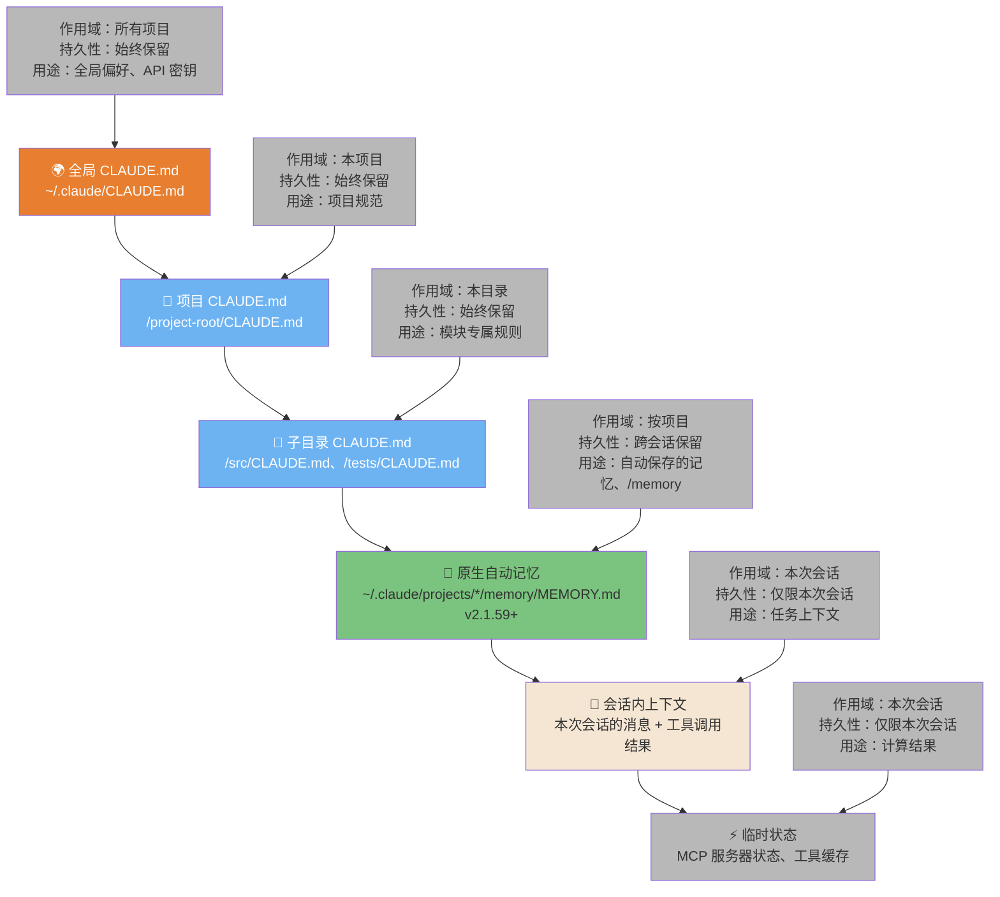
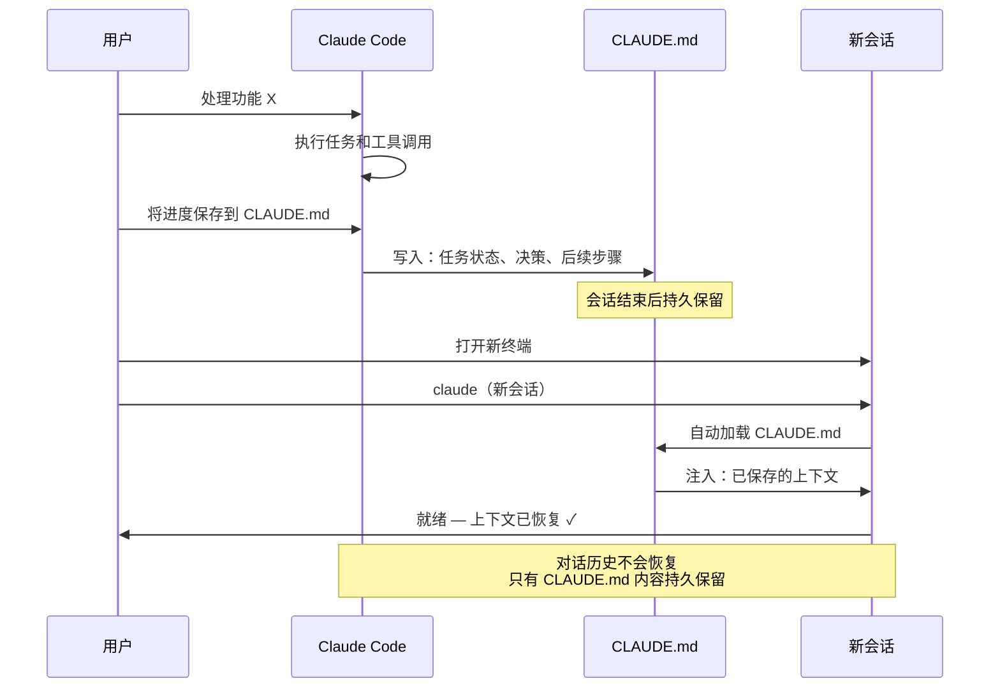

> 📚 **AI Spark Wiki** · Claude Code 知识库

---
title: "Claude Code — 上下文与会话图表"
description: "上下文区域、记忆层级、会话管理和新鲜上下文模式"
tags: [上下文, 会话, 记忆, 优化]
---

# 上下文与会话

Claude Code 如何在工作中管理上下文、记忆和会话。

---

### 上下文管理区域

你的上下文窗口有 4 个不同区域，每个区域需要不同的策略。了解自己所在的区域可以防止上下文膨胀，并在长时间会话中保持响应质量。

```mermaid
flowchart LR
    subgraph GREEN["🟢 0–50% — 舒适"]
        G1(全部能力<br/>可用)
        G2(所有工具激活)
        G3(丰富响应)
    end

    subgraph BLUE["🔵 50–75% — 正常"]
        B1(监控用量)
        B2(考虑对旧会话<br/>执行 /compact)
        B3(正常运行)
    end

    subgraph ORANGE["🟠 75–85% — 注意"]
        O1(主动建议<br/>执行 /compact)
        O2(减少冗余输出)
        O3(推迟非关键<br/>操作)
    end

    subgraph RED["🔴 85–100% — 危急"]
        R1(80% 时触发<br/>自动压缩)
        R2(仅执行必要操作)
        R3(新任务开启<br/>新会话)
    end

    GREEN --> BLUE --> ORANGE --> RED

    style G1 fill:#7BC47F,color:#333
    style G2 fill:#7BC47F,color:#333
    style G3 fill:#7BC47F,color:#333
    style B1 fill:#6DB3F2,color:#fff
    style B2 fill:#6DB3F2,color:#fff
    style B3 fill:#6DB3F2,color:#fff
    style O1 fill:#E87E2F,color:#fff
    style O2 fill:#E87E2F,color:#fff
    style O3 fill:#E87E2F,color:#fff
    style R1 fill:#E85D5D,color:#fff
    style R2 fill:#E85D5D,color:#fff
    style R3 fill:#E85D5D,color:#fff

    click G1 href "https://github.com/claude-code-ultimate-guide/claude-code-ultimate-guide/blob/main/guide/ultimate-guide.md#22-context-management" "0-50%：全部能力"
    click G2 href "https://github.com/claude-code-ultimate-guide/claude-code-ultimate-guide/blob/main/guide/ultimate-guide.md#22-context-management" "0-50%：所有工具激活"
    click G3 href "https://github.com/claude-code-ultimate-guide/claude-code-ultimate-guide/blob/main/guide/ultimate-guide.md#22-context-management" "0-50%：丰富响应"
    click B1 href "https://github.com/claude-code-ultimate-guide/claude-code-ultimate-guide/blob/main/guide/ultimate-guide.md#22-context-management" "50-75%：监控用量"
    click B2 href "https://github.com/claude-code-ultimate-guide/claude-code-ultimate-guide/blob/main/guide/ultimate-guide.md#22-context-management" "50-75%：考虑 /compact"
    click B3 href "https://github.com/claude-code-ultimate-guide/claude-code-ultimate-guide/blob/main/guide/ultimate-guide.md#22-context-management" "50-75%：正常运行"
    click O1 href "https://github.com/claude-code-ultimate-guide/claude-code-ultimate-guide/blob/main/guide/ultimate-guide.md#22-context-management" "75-85%：建议 /compact"
    click O2 href "https://github.com/claude-code-ultimate-guide/claude-code-ultimate-guide/blob/main/guide/ultimate-guide.md#22-context-management" "75-85%：减少冗余"
    click O3 href "https://github.com/claude-code-ultimate-guide/claude-code-ultimate-guide/blob/main/guide/ultimate-guide.md#22-context-management" "75-85%：推迟非关键操作"
    click R1 href "https://github.com/claude-code-ultimate-guide/claude-code-ultimate-guide/blob/main/guide/ultimate-guide.md#22-context-management" "85-100%：自动压缩"
    click R2 href "https://github.com/claude-code-ultimate-guide/claude-code-ultimate-guide/blob/main/guide/ultimate-guide.md#22-context-management" "85-100%：仅必要操作"
    click R3 href "https://github.com/claude-code-ultimate-guide/claude-code-ultimate-guide/blob/main/guide/ultimate-guide.md#22-context-management" "85-100%：开启新会话"
```



<details>
<summary>ASCII 版本</summary>

```
0%──────50%──────75%──85%──100%
│  绿色  │  蓝色  │ 橙色 │ 红色│
│ 全部   │ 正常   │ 建议  │ 自动│
│ 访问   │ 监控   │ 压缩  │ 压缩│
│        │        │ 减少  │ 仅必│
│        │        │ 冗余  │ 要  │
```

</details>

> **来源**：[上下文管理](../ultimate-guide.md#context-management) — 第 ~1335 行

---

### 记忆层级 — 6 种类型

Claude Code 有 6 种不同的记忆类型，作用域和持久性各不相同。了解每种信息该使用哪种记忆类型，是高效会话的关键。



<details>
<summary>ASCII 版本</summary>

```
永久 ──────────────────────────────────── 仅限会话

~/.claude/CLAUDE.md                    会话内上下文
      │                                      │
/project/CLAUDE.md                    临时 MCP 状态
      │
/subdir/CLAUDE.md
      │
自动记忆（MEMORY.md）← 跨会话、按项目

越高 = 作用域越广，始终保留
越低 = 作用域越窄，重启后仍保留
自动记忆 = 跨会话保留，按项目作用域
```

</details>

> **来源**：[记忆系统](../ultimate-guide.md#memory-system) — 第 ~3160 行 & ~3986 行 | 自动记忆：v2.1.59+（v3.30.0）

---

### 会话连续性 — 保存与恢复状态

会话不会自动在不同终端之间持久化上下文。此图展示如何保存状态并在新会话或新终端中恢复，从而支持异步工作流。



<details>
<summary>ASCII 版本</summary>

```
会话 1                    CLAUDE.md          会话 2
──────                    ─────────          ──────
处理任务                      │               打开终端
     │                        │                    │
保存进度 ──────────────►  写入              加载 CLAUDE.md
                           状态、          ◄── 自动注入
                           决策、
                           后续步骤
```

</details>

> **来源**：[会话管理](../ultimate-guide.md#session-management) — 第 ~9477 行

---

### 新鲜上下文——反模式 vs 最佳实践

长时间会话会积累噪声，导致响应质量下降。此图展示了退化模式，以及维持性能的推荐"专注会话"方法。

```mermaid
flowchart TD
    subgraph BAD["❌ 反模式：单体大会话"]
        B1([启动大会话]) --> B2(添加任务 A)
        B2 --> B3(添加任务 B)
        B3 --> B4(添加任务 C)
        B4 --> B5{上下文膨胀<br/>>75%}
        B5 --> B6(响应质量<br/>下降)
        B6 --> B7(强制重启<br/>丢失所有上下文)
        style B1 fill:#E85D5D,color:#fff
        style B5 fill:#E85D5D,color:#fff
        style B6 fill:#E85D5D,color:#fff
        style B7 fill:#E85D5D,color:#fff
    end

    subgraph GOOD["✅ 最佳实践：专注会话"]
        G1([启动专注会话]) --> G2(完成任务 A)
        G2 --> G3{到达自然<br/>检查点？}
        G3 -->|是| G4(保存到 CLAUDE.md)
        G4 --> G5([为任务 B 开启新会话])
        G3 -->|否| G6{上下文 >75%？}
        G6 -->|是| G7(/compact)
        G7 --> G2
        G6 -->|否| G2
        style G1 fill:#7BC47F,color:#333
        style G4 fill:#7BC47F,color:#333
        style G5 fill:#7BC47F,color:#333
        style G3 fill:#E87E2F,color:#fff
        style G6 fill:#E87E2F,color:#fff
        style G7 fill:#6DB3F2,color:#fff
    end

    click B1 href "https://github.com/claude-code-ultimate-guide/claude-code-ultimate-guide/blob/main/guide/ultimate-guide.md#22-context-management" "反模式：单体大会话"
    click B2 href "https://github.com/claude-code-ultimate-guide/claude-code-ultimate-guide/blob/main/guide/ultimate-guide.md#22-context-management" "添加任务 A"
    click B3 href "https://github.com/claude-code-ultimate-guide/claude-code-ultimate-guide/blob/main/guide/ultimate-guide.md#22-context-management" "添加任务 B"
    click B4 href "https://github.com/claude-code-ultimate-guide/claude-code-ultimate-guide/blob/main/guide/ultimate-guide.md#22-context-management" "添加任务 C"
    click B5 href "https://github.com/claude-code-ultimate-guide/claude-code-ultimate-guide/blob/main/guide/ultimate-guide.md#22-context-management" "上下文膨胀 >75%"
    click B6 href "https://github.com/claude-code-ultimate-guide/claude-code-ultimate-guide/blob/main/guide/ultimate-guide.md#22-context-management" "响应质量下降"
    click B7 href "https://github.com/claude-code-ultimate-guide/claude-code-ultimate-guide/blob/main/guide/ultimate-guide.md#22-context-management" "强制重启 — 丢失上下文"
    click G1 href "https://github.com/claude-code-ultimate-guide/claude-code-ultimate-guide/blob/main/guide/ultimate-guide.md#22-context-management" "最佳实践：专注会话"
    click G2 href "https://github.com/claude-code-ultimate-guide/claude-code-ultimate-guide/blob/main/guide/ultimate-guide.md#22-context-management" "完成任务 A"
    click G3 href "https://github.com/claude-code-ultimate-guide/claude-code-ultimate-guide/blob/main/guide/ultimate-guide.md#22-context-management" "到达自然检查点？"
    click G4 href "https://github.com/claude-code-ultimate-guide/claude-code-ultimate-guide/blob/main/guide/ultimate-guide.md#31-memory-files-claudemd" "保存到 CLAUDE.md"
    click G5 href "https://github.com/claude-code-ultimate-guide/claude-code-ultimate-guide/blob/main/guide/ultimate-guide.md#22-context-management" "为任务 B 开启新会话"
    click G6 href "https://github.com/claude-code-ultimate-guide/claude-code-ultimate-guide/blob/main/guide/ultimate-guide.md#22-context-management" "上下文 >75%？"
    click G7 href "https://github.com/claude-code-ultimate-guide/claude-code-ultimate-guide/blob/main/guide/ultimate-guide.md#22-context-management" "/compact"
```



<details>
<summary>ASCII 版本</summary>

```
差：一个大会话
任务 A → 任务 B → 任务 C → 上下文膨胀 → 质量下降 → 重启 → 丢失！

好：专注会话
任务 A ──► 检查点？──是──► 保存 CLAUDE.md ──► 为 B 开启新会话
           │
           否
           │
         上下文 >75%？──是──► /compact ──► 继续
           │
           否
           │
         继续任务
```

</details>

> **来源**：[上下文最佳实践](../ultimate-guide.md#context-best-practices) — 第 ~1525 行
