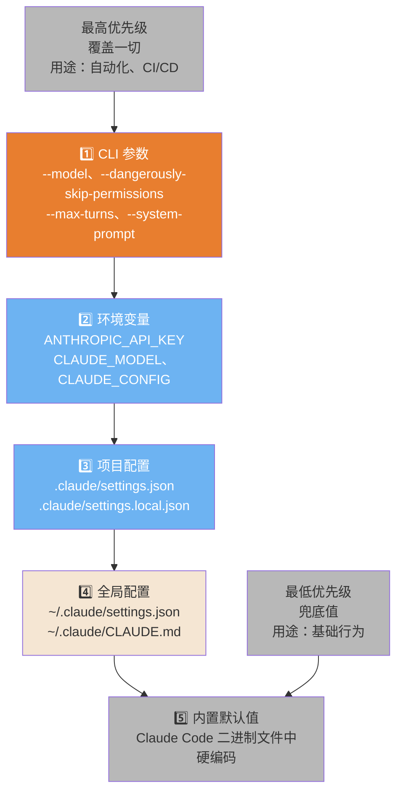
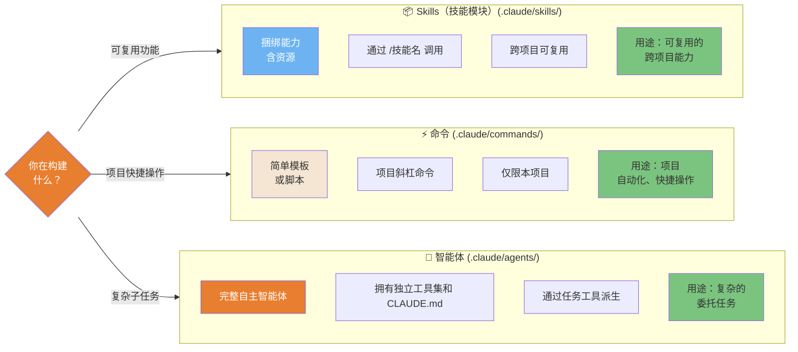
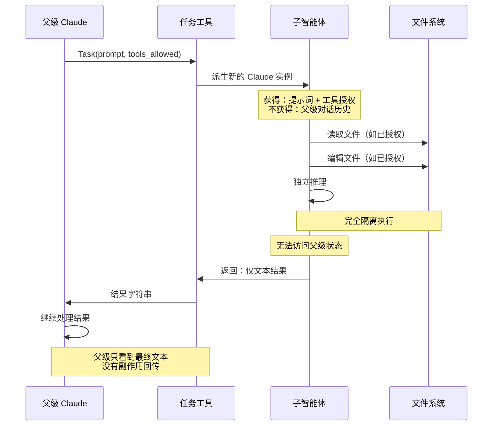

> 📚 **AI Spark Wiki** · Claude Code 知识库

---
title: "Claude Code — 配置系统图表"
description: "配置优先级、Skills 与命令与智能体、智能体生命周期、Hooks 流水线"
tags: [配置, Hooks, 智能体, Skills, 命令]
---

# 配置系统

Claude Code 如何加载设置、解决冲突并编排可扩展性。

---

### 配置优先级（5 层）

Claude Code 通过严格的优先级层次解析设置。高优先级层覆盖低优先级层。了解这一机制可以避免"为什么我的配置不生效？"的疑惑。



<details>
<summary>ASCII 版本</summary>

```
优先级（从高到低）
═══════════════════════════
1. CLI 参数          ← --model、--system-prompt
2. 环境变量          ← ANTHROPIC_API_KEY
3. 项目 .claude/     ← settings.json、settings.local.json
4. 全局 ~/.claude/   ← settings.json、CLAUDE.md
5. 内置默认值         ← 硬编码的兜底值
```

</details>

> **来源**：[配置系统](../ultimate-guide.md#configuration) — 第 ~3760 行

---

### Skills（技能模块）vs 命令 vs 智能体 — 何时使用各方

三种可扩展性机制，各有不同的用途和权衡。选错抽象方式会导致过度工程化或自动化能力不足。



<details>
<summary>ASCII 版本</summary>

```
                Skills（技能模块）       命令               智能体
位置：      .claude/skills/     .claude/commands/  .claude/agents/
触发方式：  /技能名             /命令名            任务工具
作用域：    跨项目              本项目             任意场景
复杂度：    中（捆绑）          低（模板）         高（自主）
使用场景：  可复用能力          快速快捷操作       复杂任务
```

</details>

> **来源**：[可扩展性系统](../ultimate-guide.md#extensibility) — 第 ~4495、~5025、~3900 行

---

### 智能体生命周期与作用域隔离

子智能体与父级完全隔离运行。它们接收上下文的副本，但不共享任何状态。理解这一点可以避免"为什么子智能体看不到 X？"的困惑。



<details>
<summary>ASCII 版本</summary>

```
父级 ──Task(prompt, tools)──► 子智能体
                                    │
                               [隔离执行]
                               - 读取文件
                               - 编辑文件
                               - bash（如已允许）
                                    │
父级 ◄───── 文本结果 ───────────────┘
（不共享状态，没有副作用回传）
```

</details>

> **来源**：[子智能体](../ultimate-guide.md#sub-agents) — 第 ~3900 行

---

### Hooks（钩子）事件流水线

Hooks（钩子）让你可以在 Claude Code 生命周期的关键节点运行自定义代码——用于安全扫描、日志记录、强制执行或通知。执行顺序非常重要。

```mermaid
flowchart TD
    INIT([会话开始]) -.->|v2.1.69+| INST{InstructionsLoaded 钩子}
    INST -.-> A

    A([用户发送消息]) --> UPS{UserPromptSubmit 钩子}
    UPS -->|退出码 0：继续| B{PreToolUse 钩子}
    UPS -->|退出码 2：反馈| A
    B -->|退出码 0：允许| C[工具执行]
    B -->|退出码 1：阻止| D([工具已阻止<br/>Claude 停止])
    C --> E{PostToolUse 钩子}
    E --> F[下一个工具或响应]
    F --> G{还有工具调用？}
    G -->|是| B
    G -->|否| H([会话结束])
    H --> I{Stop / SessionEnd 钩子}
    I --> J([完成])

    K{PreCompact 钩子} -.->|/compact 前| L[/compact 执行]
    L --> M{PostCompact 钩子}

    NOTE["钩子类型：<br/>bash（退出码 0/1/2）<br/>http（POST JSON → URL，v2.1.63+）"] -.-> B

    style INST fill:#6DB3F2,color:#fff
    style UPS fill:#6DB3F2,color:#fff
    style B fill:#E87E2F,color:#fff
    style D fill:#E85D5D,color:#fff
    style E fill:#E87E2F,color:#fff
    style I fill:#E87E2F,color:#fff
    style K fill:#6DB3F2,color:#fff
    style M fill:#6DB3F2,color:#fff
    style C fill:#7BC47F,color:#333
    style J fill:#7BC47F,color:#333
    style NOTE fill:#F5E6D3,color:#333

    click INIT href "https://github.com/claude-code-ultimate-guide/claude-code-ultimate-guide/blob/main/guide/ultimate-guide.md#71-the-event-system" "会话开始"
    click INST href "https://github.com/claude-code-ultimate-guide/claude-code-ultimate-guide/blob/main/guide/ultimate-guide.md#71-the-event-system" "InstructionsLoaded 钩子 — v2.1.69+"
    click A href "https://github.com/claude-code-ultimate-guide/claude-code-ultimate-guide/blob/main/guide/ultimate-guide.md#71-the-event-system" "用户发送消息"
    click UPS href "https://github.com/claude-code-ultimate-guide/claude-code-ultimate-guide/blob/main/guide/ultimate-guide.md#71-the-event-system" "UserPromptSubmit 钩子"
    click B href "https://github.com/claude-code-ultimate-guide/claude-code-ultimate-guide/blob/main/guide/ultimate-guide.md#71-the-event-system" "PreToolUse 钩子"
    click C href "https://github.com/claude-code-ultimate-guide/claude-code-ultimate-guide/blob/main/guide/core/architecture.md#2-the-tool-arsenal" "工具执行"
    click D href "https://github.com/claude-code-ultimate-guide/claude-code-ultimate-guide/blob/main/guide/ultimate-guide.md#71-the-event-system" "工具已阻止"
    click E href "https://github.com/claude-code-ultimate-guide/claude-code-ultimate-guide/blob/main/guide/ultimate-guide.md#71-the-event-system" "PostToolUse 钩子"
    click F href "https://github.com/claude-code-ultimate-guide/claude-code-ultimate-guide/blob/main/guide/ultimate-guide.md#71-the-event-system" "下一个工具或响应"
    click G href "https://github.com/claude-code-ultimate-guide/claude-code-ultimate-guide/blob/main/guide/ultimate-guide.md#71-the-event-system" "还有工具调用？"
    click H href "https://github.com/claude-code-ultimate-guide/claude-code-ultimate-guide/blob/main/guide/ultimate-guide.md#71-the-event-system" "会话结束"
    click I href "https://github.com/claude-code-ultimate-guide/claude-code-ultimate-guide/blob/main/guide/ultimate-guide.md#71-the-event-system" "Stop / SessionEnd 钩子"
    click J href "https://github.com/claude-code-ultimate-guide/claude-code-ultimate-guide/blob/main/guide/ultimate-guide.md#72-creating-hooks" "完成"
    click K href "https://github.com/claude-code-ultimate-guide/claude-code-ultimate-guide/blob/main/guide/ultimate-guide.md#71-the-event-system" "PreCompact 钩子"
    click L href "https://github.com/claude-code-ultimate-guide/claude-code-ultimate-guide/blob/main/guide/ultimate-guide.md#71-the-event-system" "/compact 执行"
    click M href "https://github.com/claude-code-ultimate-guide/claude-code-ultimate-guide/blob/main/guide/ultimate-guide.md#71-the-event-system" "PostCompact 钩子"
```

<details>
<summary>ASCII 版本</summary>

```
会话开始
     │ （InstructionsLoaded 钩子 — v2.1.69+）
用户消息
     │
 UserPromptSubmit ──退出码 2──► 反馈给 Claude（循环）
     │ 退出码 0
 PreToolUse ──退出码 1──► 已阻止
     │ 退出码 0
     ▼
工具执行
     │
PostToolUse
     │
还有工具？──是──► PreToolUse（循环）
     │ 否
会话结束
     │
  Stop / SessionEnd 钩子
     │
 完成

另外：PreCompact ──► /compact ──► PostCompact

钩子类型：bash（退出码 0/1/2）| http POST JSON（v2.1.63+）
```

</details>

> **来源**：[Hooks 系统](../ultimate-guide.md#hooks) — 第 ~5350 行 | UserPromptSubmit + HTTP 钩子：v2.1.63+ | InstructionsLoaded：v2.1.69+
