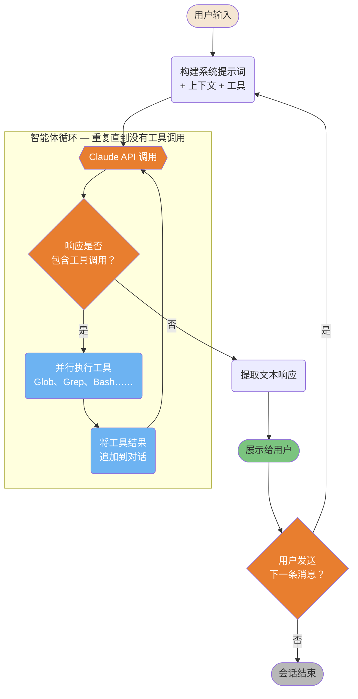
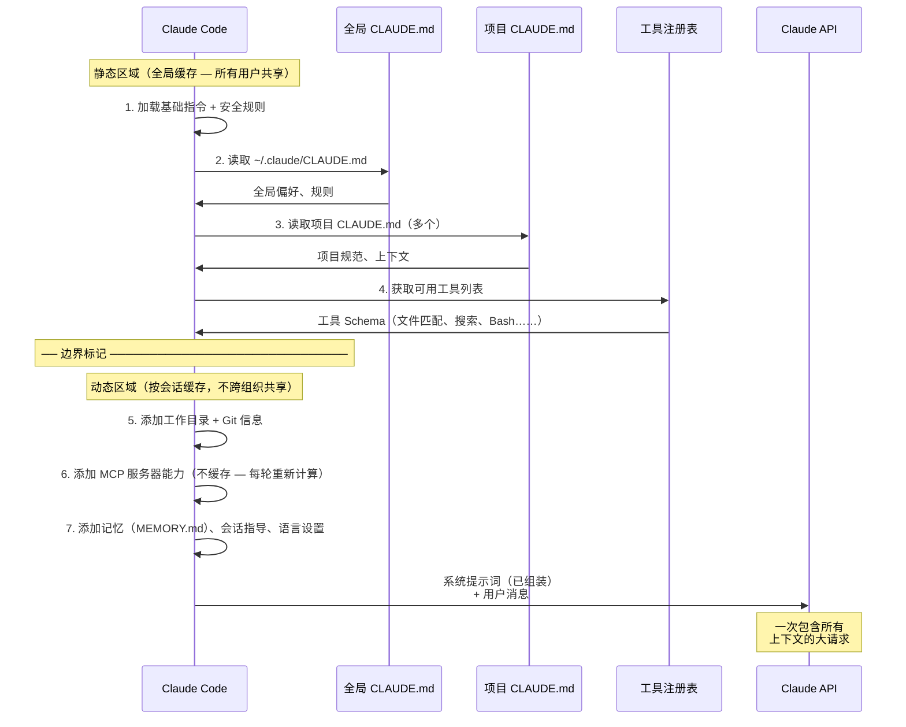
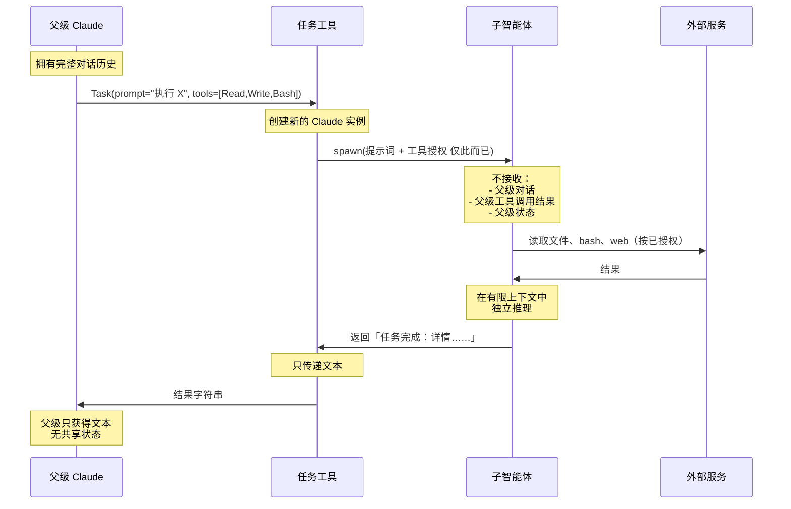

> 📚 **AI Spark Wiki** · Claude Code 知识库

---
title: "Claude Code — 架构内部图表"
description: "主循环、工具分类、系统提示词组装、子智能体隔离"
tags: [架构, 内部机制, 主循环, 工具]
---

# 架构内部

Claude Code 运行时的底层机制。

---

### 主循环

Claude Code 的核心执行由两个嵌套循环组成：**内层智能体循环**——只要返回工具调用就持续调用 API；**外层对话循环**——在用户响应时开始新轮次。



<details>
<summary>ASCII 版本</summary>

```
用户输入
     │
构建提示词（系统 + 上下文 + 工具）
     │
 ┌── 智能体循环 ───────────────────────┐
 │ Claude API ◄────────────────────┐  │
 │      │                          │  │
 │ 有工具调用？                     │  │
 │  ├─ 是 → 执行工具 ──────────────┘  │
 │  └─ 否  → 退出循环                 │
 └────────────────────────────────────┘
               │
         展示响应
               │
         用户下一条消息？──► 是 → 重建提示词 → 循环
               └─ 否 → 会话结束
```

</details>

> **来源**：[架构：主循环](../core/architecture.md#master-loop) — 第 ~72 行
>
> *来源确认（2026-03-31）：内层循环为 `queryLoop()` 异步生成器。工具通过 `StreamingToolExecutor` 执行（最多 10 个并发）。循环通过 10 种终止原因之一退出（`completed`、`max_turns`、`aborted_tools` 等）。*

---

### 工具分类与选择

Claude Code 有 6 种工具类别，各自针对不同操作进行优化。了解 Claude 选择哪种工具（以及原因），有助于你编写能引导更好工具选择的指令。

```mermaid
flowchart TD
    ROOT["Claude Code 工具集"] --> READ
    ROOT --> WRITE
    ROOT --> EXECUTE
    ROOT --> WEB
    ROOT --> WORKFLOW
    ROOT --> CONTROL

    subgraph READ["📖 读取工具"]
        R1[文件匹配工具<br/>按模式查找文件]
        R2[搜索工具<br/>搜索文件内容]
        R3[读取工具<br/>读取文件内容]
        R4[LS<br/>列出目录]
    end

    subgraph WRITE["✏️ 写入工具"]
        W1[写入工具<br/>创建新文件]
        W2[编辑工具<br/>修改已有文件]
        W3[MultiEdit<br/>批量修改]
    end

    subgraph EXECUTE["⚙️ 执行工具"]
        E1[Bash 工具<br/>Shell 命令]
        E2[任务工具<br/>派生子智能体]
    end

    subgraph WEB["🌐 Web 工具"]
        WB1[WebSearch<br/>网页搜索]
        WB2[WebFetch<br/>抓取 URL 内容]
    end

    subgraph WORKFLOW["📋 工作流工具"]
        WF1[TodoWrite<br/>管理任务列表]
        WF2[NotebookEdit<br/>Jupyter 笔记本]
    end

    subgraph CONTROL["🎛️ 控制流工具"]
        CF1[EnterPlanMode / ExitPlanMode<br/>切换计划模式]
        CF2[EnterWorktree / ExitWorktree<br/>工作树导航]
        CF3[AskUserQuestion<br/>请求用户输入]
    end

    style ROOT fill:#E87E2F,color:#fff
    style R1 fill:#6DB3F2,color:#fff
    style R2 fill:#6DB3F2,color:#fff
    style R3 fill:#6DB3F2,color:#fff
    style R4 fill:#6DB3F2,color:#fff
    style W1 fill:#F5E6D3,color:#333
    style W2 fill:#F5E6D3,color:#333
    style W3 fill:#F5E6D3,color:#333
    style E1 fill:#E85D5D,color:#fff
    style E2 fill:#E87E2F,color:#fff
    style WB1 fill:#7BC47F,color:#333
    style WB2 fill:#7BC47F,color:#333
    style WF1 fill:#B8B8B8,color:#333
    style WF2 fill:#B8B8B8,color:#333
    style CF1 fill:#B8B8B8,color:#333
    style CF2 fill:#B8B8B8,color:#333
    style CF3 fill:#B8B8B8,color:#333

    click ROOT href "https://github.com/claude-code-ultimate-guide/claude-code-ultimate-guide/blob/main/guide/core/architecture.md#2-the-tool-arsenal" "Claude Code 工具集"
    click R1 href "https://github.com/claude-code-ultimate-guide/claude-code-ultimate-guide/blob/main/guide/core/architecture.md#2-the-tool-arsenal" "文件匹配工具 — 按模式查找文件"
    click R2 href "https://github.com/claude-code-ultimate-guide/claude-code-ultimate-guide/blob/main/guide/core/architecture.md#2-the-tool-arsenal" "搜索工具 — 搜索文件内容"
    click R3 href "https://github.com/claude-code-ultimate-guide/claude-code-ultimate-guide/blob/main/guide/core/architecture.md#2-the-tool-arsenal" "读取工具 — 读取文件内容"
    click R4 href "https://github.com/claude-code-ultimate-guide/claude-code-ultimate-guide/blob/main/guide/core/architecture.md#2-the-tool-arsenal" "LS — 列出目录"
    click W1 href "https://github.com/claude-code-ultimate-guide/claude-code-ultimate-guide/blob/main/guide/core/architecture.md#2-the-tool-arsenal" "写入工具 — 创建新文件"
    click W2 href "https://github.com/claude-code-ultimate-guide/claude-code-ultimate-guide/blob/main/guide/core/architecture.md#2-the-tool-arsenal" "编辑工具 — 修改已有文件"
    click W3 href "https://github.com/claude-code-ultimate-guide/claude-code-ultimate-guide/blob/main/guide/core/architecture.md#2-the-tool-arsenal" "MultiEdit — 批量修改"
    click E1 href "https://github.com/claude-code-ultimate-guide/claude-code-ultimate-guide/blob/main/guide/core/architecture.md#2-the-tool-arsenal" "Bash 工具 — Shell 命令"
    click E2 href "https://github.com/claude-code-ultimate-guide/claude-code-ultimate-guide/blob/main/guide/ultimate-guide.md#41-what-are-agents" "任务工具 — 派生子智能体"
    click WB1 href "https://github.com/claude-code-ultimate-guide/claude-code-ultimate-guide/blob/main/guide/core/architecture.md#2-the-tool-arsenal" "WebSearch"
    click WB2 href "https://github.com/claude-code-ultimate-guide/claude-code-ultimate-guide/blob/main/guide/core/architecture.md#2-the-tool-arsenal" "WebFetch"
    click WF1 href "https://github.com/claude-code-ultimate-guide/claude-code-ultimate-guide/blob/main/guide/core/architecture.md#2-the-tool-arsenal" "TodoWrite — 任务列表"
    click WF2 href "https://github.com/claude-code-ultimate-guide/claude-code-ultimate-guide/blob/main/guide/core/architecture.md#2-the-tool-arsenal" "NotebookEdit — Jupyter"
    click CONTROL href "https://github.com/claude-code-ultimate-guide/claude-code-ultimate-guide/blob/main/guide/core/architecture.md#2-the-tool-arsenal" "控制流工具"
    click CF1 href "https://github.com/claude-code-ultimate-guide/claude-code-ultimate-guide/blob/main/guide/core/architecture.md#2-the-tool-arsenal" "EnterPlanMode / ExitPlanMode"
    click CF2 href "https://github.com/claude-code-ultimate-guide/claude-code-ultimate-guide/blob/main/guide/core/architecture.md#2-the-tool-arsenal" "EnterWorktree / ExitWorktree"
    click CF3 href "https://github.com/claude-code-ultimate-guide/claude-code-ultimate-guide/blob/main/guide/core/architecture.md#2-the-tool-arsenal" "AskUserQuestion"
```



<details>
<summary>ASCII 版本</summary>

```
读取：   文件匹配工具（查找）、搜索工具（搜索）、读取工具（内容）、LS（列表）
写入：   写入工具（创建）、编辑工具（修改）、MultiEdit（批量）
执行：   Bash 工具（Shell）、任务工具（子智能体）← 最强大/高风险
Web：    WebSearch、WebFetch
工作流： TodoWrite、NotebookEdit
控制：   EnterPlanMode/ExitPlanMode、EnterWorktree/ExitWorktree、AskUserQuestion
```

</details>

> **来源**：[架构：工具](../core/architecture.md#tools) — 第 ~213 行

> *已简化——还有更多工具可用。完整列表见 [架构：工具集](../core/architecture.md#tools)。*

---

### 系统提示词组装

在每次 API 调用前，Claude Code 会按照特定顺序从多个来源组装系统提示词。提示词被分为两个缓存区域，中间由边界标记分隔。



<details>
<summary>ASCII 版本</summary>

```
静态区域（全局可缓存，跨组织）：
1. 基础指令（硬编码）
2. ~/.claude/CLAUDE.md
3. /project/CLAUDE.md + 子目录
4. 工具定义列表
────── 边界标记 ──────
动态区域（按会话缓存）：
5. 工作目录 + Git 状态
6. MCP 服务器能力（始终重新计算）
7. 记忆、会话指导、语言设置
──────────────────────
→ 全部合并 → Claude API 调用
```

</details>

> **来源**：[架构：系统提示词](../core/architecture.md#system-prompt) — 第 ~354 行
>
> *来源确认（2026-03-31）：通过 `SYSTEM_PROMPT_DYNAMIC_BOUNDARY` 标记实现两区域架构。静态区域设有 `cacheScope: 'global'`（所有用户共享）。MCP 指令明确不缓存——源码注释：「服务器在每轮之间连接/断开」。*

---

### 子智能体上下文隔离

子智能体与父级完全隔离——它们无法读取父级的对话，也无法修改父级状态。这种隔离既是一种安全特性，也是有意为之的设计约束。



<details>
<summary>ASCII 版本</summary>

```
父级（完整上下文）
    │
    Task(prompt, tools=[...])
    │
    ▼
子智能体（隔离）
  输入：提示词 + 工具授权 仅此而已
  能做：独立使用已授权的工具
  不能做：查看父级对话、修改父级状态
  输出：仅文本结果
    │
    ▼
父级接收：文本字符串
```

</details>

> **来源**：[架构：子智能体](../core/architecture.md#sub-agents) — 第 ~444 行
