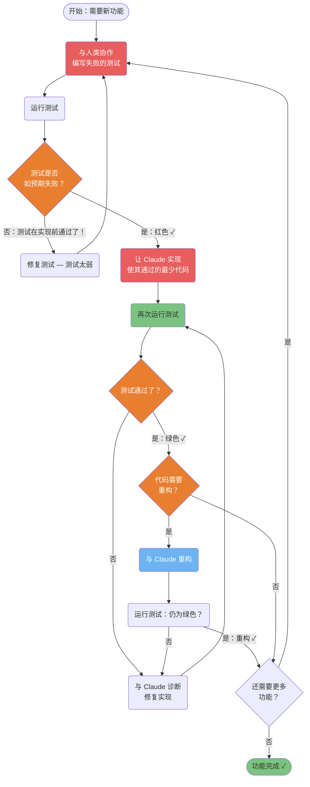
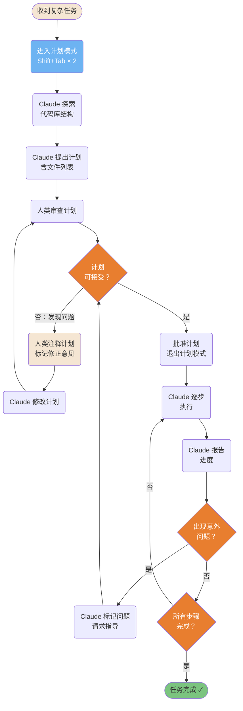
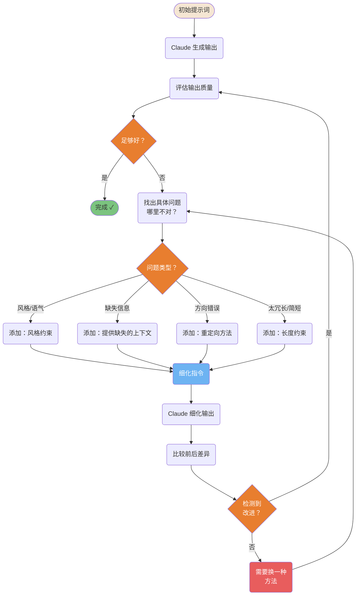
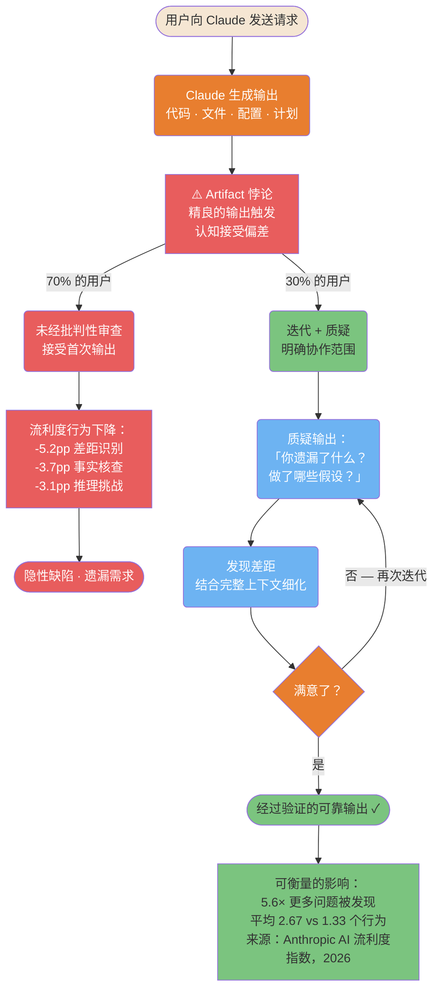

> 📚 **AI Spark Wiki** · Claude Code 知识库

---
title: "Claude Code — 开发工作流图表"
description: "TDD 循环、规范优先流水线、计划驱动工作流、迭代优化循环"
tags: [工作流, TDD, 规范优先, 计划驱动, 迭代]
---

# 开发工作流

构建 AI 辅助开发会话的经过验证的模式。

---

### TDD 红-绿-重构与 Claude 配合

适配 Claude Code 的测试驱动开发（TDD）：先写失败的测试，再让 Claude 仅实现使其通过所需的最少代码。这可以防止过度工程化，并确保测试真正验证行为。



<details>
<summary>ASCII 版本</summary>

```
编写失败的测试（红色）
        │
    运行测试
        │
  如预期失败？
  ├─ 否  → 修复测试（太弱）
  └─ 是 → 让 Claude：实现最少代码
                │
           运行测试
                │
           通过？（绿色）
           ├─ 否  → 诊断 + 修复
           └─ 是 → 需要重构？
                    ├─ 是 → 重构（重构）→ 重新运行测试
                    └─ 否  → 下一个功能
```

</details>

> **来源**：[TDD 与 Claude](../workflows/tdd-with-claude.md)

---

### 规范优先开发流水线

在写代码之前先写规范。Claude 将规范作为单一可信来源——防止计划与实际构建之间产生偏差。

```mermaid
flowchart LR
    A([想法 / 需求]) --> B(用自然语言<br/>编写 spec.md)
    B --> C(Claude 审查规范<br/>检查清晰度和完整性)
    C --> D{规范是否已<br/>获人类批准？}
    D -->|否：发现缺陷| E(完善规范<br/>弥补缺陷)
    E --> C
    D -->|是| F(根据规范<br/>生成测试)
    F --> G(根据规范 + 测试<br/>生成实现)
    G --> H(运行测试套件)
    H --> I{所有测试<br/>通过？}
    I -->|否| J(Claude 修复<br/>实现)
    J --> H
    I -->|是| K(人类审查<br/>规范 vs 输出)
    K --> L{与规范<br/>匹配？}
    L -->|否| M(更新规范<br/>或实现)
    M --> K
    L -->|是| N([合并 ✓])

    style A fill:#F5E6D3,color:#333
    style B fill:#6DB3F2,color:#fff
    style D fill:#E87E2F,color:#fff
    style I fill:#E87E2F,color:#fff
    style L fill:#E87E2F,color:#fff
    style N fill:#7BC47F,color:#333

    click A href "https://github.com/claude-code-ultimate-guide/claude-code-ultimate-guide/blob/main/guide/workflows/spec-first.md" "想法 / 需求"
    click B href "https://github.com/claude-code-ultimate-guide/claude-code-ultimate-guide/blob/main/guide/workflows/spec-first.md" "编写 spec.md"
    click C href "https://github.com/claude-code-ultimate-guide/claude-code-ultimate-guide/blob/main/guide/workflows/spec-first.md" "Claude 审查规范"
    click D href "https://github.com/claude-code-ultimate-guide/claude-code-ultimate-guide/blob/main/guide/workflows/spec-first.md" "规范获人类批准？"
    click E href "https://github.com/claude-code-ultimate-guide/claude-code-ultimate-guide/blob/main/guide/workflows/spec-first.md" "完善规范"
    click F href "https://github.com/claude-code-ultimate-guide/claude-code-ultimate-guide/blob/main/guide/workflows/spec-first.md" "根据规范生成测试"
    click G href "https://github.com/claude-code-ultimate-guide/claude-code-ultimate-guide/blob/main/guide/workflows/spec-first.md" "生成实现"
    click H href "https://github.com/claude-code-ultimate-guide/claude-code-ultimate-guide/blob/main/guide/workflows/spec-first.md" "运行测试套件"
    click I href "https://github.com/claude-code-ultimate-guide/claude-code-ultimate-guide/blob/main/guide/workflows/spec-first.md" "所有测试通过？"
    click J href "https://github.com/claude-code-ultimate-guide/claude-code-ultimate-guide/blob/main/guide/workflows/spec-first.md" "Claude 修复实现"
    click K href "https://github.com/claude-code-ultimate-guide/claude-code-ultimate-guide/blob/main/guide/workflows/spec-first.md" "人类审查"
    click L href "https://github.com/claude-code-ultimate-guide/claude-code-ultimate-guide/blob/main/guide/workflows/spec-first.md" "与规范匹配？"
    click M href "https://github.com/claude-code-ultimate-guide/claude-code-ultimate-guide/blob/main/guide/workflows/spec-first.md" "更新规范或实现"
    click N href "https://github.com/claude-code-ultimate-guide/claude-code-ultimate-guide/blob/main/guide/workflows/spec-first.md" "合并 ✓"
```



<details>
<summary>ASCII 版本</summary>

```
想法 → 编写 spec.md → Claude 审查
                             │
                       通过？─否→ 完善规范
                             │ 是
                       根据规范生成测试
                             │
                       生成实现
                             │
                       运行测试 → 通过？─否→ Claude 修复
                             │ 是
                       人类审查 → 与规范匹配？─否→ 修复
                             │ 是
                           合并 ✓
```

</details>

> **来源**：[规范优先开发](../workflows/spec-first.md)

---

### 带注释的计划驱动工作流

复杂任务受益于计划模式：Claude 探索代码库，提出计划，你进行注释，然后 Claude 只执行已批准的内容。防止大规模重构时出现意外。



<details>
<summary>ASCII 版本</summary>

```
复杂任务
     │
计划模式（Shift+Tab×2）
     │
Claude 探索代码库
     │
Claude 提出计划
     │
人类审查 ──否──► 注释 + Claude 修改 ──► 重新审查
     │ 是
批准 + 退出计划模式
     │
Claude 逐步执行
     │
意外？──是──► 标记 + 请求指导
     │ 否
完成？──否──► 继续
     │ 是
完成 ✓
```

</details>

> **来源**：[计划驱动工作流](../workflows/plan-driven.md)

---

### 迭代优化循环

输出很少在第一次就完全达到预期。这个循环为你提供了一种系统化的方式，通过有针对性的反馈来改进结果，而不是给出「让它更好」这样模糊的指令。



<details>
<summary>ASCII 版本</summary>

```
提示词 → 输出 → 评估 → 足够好？──是──► 完成
                             │ 否
                      找出具体问题
                             │
                      ┌──────┴──────────────┐
                     风格  缺失  方向  长度
                      └──────┬──────────────┘
                      细化指令
                             │
                      Claude 细化
                             │
                      更好了？──是──► 再次评估
                             │ 否
                      换一种方法
```

</details>

> **来源**：[迭代优化](../workflows/iterative-refinement.md) — 第 ~347 行

---

### AI 流利度 — 高流利度 vs 低流利度路径

当 Claude 生成看起来精良的输出时，一种认知偏差会被触发：输出看起来越完整，大多数用户对其批判性评估就越少。这就是「Artifact 悖论」，Anthropic 在 9,830 次对话中记录了这一现象。此图展示了区分高流利度用户（30%）和接受首次输出的用户（70%）的因素，以及可衡量的输出质量差异。



<details>
<summary>ASCII 版本</summary>

```
用户请求 → Claude 输出（代码 · 文件 · 配置 · 计划）
                        ↓
              ⚠️ Artifact 悖论
          精良的输出 → 认知偏差
                        ↓
    ┌───────────────────┴──────────────────────┐
70% 的用户                            30% 的用户
未经审查接受                          迭代 + 质疑
        ↓                                     ↓
流利度行为下降：              质疑：「你遗漏了什么？
-5.2pp 差距识别                        做了哪些假设？」
-3.7pp 事实核查                               ↓
-3.1pp 推理挑战               发现差距 → 细化
        ↓                                     ↓
隐性缺陷                    满意了？──否──► 迭代
                                        ↓ 是
                            经过验证的输出 ✓
                                        ↓
                           5.6× 更多问题被发现
                           平均 2.67 vs 1.33 个行为
```

</details>

> **来源**：[Anthropic AI 流利度指数](https://www.anthropic.com/research/AI-fluency-index)（Swanson 等，2026-02-23）— [指南章节：常见陷阱](../ultimate-guide.md#common-pitfalls--best-practices)
