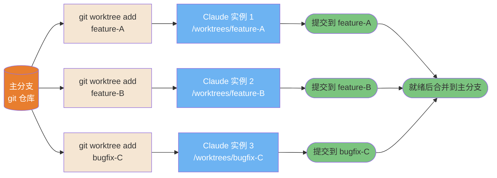
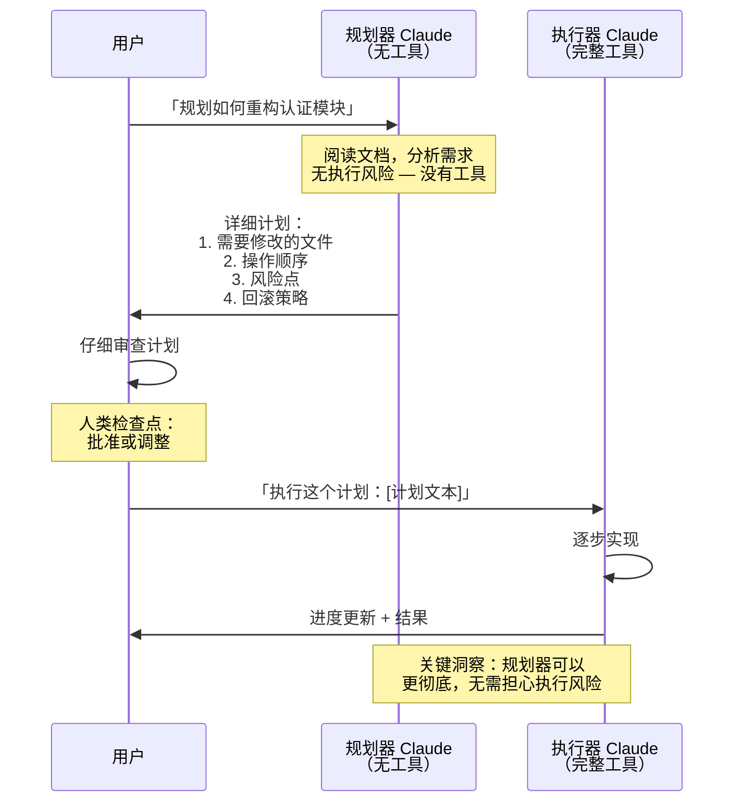
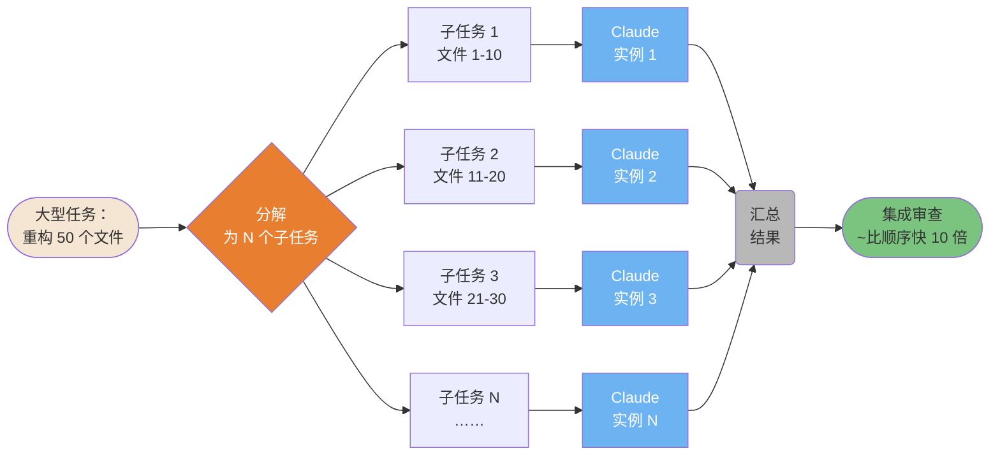
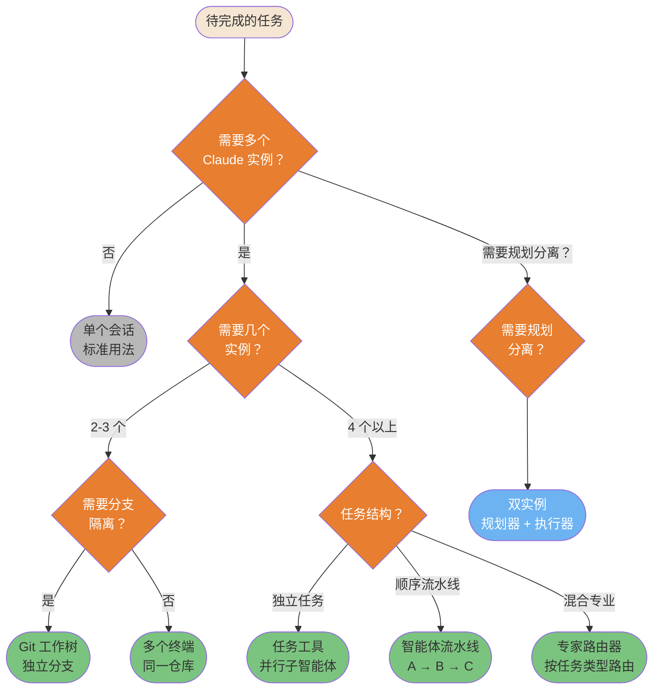

> 📚 **AI Spark Wiki** · Claude Code 知识库

---
title: "Claude Code — 多智能体模式图表"
description: "智能体拓扑结构、工作树、双实例规划、水平扩展、决策矩阵"
tags: [多智能体, 模式, 工作树, 编排, 扩展]
---

# 多智能体模式

协调多个 Claude 实例进行并行和复杂工作的模式。

---

### 智能体团队 — 3 种编排拓扑

三种经过验证的多智能体协调拓扑结构。根据任务独立性、顺序要求和专业化需求来选择。

```mermaid
flowchart TD
    subgraph ORCH["模式 1：编排器 + 工作者"]
        OL[主控智能体] --> OW1[工作者 1<br/>前端]
        OL --> OW2[工作者 2<br/>后端]
        OL --> OW3[工作者 3<br/>测试]
        OW1 & OW2 & OW3 --> OR([结果汇总])
    end

    subgraph PIPE["模式 2：流水线"]
        PA[智能体 A<br/>需求] --> PB[智能体 B<br/>实现]
        PB --> PC[智能体 C<br/>审查]
        PC --> PD([最终输出])
    end

    subgraph ROUTE["模式 3：专家路由器"]
        RR{路由器智能体<br/>分析任务} --> RC[代码智能体]
        RR --> RT[测试智能体]
        RR --> RD[文档智能体]
        RC & RT & RD --> RO([专业化结果])
    end

    style OL fill:#E87E2F,color:#fff
    style OW1 fill:#6DB3F2,color:#fff
    style OW2 fill:#6DB3F2,color:#fff
    style OW3 fill:#6DB3F2,color:#fff
    style OR fill:#7BC47F,color:#333
    style PA fill:#F5E6D3,color:#333
    style PB fill:#F5E6D3,color:#333
    style PC fill:#F5E6D3,color:#333
    style PD fill:#7BC47F,color:#333
    style RR fill:#E87E2F,color:#fff
    style RC fill:#6DB3F2,color:#fff
    style RT fill:#6DB3F2,color:#fff
    style RD fill:#6DB3F2,color:#fff
    style RO fill:#7BC47F,color:#333

    click OL href "https://github.com/claude-code-ultimate-guide/claude-code-ultimate-guide/blob/main/guide/workflows/agent-teams.md" "主控智能体"
    click OW1 href "https://github.com/claude-code-ultimate-guide/claude-code-ultimate-guide/blob/main/guide/workflows/agent-teams.md" "工作者：前端"
    click OW2 href "https://github.com/claude-code-ultimate-guide/claude-code-ultimate-guide/blob/main/guide/workflows/agent-teams.md" "工作者：后端"
    click OW3 href "https://github.com/claude-code-ultimate-guide/claude-code-ultimate-guide/blob/main/guide/workflows/agent-teams.md" "工作者：测试"
    click OR href "https://github.com/claude-code-ultimate-guide/claude-code-ultimate-guide/blob/main/guide/workflows/agent-teams.md" "结果汇总"
    click PA href "https://github.com/claude-code-ultimate-guide/claude-code-ultimate-guide/blob/main/guide/workflows/agent-teams.md" "智能体 A：需求"
    click PB href "https://github.com/claude-code-ultimate-guide/claude-code-ultimate-guide/blob/main/guide/workflows/agent-teams.md" "智能体 B：实现"
    click PC href "https://github.com/claude-code-ultimate-guide/claude-code-ultimate-guide/blob/main/guide/workflows/agent-teams.md" "智能体 C：审查"
    click PD href "https://github.com/claude-code-ultimate-guide/claude-code-ultimate-guide/blob/main/guide/workflows/agent-teams.md" "最终输出"
    click RR href "https://github.com/claude-code-ultimate-guide/claude-code-ultimate-guide/blob/main/guide/workflows/agent-teams.md" "路由器智能体"
    click RC href "https://github.com/claude-code-ultimate-guide/claude-code-ultimate-guide/blob/main/guide/workflows/agent-teams.md" "代码智能体"
    click RT href "https://github.com/claude-code-ultimate-guide/claude-code-ultimate-guide/blob/main/guide/workflows/agent-teams.md" "测试智能体"
    click RD href "https://github.com/claude-code-ultimate-guide/claude-code-ultimate-guide/blob/main/guide/workflows/agent-teams.md" "文档智能体"
    click RO href "https://github.com/claude-code-ultimate-guide/claude-code-ultimate-guide/blob/main/guide/workflows/agent-teams.md" "专业化结果"
```



<details>
<summary>ASCII 版本</summary>

```
编排器 + 工作者：         流水线：                路由器：

   主控智能体            智能体 A（需求）          路由器
  /    |     \                │                  /  |  \
W1    W2     W3          智能体 B（实现）       代码 测试 文档
  \   |     /                 │                  \  |  /
   汇总                  智能体 C（审查）          结果
                               │
                           最终输出
```

</details>

> **来源**：[智能体团队](../workflows/agent-teams.md) — 第 ~59 行

---

### Git 工作树多实例模式

Git 工作树实现真正的并行开发：每个 Claude 实例在独立分支的独立工作目录中工作。无冲突，无上下文混淆。



<details>
<summary>ASCII 版本</summary>

```
主仓库
├── git worktree add feature-A → Claude 1 → 提交到 feature-A
├── git worktree add feature-B → Claude 2 → 提交到 feature-B
└── git worktree add bugfix-C  → Claude 3 → 提交到 bugfix-C

无冲突：独立工作目录，独立分支
全部完成后合并回主分支
```

</details>

> **来源**：[Git 工作树](../ultimate-guide.md#git-worktrees) — 第 ~10634 行

---

### 双实例规划模式（Jon Williams）

使用两个 Claude 实例将规划与执行分离，可以防止代价高昂的错误：规划器 Claude 没有工具，所以在分析期间不会意外执行任何操作。



<details>
<summary>ASCII 版本</summary>

```
用户 → 规划器（无工具）：「规划 X」
         │
    [安全分析，无执行风险]
         │
规划器 → 用户：详细计划
         │
用户审查 + 批准
         │
用户 → 执行器（完整工具）：「执行：[计划]」
         │
    [带完整上下文地实现]
         │
执行器 → 用户：结果
```

</details>

> **来源**：[双实例规划](../workflows/dual-instance-planning.md)

---

### Boris Cherny 水平扩展模式

当任务可以并行化时，同时派生 N 个 Claude 实例，而不是顺序运行。加速比与任务独立性成正比。



<details>
<summary>ASCII 版本</summary>

```
大型任务
     │
分解为 N 个独立子任务
     │
┌────┼────┐
│    │    │
I1  I2  I3……（并行）
│    │    │
└────┼────┘
     │
汇总 → 集成审查
（~比顺序快 10 倍）
```

</details>

> **来源**：[水平扩展](../ultimate-guide.md#horizontal-scaling) — 第 ~9617 行

---

### 多实例决策矩阵

并非每个任务都需要多个实例。这个决策树根据任务特征引导你选择正确的模式。



<details>
<summary>ASCII 版本</summary>

```
需要多个实例？
├─ 否 → 单个会话
├─ 是 → 需要几个？
│        ├─ 2-3 个 → 需要分支隔离？
│        │        ├─ 是 → Git 工作树
│        │        └─ 否  → 多个终端
│        └─ 4 个以上 → 任务结构？
│                 ├─ 独立 → 任务工具（并行子智能体）
│                 ├─ 顺序  → 智能体流水线 A→B→C
│                 └─ 混合  → 专家路由器
└─ 需要规划分离？ → 双实例（规划器 + 执行器）
```

</details>

> **来源**：[多实例模式](../ultimate-guide.md#multi-instance-patterns) — 第 ~11176 行
