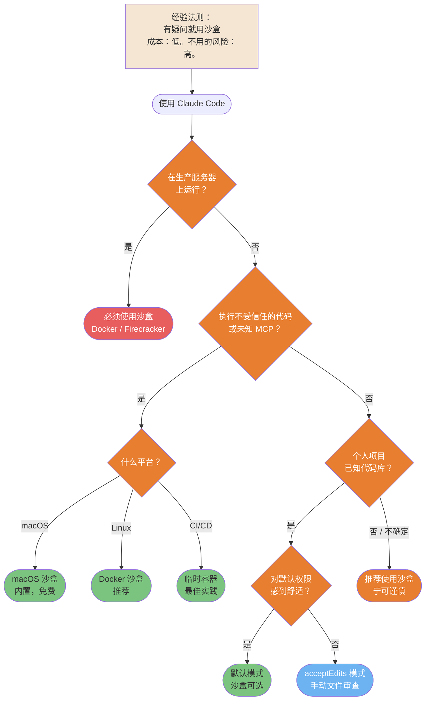

> 📚 **AI Spark Wiki** · Claude Code 知识库

---
title: "Claude Code — 安全与生产环境图表"
description: "3 层防御、沙盒决策、验证悖论、CI/CD 流水线"
tags: [安全, 生产, 沙盒, CI/CD, 防御]
---

# 安全与生产环境

在敏感和生产环境中安全运行 Claude Code 的模式。

---

### 安全 3 层防御模型

Claude Code 的纵深防御：预防层阻止大多数威胁，检测层捕获漏网之鱼，响应层限制爆炸半径。任何单一层次都不够充分。

```mermaid
flowchart LR
    THREAT([威胁 / 攻击]) --> L1

    subgraph L1["🛡️ 第 1 层：预防"]
        P1[MCP 服务器审查<br/>安装前阅读源码]
        P2[CLAUDE.md 限制<br/>定义禁止操作]
        P3[.claudeignore<br/>隐藏敏感文件]
        P4[最小权限<br/>bypassPermissions 仅限 CI]
    end

    subgraph L2["🔍 第 2 层：检测"]
        D1[工具前钩子<br/>记录所有工具调用]
        D2[审计日志<br/>完整历史记录]
        D3[异常告警<br/>意外的文件访问]
    end

    subgraph L3["🔒 第 3 层：响应"]
        R1[沙盒隔离<br/>Docker / Firecracker]
        R2[权限关卡<br/>高风险操作需人工审批]
        R3[回滚能力<br/>git revert、备份]
    end

    L1 -->|被绕过| L2
    L2 -->|被绕过| L3
    L3 --> BLOCKED([威胁已遏制])

    style THREAT fill:#E85D5D,color:#fff
    style P1 fill:#7BC47F,color:#333
    style P2 fill:#7BC47F,color:#333
    style P3 fill:#7BC47F,color:#333
    style P4 fill:#7BC47F,color:#333
    style D1 fill:#6DB3F2,color:#fff
    style D2 fill:#6DB3F2,color:#fff
    style D3 fill:#6DB3F2,color:#fff
    style R1 fill:#E87E2F,color:#fff
    style R2 fill:#E87E2F,color:#fff
    style R3 fill:#E87E2F,color:#fff
    style BLOCKED fill:#7BC47F,color:#333

    click THREAT href "https://github.com/claude-code-ultimate-guide/claude-code-ultimate-guide/blob/main/guide/security/security-hardening.md" "威胁 / 攻击"
    click P1 href "https://github.com/claude-code-ultimate-guide/claude-code-ultimate-guide/blob/main/guide/security/security-hardening.md#part-1-prevention-before-you-start" "MCP 服务器审查"
    click P2 href "https://github.com/claude-code-ultimate-guide/claude-code-ultimate-guide/blob/main/guide/security/security-hardening.md#part-1-prevention-before-you-start" "CLAUDE.md 限制"
    click P3 href "https://github.com/claude-code-ultimate-guide/claude-code-ultimate-guide/blob/main/guide/security/security-hardening.md#part-1-prevention-before-you-start" ".claudeignore"
    click P4 href "https://github.com/claude-code-ultimate-guide/claude-code-ultimate-guide/blob/main/guide/security/security-hardening.md#part-1-prevention-before-you-start" "最小权限"
    click D1 href "https://github.com/claude-code-ultimate-guide/claude-code-ultimate-guide/blob/main/guide/security/security-hardening.md#part-2-detection-while-you-work" "工具前钩子"
    click D2 href "https://github.com/claude-code-ultimate-guide/claude-code-ultimate-guide/blob/main/guide/security/security-hardening.md#part-2-detection-while-you-work" "审计日志"
    click D3 href "https://github.com/claude-code-ultimate-guide/claude-code-ultimate-guide/blob/main/guide/security/security-hardening.md#part-2-detection-while-you-work" "异常告警"
    click R1 href "https://github.com/claude-code-ultimate-guide/claude-code-ultimate-guide/blob/main/guide/security/security-hardening.md#part-3-response-when-things-go-wrong" "沙盒隔离"
    click R2 href "https://github.com/claude-code-ultimate-guide/claude-code-ultimate-guide/blob/main/guide/security/security-hardening.md#part-3-response-when-things-go-wrong" "权限关卡"
    click R3 href "https://github.com/claude-code-ultimate-guide/claude-code-ultimate-guide/blob/main/guide/security/security-hardening.md#part-3-response-when-things-go-wrong" "回滚能力"
    click BLOCKED href "https://github.com/claude-code-ultimate-guide/claude-code-ultimate-guide/blob/main/guide/security/security-hardening.md" "威胁已遏制"
```



<details>
<summary>ASCII 版本</summary>

```
威胁
  │
第 1 层：预防
  - MCP 审查 + CLAUDE.md 限制 + .claudeignore
  │（被绕过）→
第 2 层：检测
  - 钩子日志 + 审计日志 + 异常告警
  │（被绕过）→
第 3 层：响应
  - 沙盒 + 权限关卡 + 回滚
  │
已遏制
```

</details>

> **来源**：[安全加固](../security/security-hardening.md) — 完整指南

---

### 沙盒决策树

沙盒化会带来额外开销。使用这个决策树来判断你的情况是强制使用、推荐使用还是可选使用。



<details>
<summary>ASCII 版本</summary>

```
生产服务器？→ 是 → 必须使用沙盒（Docker/Firecracker）
     │ 否
不受信任的代码或未知 MCP？
  ├─ 是 → macOS 沙盒 / Docker / 临时容器
  └─ 否  → 已知代码库的个人项目？
            ├─ 是 → 默认或 acceptEdits（沙盒可选）
            └─ 否  → 推荐使用沙盒

规则：有疑问就用沙盒。
```

</details>

> **来源**：[原生沙盒](../security/sandbox-native.md) — 第 ~512 行

---

### 验证悖论

让 Claude 验证自己的工作是循环论证。生成 bug 的同一个模型在审查时往往也会遗漏它。这种反模式会导致生产事故。

```mermaid
flowchart TD
    subgraph BAD["❌ 反模式：循环验证"]
        BA([Claude 编写代码]) --> BB(询问 Claude：<br/>「这正确吗？」)
        BB --> BC{Claude 说：<br/>「看起来没问题！」}
        BC -->|部署| BD([生产环境中出现 Bug])
        BC --> BE["失败原因：<br/>同一个模型<br/>同样的训练偏差<br/>同样的盲点"]
        style BA fill:#E85D5D,color:#fff
        style BD fill:#E85D5D,color:#fff
        style BE fill:#E85D5D,color:#fff
        style BC fill:#E87E2F,color:#fff
    end

    subgraph GOOD["✅ 最佳实践：独立验证"]
        GA([Claude 编写代码]) --> GB(人类审查<br/>关键部分)
        GA --> GC(自动化测试套件<br/>独立运行)
        GA --> GD(不同工具验证<br/>Semgrep、ESLint 等)
        GB & GC & GD --> GE{所有检查<br/>通过？}
        GE -->|是| GF([可以安全部署])
        GE -->|否| GG([部署前修复])
        style GA fill:#7BC47F,color:#333
        style GB fill:#7BC47F,color:#333
        style GC fill:#7BC47F,color:#333
        style GD fill:#7BC47F,color:#333
        style GF fill:#7BC47F,color:#333
        style GE fill:#E87E2F,color:#fff
        style GG fill:#6DB3F2,color:#fff
    end

    click BA href "https://github.com/claude-code-ultimate-guide/claude-code-ultimate-guide/blob/main/guide/security/production-safety.md" "Claude 编写代码（反模式）"
    click BB href "https://github.com/claude-code-ultimate-guide/claude-code-ultimate-guide/blob/main/guide/security/production-safety.md" "让 Claude 验证"
    click BC href "https://github.com/claude-code-ultimate-guide/claude-code-ultimate-guide/blob/main/guide/security/production-safety.md" "Claude 说没问题"
    click BD href "https://github.com/claude-code-ultimate-guide/claude-code-ultimate-guide/blob/main/guide/security/production-safety.md" "生产环境中出现 Bug"
    click BE href "https://github.com/claude-code-ultimate-guide/claude-code-ultimate-guide/blob/main/guide/security/production-safety.md" "失败原因"
    click GA href "https://github.com/claude-code-ultimate-guide/claude-code-ultimate-guide/blob/main/guide/security/production-safety.md" "Claude 编写代码（最佳实践）"
    click GB href "https://github.com/claude-code-ultimate-guide/claude-code-ultimate-guide/blob/main/guide/security/production-safety.md" "人类审查关键部分"
    click GC href "https://github.com/claude-code-ultimate-guide/claude-code-ultimate-guide/blob/main/guide/security/production-safety.md" "自动化测试套件"
    click GD href "https://github.com/claude-code-ultimate-guide/claude-code-ultimate-guide/blob/main/guide/security/production-safety.md" "不同工具验证"
    click GE href "https://github.com/claude-code-ultimate-guide/claude-code-ultimate-guide/blob/main/guide/security/production-safety.md" "所有检查通过？"
    click GF href "https://github.com/claude-code-ultimate-guide/claude-code-ultimate-guide/blob/main/guide/security/production-safety.md" "可以安全部署"
    click GG href "https://github.com/claude-code-ultimate-guide/claude-code-ultimate-guide/blob/main/guide/security/production-safety.md" "部署前修复"
```



<details>
<summary>ASCII 版本</summary>

```
差：Claude 编写 → Claude 检查 → 「没问题」→ 部署 → Bug
   （同一模型，同样的偏差，循环论证）

好：Claude 编写 → 人类审查（关键部分）
                → 自动化测试（独立）
                → 静态分析（不同工具）
                → 全部通过？→ 部署 ✓
```

</details>

> **来源**：[生产安全](../security/production-safety.md) — 第 ~639 行

---

### CI/CD 集成流水线

Claude Code 可以在非交互模式下在 CI/CD 流水线中运行，对每个 PR 进行自动化代码审查、文档和质量检查。

```mermaid
flowchart LR
    PR([PR 创建]) --> GH{GitHub Actions<br/>触发}
    GH --> ENV[设置环境<br/>ANTHROPIC_API_KEY 密钥]
    ENV --> CC[claude --print --headless<br/>「运行质量检查」]

    CC --> subgraph TASKS["并行检查"]
        T1[代码风格检查<br/>ESLint / Prettier]
        T2[测试套件<br/>Vitest / Jest]
        T3[安全扫描<br/>Semgrep MCP]
        T4[文档完整性<br/>检查导出]
    end

    T1 & T2 & T3 & T4 --> AGG{所有<br/>检查通过？}
    AGG -->|是| OK([✓ 检查通过<br/>等待人工审查])
    AGG -->|否| FAIL([✗ 在 PR 上报告失败])
    FAIL --> FIX([开发者修复<br/>重新触发 CI])
    FIX --> CC

    style PR fill:#F5E6D3,color:#333
    style GH fill:#B8B8B8,color:#333
    style CC fill:#E87E2F,color:#fff
    style T1 fill:#6DB3F2,color:#fff
    style T2 fill:#6DB3F2,color:#fff
    style T3 fill:#6DB3F2,color:#fff
    style T4 fill:#6DB3F2,color:#fff
    style AGG fill:#E87E2F,color:#fff
    style OK fill:#7BC47F,color:#333
    style FAIL fill:#E85D5D,color:#fff
    style FIX fill:#F5E6D3,color:#333

    click PR href "https://github.com/claude-code-ultimate-guide/claude-code-ultimate-guide/blob/main/guide/ultimate-guide.md#93-cicd-integration" "PR 创建"
    click GH href "https://github.com/claude-code-ultimate-guide/claude-code-ultimate-guide/blob/main/guide/ultimate-guide.md#93-cicd-integration" "GitHub Actions 触发"
    click ENV href "https://github.com/claude-code-ultimate-guide/claude-code-ultimate-guide/blob/main/guide/ultimate-guide.md#93-cicd-integration" "设置环境"
    click CC href "https://github.com/claude-code-ultimate-guide/claude-code-ultimate-guide/blob/main/guide/ultimate-guide.md#93-cicd-integration" "claude --print --headless"
    click T1 href "https://github.com/claude-code-ultimate-guide/claude-code-ultimate-guide/blob/main/guide/ultimate-guide.md#93-cicd-integration" "代码风格检查"
    click T2 href "https://github.com/claude-code-ultimate-guide/claude-code-ultimate-guide/blob/main/guide/ultimate-guide.md#93-cicd-integration" "测试套件"
    click T3 href "https://github.com/claude-code-ultimate-guide/claude-code-ultimate-guide/blob/main/guide/ultimate-guide.md#93-cicd-integration" "安全扫描"
    click T4 href "https://github.com/claude-code-ultimate-guide/claude-code-ultimate-guide/blob/main/guide/ultimate-guide.md#93-cicd-integration" "文档完整性"
    click AGG href "https://github.com/claude-code-ultimate-guide/claude-code-ultimate-guide/blob/main/guide/ultimate-guide.md#93-cicd-integration" "所有检查通过？"
    click OK href "https://github.com/claude-code-ultimate-guide/claude-code-ultimate-guide/blob/main/guide/ultimate-guide.md#93-cicd-integration" "检查通过"
    click FAIL href "https://github.com/claude-code-ultimate-guide/claude-code-ultimate-guide/blob/main/guide/ultimate-guide.md#93-cicd-integration" "在 PR 上报告失败"
    click FIX href "https://github.com/claude-code-ultimate-guide/claude-code-ultimate-guide/blob/main/guide/ultimate-guide.md#93-cicd-integration" "开发者修复"
```

<details>
<summary>ASCII 版本</summary>

```
PR 创建 → GitHub Actions → 设置 ANTHROPIC_API_KEY
                                    │
                          claude --print --headless
                                    │
                    ┌───────────────┼────────────────┐
                  风格           测试            安全
                                    │
                          所有通过？──否──► PR 失败 + 报告
                            │ 是
                          ✓ 通过 → 人工审查 → 合并
```

</details>

> **来源**：[CI/CD 集成](../ultimate-guide.md#cicd-integration) — 第 ~6835 行
