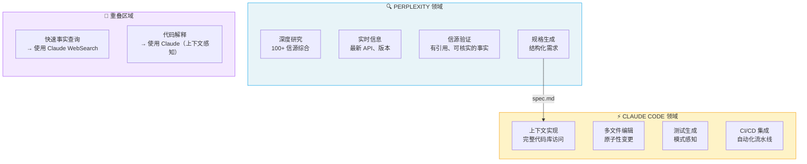
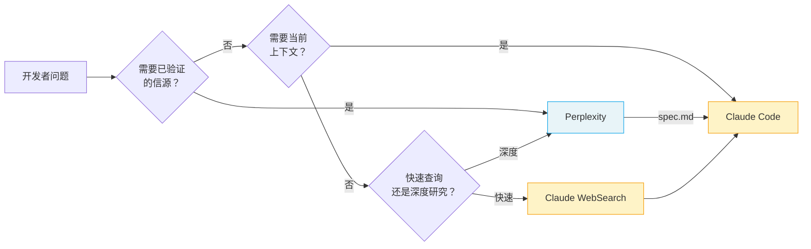
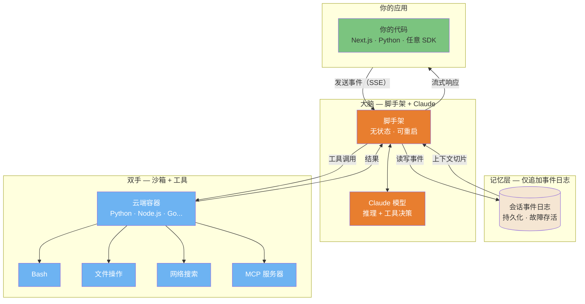
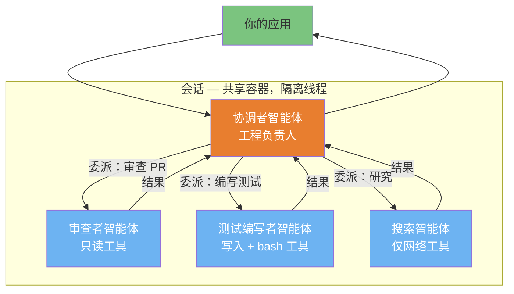

> 📚 **AI Spark Wiki** · Claude Code 知识库

---
title: "AI 生态系统：利用互补工具最大化 Claude Code 效能"
description: "何时使用 Claude Code 与互补 AI 工具，以及如何将它们串联以实现最优工作流"
tags: [ai-ecosystem, guide, workflows, integration]
---

# AI 生态系统：利用互补工具最大化 Claude Code 效能

> **阅读时间**：约 25 分钟
>
> **目的**：本指南帮助你了解何时使用 Claude Code 与互补 AI 工具，以及如何将它们串联以实现最优工作流。

---

## 目录

- [简介](#简介)
- [1. Perplexity AI（研究与信源）](#1-perplexity-ai研究与信源)
- [2. Google Gemini（视觉理解）](#2-google-gemini视觉理解)
- [3. Kimi（PPTX 与长文档生成）](#3-kimipptx-与长文档生成)
- [4. NotebookLM（综合分析与音频）](#4-notebooklm综合分析与音频)
- [5. 语音转文字工具（Wispr Flow、Superwhisper）](#5-语音转文字工具wispr-flowsuperwhisper)
- [6. IDE 集成工具（Cursor、Windsurf、Cline）](#6-ide-集成工具cursorwindsurfcline)
- [6.1 Google Antigravity（智能体优先 IDE）](#61-google-antigravity智能体优先-ide)
- [7. UI 原型工具（v0、Bolt、Lovable）](#7-ui-原型工具v0boltlovable)
- [8. 工作流编排](#8-工作流编排)
- [9. 成本与订阅策略](#9-成本与订阅策略)
- [10. Claude Cowork（研究预览）](#10-claude-cowork研究预览)
- [11. AI 编程智能体矩阵](#11-ai-编程智能体矩阵)
- [11.1 Goose：开源替代方案（Block）](#111-goose开源替代方案block)
- [11.2 从业者洞见](#112-从业者洞见)
- [11.3 何时自建 vs 直接使用](#113-何时自建-vs-直接使用)
- [11.4 技能分发平台](#114-技能分发平台)
- [12. 上下文打包工具](#12-上下文打包工具)
- [14. Claude 托管智能体（云端托管平台）](#14-claude-托管智能体云端托管平台)
- [15. Project Glasswing 与 Claude Mythos 预览（防御性安全）](#15-project-glasswing-与-claude-mythos-预览防御性安全)
- [16. 逐 Token 解析：LLM 的工作原理（交互式指南）](#16-逐-token-解析llm-的工作原理交互式指南)
- [附录：即用型提示词](#附录即用型提示词)
- [替代服务商（社区变通方案）](#替代服务商社区变通方案)

---

## 简介

### 理念：增强而非替代

Claude Code 的优势在于：
- **跨整个代码库的上下文推理**
- **多文件实现**与测试集成
- **持久化记忆**（通过 CLAUDE.md 文件）
- **CLI 自动化**（用于 CI/CD 流水线）
- **智能体任务完成**（几乎无需人工监督）

Claude Code 设计上不擅长的事项：
- **带信源验证的实时网络搜索**（WebSearch 存在但功能有限）
- **图像生成**（无原生能力）
- **PowerPoint/幻灯片生成**（无 PPTX 输出）
- **音频合成**（无 TTS）
- **基于浏览器的原型设计**（无可视化预览）

目标不是找"更好"的工具，而是在**每个步骤用对工具**并进行串联。

### 互补矩阵

| 任务 | Claude Code | 更佳替代方案 | 原因 |
|------|-------------|-------------|------|
| **代码实现** | ✅ 最佳 | - | 上下文推理 + 文件编辑 |
| **带信源的深度研究** | ⚠️ 有限 | Perplexity Pro | 100+ 已验证信源 |
| **图像 → 代码** | ⚠️ 有限 | Gemini 2.5+ | 更优的视觉理解 |
| **幻灯片生成** | ❌ 无 | Kimi.com | 原生 PPTX 导出 |
| **音频概览** | ❌ 无 | NotebookLM | 播客式综合 |
| **浏览器原型** | ❌ 无 | v0.dev, Bolt | 实时预览 |
| **IDE 自动补全** | ❌ 无 | Copilot, Cursor | 内联提示 |

---

## 1. Perplexity AI（研究与信源）

### 互补关系图

下图展示了 Perplexity 与 Claude Code 在开发工作流中如何相互补充：



**核心洞见**：Perplexity 回答"我们应该构建什么？"→ Claude Code 回答"在这个项目里怎么构建？"

### 决策流程



### 何时选择 Perplexity 而非 Claude

| 场景 | 使用 Perplexity | 使用 Claude |
|------|----------------|------------|
| "X 的最新 API 是什么？" | ✅ | ⚠️ 知识截止日期限制 |
| "比较 5 个认证库" | ✅ 有信源 | ⚠️ 可能产生幻觉 |
| "解释这个报错信息" | ⚠️ 通用回答 | ✅ 上下文感知 |
| "在我的代码库里实现认证" | ❌ 无文件访问 | ✅ 完整访问 |

### 面向开发者的 Perplexity Pro 功能

**深度研究模式**
- 将 100+ 信源综合为结构化输出
- 耗时 3-5 分钟，但产出全面的规格文档
- 导出为 Markdown → 传入 Claude Code

**模型选择**
- Claude Sonnet 4：最适合技术文档写作
- GPT-4o：适合代码片段
- Sonar Pro：快速事实查询

**Labs 功能**
- Spaces：持久化项目上下文
- 代码块：带语法高亮的导出
- 图表：从数据自动生成

### 集成工作流

#### 模式 1：研究 → 规格 → 代码

```
┌─────────────────────────────────────────────────────────┐
│ 1. PERPLEXITY（深度研究）                                │
│    "研究 Next.js 15 中 JWT 刷新 Token 的最佳实践。       │
│     包括安全注意事项、常见陷阱和库推荐。"                │
│                                                         │
│    → 输出：2000 字规格文档（含信源）                    │
└───────────────────────────┬─────────────────────────────┘
                            ↓ 导出为 spec.md
┌─────────────────────────────────────────────────────────┐
│ 2. CLAUDE CODE                                          │
│    > claude                                             │
│    "按照 spec.md 实现 JWT 刷新 Token。                  │
│     使用推荐的 jose 库。"                               │
│                                                         │
│    → 输出：含测试的可运行实现                           │
└─────────────────────────────────────────────────────────┘
```

#### 模式 2：并排窗格工作流

使用 tmux 或终端分屏：

```bash
# 左侧窗格：Perplexity（浏览器或 CLI）
perplexity "Best practices for rate limiting in Express"

# 右侧窗格：Claude Code（实现）
claude "Add rate limiting to API. Check spec.md for approach."
```

### 对比：Claude WebSearch vs Perplexity

| 功能 | Claude WebSearch | Perplexity Pro |
|------|-----------------|----------------|
| 信源数量 | ~5-10 | 100+（深度研究） |
| 信源验证 | 基础 | 完整引用 |
| 实时数据 | 是 | 是 |
| 导出格式 | 上下文中的文本 | Markdown、代码块 |
| 最适合 | 快速查询 | 全面研究 |
| 费用 | 已包含 | $20/月（Pro） |

**建议**：快速事实核查用 Claude WebSearch。在进行任何需要理解生态系统的重要实现前，先用 Perplexity 深度研究。

---

## 2. Google Gemini（视觉理解）

### 开发者使用场景

**Gemini 的视觉超能力**：
- UI 原型图 → HTML/CSS/React 代码（90%+ 还原度）
- 图表解读（流程图 → Mermaid/代码）
- 截图调试（"为什么这里看起来有问题？"）
- 设计 Token 提取（从图片中提取颜色、间距）

### 面向开发的 Gemini 2.5 Pro

以下方面表现最佳：
- **复杂 UI 转换**：上传 Figma 截图 → 获得 Tailwind 组件
- **图表理解**：架构图 → 实现方案
- **错误分析**：上传报错截图 → 获得调试步骤

模型选择：
- **Gemini 2.5 Pro**：复杂视觉推理、长上下文
- **Gemini 2.5 Flash**：快速视觉任务、成本更低

### 集成工作流

#### 模式：视觉 → 代码

```
┌─────────────────────────────────────────────────────────┐
│ 1. GEMINI 2.5 PRO                                       │
│    上传：Figma 设计的 screenshot.png                     │
│    提示词："将其转换为使用 Tailwind CSS 的 React 组件。  │
│            使用语义化 HTML 并包含响应式断点。"           │
│                                                         │
│    → 输出：JSX + Tailwind 代码                          │
└───────────────────────────┬─────────────────────────────┘
                            ↓ 复制到剪贴板
┌─────────────────────────────────────────────────────────┐
│ 2. CLAUDE CODE                                          │
│    > claude                                             │
│    "为我们的 Next.js 项目优化这个组件。                  │
│     添加正确的 TypeScript 类型、我们的 Button 组件，     │
│     并接入认证上下文。"                                  │
│                                                         │
│    → 输出：生产就绪的组件                               │
└─────────────────────────────────────────────────────────┘
```

#### 模式：图表 → 实现方案

```
┌─────────────────────────────────────────────────────────┐
│ 1. GEMINI                                               │
│    上传：architecture-diagram.png                       │
│    提示词："分析这张架构图。                             │
│            输出相同结构的 Mermaid 图表，并列出组件。"    │
│                                                         │
│    → 输出：Mermaid 代码 + 组件列表                      │
└───────────────────────────┬─────────────────────────────┘
                            ↓ 将 Mermaid 粘贴到 CLAUDE.md
┌─────────────────────────────────────────────────────────┐
│ 2. CLAUDE CODE                                          │
│    "实现 CLAUDE.md 架构图中的 UserService 组件。        │
│     先写接口，再写实现。"                               │
│                                                         │
│    → 输出：已实现的服务                                 │
└─────────────────────────────────────────────────────────┘
```

### 图像生成替代方案

用于生成图表、原型图或视觉素材：

| 工具 | 最适合 | 格式 | 质量 |
|------|--------|------|------|
| Ideogram 3.0 | UI 原型图、图标 | PNG, SVG | 高 |
| Recraft v3 | 矢量图、Logo | SVG, PNG | 非常高 |
| Midjourney | 艺术视觉 | PNG | 艺术风格 |
| DALL-E 3 | 快速概念图 | PNG | 良好 |

**生成图像的工作流**：
1. 用所选工具生成图像
2. 上传到 Gemini 进行 → 代码转换
3. 用 Claude Code 精细化

---

## 3. Kimi（PPTX 与长文档生成）

### Kimi 是什么？

[Kimi](https://kimi.ai) 是月之暗面的 AI 助手，以下特性值得关注：
- **原生 PPTX 生成**（真实幻灯片，非 Markdown）
- **128K+ Token 上下文**（可处理整个代码库）
- **代码感知布局**（幻灯片中的语法高亮）
- **多语言支持**（中英文表现出色）

### 开发者使用场景

**演示文稿生成**：
- PR 摘要 → 利益相关方汇报材料
- 架构文档 → 可视化演示
- 技术规格 → 团队入职幻灯片
- 代码讲解 → 培训材料

### 集成工作流

#### 模式：代码 → 演示文稿

```
┌─────────────────────────────────────────────────────────┐
│ 1. CLAUDE CODE                                          │
│    "生成最近 5 次提交所有变更的摘要。                    │
│     格式为 Markdown，包含以下章节：                      │
│     概述、主要变更、破坏性变更、迁移说明。"              │
│                                                         │
│    → 输出：changes-summary.md                          │
└───────────────────────────┬─────────────────────────────┘
                            ↓ 上传到 Kimi
┌─────────────────────────────────────────────────────────┐
│ 2. KIMI                                                 │
│    提示词："根据此摘要为非技术利益相关方                 │
│            制作 10 页幻灯片。                            │
│            使用商务友好的语言。                          │
│            每个主要功能单独一页。"                       │
│                                                         │
│    → 输出：stakeholder-update.pptx                      │
└─────────────────────────────────────────────────────────┘
```

#### 模式：架构 → 培训材料

```
┌─────────────────────────────────────────────────────────┐
│ 1. CLAUDE CODE（使用 /explain 或等效命令）               │
│    "解释本项目中的认证流程。                             │
│     包含时序图（Mermaid）和关键文件。"                   │
│                                                         │
│    → 输出：含图表的 auth-explanation.md                 │
└───────────────────────────┬─────────────────────────────┘
                            ↓ 上传到 Kimi
┌─────────────────────────────────────────────────────────┐
│ 2. KIMI                                                 │
│    "为新开发者制作入职演示文稿。                         │
│     20 页，涵盖认证系统。                               │
│     在相关位置包含代码片段和图表。"                      │
│                                                         │
│    → 输出：auth-onboarding.pptx                         │
└─────────────────────────────────────────────────────────┘
```

### 对比：演示文稿工具

| 工具 | 优势 | 劣势 | 最适合 |
|------|------|------|--------|
| **Kimi** | 原生 PPTX、代码感知 | 设计精致度稍低 | 技术演示 |
| **Gamma.app** | 精美模板 | 代码支持较弱 | 商业演示 |
| **Tome** | AI 原生、视觉效果好 | 价格较贵 | 市场营销 |
| **Beautiful.ai** | 智能模板 | 需手动操作 | 注重设计 |
| **Marp** | Markdown → 幻灯片 | 需手动样式 | 开发者演示 |

**建议**：有代码的技术内容用 Kimi。商业/投资人演示用 Gamma。

---

## 4. NotebookLM（综合分析与音频）

### 开发者使用场景

**文档综合**：
- 上传 50+ 文件 → 获得统一理解
- 对代码库提问
- 生成音频概览，利用通勤时间学习

**音频概览功能**：
- 从上传内容生成 10-15 分钟"播客"
- 两位 AI 主持人讨论你的文档
- 非常适合入职培训或复习大型系统

### 集成工作流

#### 模式：代码库 → 音频入职培训

```
┌─────────────────────────────────────────────────────────┐
│ 1. 导出（通过 Claude Code 或手动）                       │
│    "将 docs/ 中所有 Markdown 文件及主 README             │
│     导出到单个 combined-docs.md 文件。"                  │
│                                                         │
│    → 输出：combined-docs.md（50K Token）                │
└───────────────────────────┬─────────────────────────────┘
                            ↓ 上传到 NotebookLM
┌─────────────────────────────────────────────────────────┐
│ 2. NOTEBOOKLM                                           │
│    - 添加 combined-docs.md 为信源                       │
│    - 点击"生成音频概览"                                 │
│    - 等待 3-5 分钟生成                                  │
│                                                         │
│    → 输出：12 分钟系统解说音频                          │
└───────────────────────────┬─────────────────────────────┘
                            ↓ 通勤途中收听
┌─────────────────────────────────────────────────────────┐
│ 3. 回到 CLAUDE CODE                                     │
│    "根据我的音频概览笔记：                              │
│     [粘贴笔记]                                          │
│     帮我更详细地理解认证流程。"                          │
│                                                         │
│    → 输出：上下文感知的深度解析                         │
└─────────────────────────────────────────────────────────┘
```

#### 模式：多信源综合

```
┌─────────────────────────────────────────────────────────┐
│ NOTEBOOKLM                                              │
│ 上传多个信源：                                          │
│ - 你的代码库文档（combined-docs.md）                    │
│ - 框架文档（Next.js 文档 PDF）                          │
│ - 相关文章（URL 或 PDF）                                │
│                                                         │
│ 提问："我们的认证实现与 Next.js 最佳实践相比如何？"     │
│                                                         │
│    → 输出：带引用的比较分析                             │
└─────────────────────────────────────────────────────────┘
```

### 导出到 CLAUDE.md

NotebookLM 综合分析后，将关键洞见导出到你的项目：

```markdown
## 架构洞见（来自 NotebookLM 综合分析）

### 关键模式
- 服务层使用仓储模式
- 认证流程遵循带 PKCE 的 OAuth2
- 状态管理通过 React Query

### 已识别的潜在问题
- Token 刷新逻辑文档缺失
- 关键路径中缺少错误边界

### 建议
- 补充 Token 刷新文档
- 实施错误边界审计
```

---

## 4.1 NotebookLM MCP 集成

**可用版本**：Claude Code v2.1+（支持 MCP）

**功能说明**：直接从 Claude Code 查询你的 NotebookLM 笔记本，在多次提问中保持对话上下文。

### 安装

```bash
# 安装 NotebookLM MCP 服务器
claude mcp add notebooklm npx notebooklm-mcp@latest

# 配置 profile（可选，添加到 ~/.zshrc 或 ~/.bashrc）
export NOTEBOOKLM_PROFILE=standard  # minimal（5 个工具）| standard（10 个工具）| full（16 个工具）

# 验证安装
claude mcp list
# 应显示：notebooklm: npx notebooklm-mcp@latest - ✓ Connected
```

**Profile 对比**：

| Profile | 工具数 | 使用场景 |
|---------|--------|---------|
| `minimal` | 5 | 基础查询、Token 受限环境 |
| `standard` | 10 | **推荐** - 查询 + 库管理 |
| `full` | 16 | 高级功能（浏览器控制、清理、重新认证） |

**详细工具列表**：

| 工具 | minimal | standard | full | 说明 |
|------|---------|----------|------|------|
| `ask_question` | ✅ | ✅ | ✅ | 带对话上下文查询笔记本 |
| `add_notebook` | ✅ | ✅ | ✅ | 向库中添加笔记本 |
| `list_notebooks` | ✅ | ✅ | ✅ | 列出库中所有笔记本 |
| `get_notebook` | ✅ | ✅ | ✅ | 按 ID 获取笔记本详情 |
| `setup_auth` | ✅ | ✅ | ✅ | 初始 Google 认证 |
| `select_notebook` | ❌ | ✅ | ✅ | 设置活跃笔记本 |
| `update_notebook` | ❌ | ✅ | ✅ | 更新笔记本元数据 |
| `search_notebooks` | ❌ | ✅ | ✅ | 按关键词搜索库 |
| `list_sessions` | ❌ | ✅ | ✅ | 列出活跃对话会话 |
| `get_health` | ❌ | ✅ | ✅ | 检查认证状态和配置 |
| `remove_notebook` | ❌ | ❌ | ✅ | 从库中移除笔记本 |
| `re_auth` | ❌ | ❌ | ✅ | 切换 Google 账号 |
| `cleanup_data` | ❌ | ❌ | ✅ | 清除浏览器数据和会话 |
| `get_browser_state` | ❌ | ❌ | ✅ | 手动检查浏览器状态 |
| `execute_browser_action` | ❌ | ❌ | ✅ | 手动浏览器控制 |
| `wait_for_element` | ❌ | ❌ | ✅ | 等待浏览器元素加载 |

### 认证

**重要**：NotebookLM MCP 使用独立的 Chrome Profile，与你的主浏览器会话隔离。

```bash
# 在 Claude Code 中，首次设置：
"Log me in to NotebookLM"

# 浏览器自动打开进行 Google 认证
# 选择你的 Google 账号（技巧：使用 authuser=1 切换副账号）
# 会话持久存储于：~/Library/Application Support/notebooklm-mcp/
```

**多账号设置**：

如果你有多个 Google 账号并需要使用特定账号：

1. **在浏览器中预配置**：打开 `https://notebooklm.google.com/?authuser=1`（修改数字切换不同账号）
2. 用目标账号登录
3. **然后**在 Claude Code 中运行认证

MCP 将凭据存储在独立的 Chrome Profile 中，不受主浏览器 Cookie 影响。

**验证认证**：

```bash
"Check NotebookLM health status"

# 认证成功后的预期输出：
# {
#   "authenticated": true,
#   "account": "your-email@gmail.com",
#   "notebooks": <count>
# }
```

### 构建笔记本库

与 Web UI 不同，MCP 通过**分享链接**而非自动同步所有笔记本来工作。

**添加笔记本**：

```bash
# 1. 在 NotebookLM Web UI 中：
#    - 打开笔记本
#    - 点击"分享"→"任何拥有链接的人"
#    - 复制分享 URL

# 2. 在 Claude Code 中：
"Add notebook: https://notebooklm.google.com/notebook/abc123...
Name: LLM Engineer Handbook
Description: Comprehensive guide on LLM engineering practices
Topics: LLM, fine-tuning, RAG, deployment"

# 只需最少元数据 - MCP 会自动分析内容
```

**列出你的库**：

```bash
"List my NotebookLM notebooks"

# 显示所有已添加的笔记本，含主题、使用场景、最后使用时间
```

**搜索库**：

```bash
"Search NotebookLM library for: React patterns"

# 根据名称、描述、主题返回相关笔记本
```

### 查询笔记本

**直接查询**（指定笔记本）：

```bash
"In LLM Engineer Handbook, how do I implement RAG with embeddings?"

# Claude 将：
# 1. 选择指定笔记本
# 2. 向 NotebookLM 发送你的问题
# 3. 返回带精确引用的答案
# 4. 维护 session_id 以便追问
```

**上下文对话**：

```bash
# 第一个问题
"In Building Large-Scale Web Apps notebook, what are the caching strategies?"

# 追问（使用相同 session_id）
"How would that apply to a Next.js application?"

# 继续追问
"What about Redis vs in-memory cache trade-offs?"

# 所有查询共享会话上下文
```

**选择活跃笔记本**：

```bash
"Select LLM Engineer Handbook as active notebook"

# 之后可不指定笔记本直接提问
"What are the fine-tuning techniques?"
"How does DPO compare to RLHF?"
```

### 高级工作流

**跨笔记本研究**：

```bash
# 跨笔记本对比洞见
"What does LLM Engineer Handbook say about embeddings?"
"Now check Playwright Automation guide for testing strategies"
"How can I combine these approaches?"
```

**更新笔记本元数据**：

```bash
# 使用笔记本后，完善其元数据
"Update LLM Engineer Handbook:
 - Add topic: prompt engineering
 - Add use case: When designing LLM architectures"

# 帮助 Claude 在未来查询中自动选择正确的笔记本
```

**会话管理**：

```bash
"List active NotebookLM sessions"

# 显示所有对话会话，含消息数量、存活时间
# 可用于恢复之前的研究线程
```

### 对比：MCP vs Web UI

| 功能 | MCP 集成 | Web UI |
|------|---------|--------|
| 从 Claude Code 访问 | ✅ 直接 | ❌ 手动复制粘贴 |
| 对话上下文 | ✅ 持久化 session_id | ⚠️ 仅 Web 聊天 |
| 跨笔记本查询 | ✅ 无缝切换 | ⚠️ 手动导航 |
| 音频生成 | ❌ 使用 Web UI | ✅ 原生支持 |
| 分享笔记本 | ✅ 通过库 | ✅ 原生支持 |
| 查询速度 | ✅ 即时 | ⚠️ 需浏览器导航 |

**最佳实践**：开发过程中用 **MCP 查询**，入职培训时用 **Web UI 生成音频**。

### 故障排除

| 问题 | 解决方案 |
|------|---------|
| `notebooklm: not connected` | 运行 `source ~/.zshrc`（或重启终端），然后重启 Claude Code |
| 认证后笔记本列表为空 | 已认证但尚未添加笔记本 - 使用分享链接工作流 |
| Google 账号不对 | 清除认证：删除 `~/Library/Application Support/notebooklm-mcp/chrome_profile/`，重新认证 |
| "Tool not found" | 检查 `NOTEBOOKLM_PROFILE` 变量是否正确设置 |
| 速率限制错误 | 等待 24 小时或用其他 Google 账号重新认证 |

**检查 MCP 配置**：

```bash
# 查看 .claude.json 中的 MCP 配置
cat ~/.claude.json | jq '.mcpServers.notebooklm'

# 应显示：
# {
#   "type": "stdio",
#   "command": "npx",
#   "args": ["notebooklm-mcp@latest"],
#   "env": {}
# }
```

### 示例：入职工作流

```bash
# 第 1 天：设置
"Log me in to NotebookLM"
"Add notebook: <share-link-1> - Codebase Architecture"
"Add notebook: <share-link-2> - API Documentation"

# 第 2 天：研究
"In Codebase Architecture, what's the auth flow?"
"How does that integrate with the API docs?"
"Select API Documentation notebook"
"What are the rate limiting strategies?"

# 第 2 周：进阶
"Search library for: database patterns"
"In Database Patterns notebook, explain connection pooling"
"How would I implement this in our codebase?"
```

---

## 4.2 高级功能（Full Profile）

**何时使用 `full` profile**：
- 需要频繁切换 Google 账号（`re_auth`）
- 想要不手动删文件就清理 MCP 数据（`cleanup_data`）
- 需要从库中移除笔记本（`remove_notebook`）
- 需要手动浏览器控制进行高级调试

**启用 full profile**：

```bash
# 添加到 ~/.zshrc 或 ~/.bashrc
export NOTEBOOKLM_PROFILE=full

# 重启 Claude Code
```

### 从库中移除笔记本

```bash
"Remove notebook: LLM Engineer Handbook"

# 或按 ID：
"Remove notebook with ID: llm-engineer-handbook"
```

**使用场景**：整理库、移除过时笔记本、修复重复条目。

### 重新认证（账号切换）

**场景**：你想从个人 Google 账号切换到工作账号。

```bash
"Re-authenticate NotebookLM with different account"

# 浏览器打开，选择不同的 Google 账号
# 新凭据保存，旧会话清除
```

**与 `setup_auth` 的区别**：
- `setup_auth`：首次认证
- `re_auth`：切换账号（清除现有会话）

**重要**：重新认证后，你的笔记本库**保留**（本地存储），但你需要验证对笔记本的访问权限（必须与新账号共享）。

### 清理数据

**场景**：全新开始，清除所有 MCP 数据（认证、库、浏览器 Profile）。

```bash
"Clean up NotebookLM MCP data"

# 选项：
# - preserve_library：保留笔记本元数据（默认：false）
# - confirm：安全确认（默认：false）
```

**将被删除的内容**：
- 浏览器 Profile（`~/Library/Application Support/notebooklm-mcp/chrome_profile/`）
- 认证 Cookie
- 活跃会话
- 笔记本库（除非 `preserve_library=true`）

**何时使用**：
- 重新认证无法解决的认证问题
- 浏览器冲突或损坏
- 测试后全新开始
- 卸载 MCP 前

**示例**：

```bash
"Clean NotebookLM data but keep my library"
# → cleanup_data(preserve_library=true, confirm=true)

"Completely reset NotebookLM MCP"
# → cleanup_data(preserve_library=false, confirm=true)
```

### 手动浏览器控制

**高级调试工具**（仅 full profile）：

**1. 获取浏览器状态**：

```bash
"Show NotebookLM browser state"

# 返回：current_url、cookies、local_storage、session_storage
```

**2. 执行浏览器操作**：

```bash
"Navigate NotebookLM browser to specific notebook URL"
"Click element in NotebookLM browser"
"Type text in NotebookLM browser"
```

**3. 等待元素**：

```bash
"Wait for element to load in NotebookLM browser"
```

**使用场景**：调试认证问题、在失败时检查浏览器状态、手动导航笔记本。

---

## 4.3 浏览器选项（所有 Profile）

控制查询和认证时的浏览器行为。

### 可用选项

```javascript
{
  // 可见性
  "headless": true,        // 无界面模式运行（默认：true）
  "show": false,          // 显示浏览器窗口（默认：false）

  // 性能
  "timeout_ms": 30000,    // 操作超时（默认：30000）

  // 视口
  "viewport": {
    "width": 1920,        // 默认：1920
    "height": 1080        // 默认：1080
  },

  // 隐身模式（模拟人类行为）
  "stealth": {
    "enabled": true,           // 主开关（默认：true）
    "human_typing": true,      // 模拟打字速度（默认：true）
    "random_delays": true,     // 随机暂停（默认：true）
    "mouse_movements": true,   // 真实鼠标移动（默认：true）
    "typing_wpm_min": 160,     // 最低打字速度（默认：160）
    "typing_wpm_max": 240,     // 最高打字速度（默认：240）
    "delay_min_ms": 100,       // 操作间最小延迟（默认：100）
    "delay_max_ms": 400        // 操作间最大延迟（默认：400）
  }
}
```

### 使用示例

**可视化调试认证**：

```bash
"Log me in to NotebookLM with visible browser"

# Claude 调用：setup_auth(show_browser=true)
```

**慢速连接自定义超时**：

```bash
"Ask NotebookLM (with 60s timeout): What are the main concepts?"

# Claude 调用：ask_question(timeout_ms=60000, ...)
```

**禁用隐身模式以加快查询速度**（如不担心速率限制）：

```bash
# 高级用法：需要直接工具调用（非自然语言）
ask_question(
  question="...",
  browser_options={
    "stealth": {"enabled": false},
    "timeout_ms": 10000
  }
)
```

**何时自定义**：
- **显示浏览器**：调试认证问题、验证账号选择
- **增加超时**：网络慢、笔记本大、查询复杂
- **禁用隐身**：本地测试、调试、优先速度
- **自定义视口**：测试响应式笔记本 UI（少见）

---

## 4.4 会话管理

NotebookLM MCP 通过 `session_id` 在多次查询间保持对话上下文。

### 会话工作原理

```bash
# 第一次查询 → 创建会话
"In LLM Engineer Handbook, what is RAG?"
# → 返回 session_id: "abc123"

# 追问 → 使用相同会话
"How does it compare to fine-tuning?"
# → 自动使用 session_id: "abc123"

# 切换笔记本 → 新会话
"In Playwright Guide, how do I test?"
# → 新 session_id: "xyz789"
```

**会话属性**：
- **自动**：Claude 自动管理追问时的 session_id
- **作用域**：每个笔记本每次对话一个会话
- **超时**：15 分钟无活动（可配置）
- **最大并发**：10 个（可配置）

### 列出活跃会话

```bash
"List my active NotebookLM sessions"

# 返回：
# - session_id
# - notebook_name
# - age_seconds
# - message_count
# - last_activity（时间戳）
```

**使用场景**：恢复之前的研究线程、了解查询历史、调试上下文问题。

### 手动会话控制

**恢复特定会话**：

```bash
"Continue NotebookLM session abc123 with question: What about embeddings?"

# Claude 调用：ask_question(session_id="abc123", question="...")
```

**强制新会话**（忽略上下文）：

```bash
"Ask NotebookLM in fresh session: What is RAG?"

# Claude 省略 session_id 以创建新会话
```

**会话清理**：

会话在 15 分钟后自动过期。通过 `cleanup_data` 手动清理。

---

## 4.5 库管理最佳实践

### 组织笔记本

**命名规范**：

```bash
# 好：描述性强、易于搜索
"LLM Engineer Handbook"
"Playwright Testing Guide"
"Next.js Architecture Patterns"

# 差：模糊、无意义
"Notebook 1"
"My Docs"
"Tech Stuff"
```

**主题策略**：

```bash
# 具体、层次化
topics: ["RAG", "embeddings", "vector databases", "LLM fine-tuning"]

# 过于宽泛
topics: ["AI", "programming"]
```

**使用场景**（帮助 Claude 自动选择）：

```bash
# 面向行动
use_cases: [
  "When implementing RAG systems",
  "For fine-tuning LLM models",
  "To understand embeddings architecture"
]
```

### 元数据精细化工作流

使用笔记本后，完善其元数据：

```bash
# 初始添加（最少信息）
"Add notebook: <url>
Name: TypeScript Guide
Description: TypeScript best practices
Topics: TypeScript, types"

# 使用后（完善）
"Update TypeScript Guide:
 - Add topic: generics
 - Add topic: utility types
 - Add use case: When designing type-safe APIs
 - Add tag: advanced"
```

### 搜索与发现

**关键词搜索**：

```bash
"Search library for: React hooks"
"Search library for: testing"
"Search library for: architecture patterns"
```

**智能选择**（由 Claude 决策）：

```bash
"Which notebook should I consult about database design?"
# Claude 搜索库，推荐最佳匹配

"I need help with TypeScript generics"
# 如果元数据匹配，Claude 自动选择 TypeScript Guide
```

### 笔记本生命周期

```bash
# 1. 添加
"Add notebook: <url> - Name: X, Description: Y, Topics: Z"

# 2. 使用
"In X notebook, ask: ..."

# 3. 完善
"Update X: Add topic: ..., Add use case: ..."

# 4. 归档（full profile）
"Remove notebook: X"  # 如果过时或重复
```

### 费用

**免费**：NotebookLM（含 MCP 集成）使用 Google 账号即可免费使用

**限制**：
- 免费层：100 个笔记本、每个笔记本 50 个信源、50 万字、每日 50 次查询
- Google AI Premium/Ultra：限制提高 5 倍

---

## 5. 语音转文字工具（Wispr Flow、Superwhisper）

**理念**："氛围编程"——口述意图，让 AI 来实现

语音输入速度约为打字的 4 倍（约 150 词/分钟 vs 约 40 词/分钟），且能传递更丰富的上下文。不用打字，你自然会说更多。

### 工具对比

| 工具 | 处理方式 | 延迟 | 隐私保护 | 价格 | 平台 |
|------|---------|------|---------|------|------|
| **Wispr Flow** | 云端 | ~500ms | SOC 2 认证 | $12/月 | Mac、Win、iOS |
| **Superwhisper** | 本地 | 1-2s | 100% 离线 | ~$50 买断 | 仅 Mac |
| **MacWhisper** | 本地 | 不固定 | 100% 离线 | $49 买断 | 仅 Mac |

### 语音 + Claude Code 最佳使用场景

| 场景 | 语音为何更优 |
|------|------------|
| 大量上下文输入 | 自然包含约束条件、边缘情况、业务背景 |
| 头脑风暴 | 减少自我过滤，更多原始想法 |
| 多智能体管理 | 同时向 3-4 个 Claude 会话口述 |
| 无障碍需求 | RSI、行动不便、视觉疲劳 |

### 氛围编程工作流

1. 打开 Claude Code 或 Cursor
2. 激活语音（Wispr 快捷键或系统听写）
3. 自然口述："我需要一个显示用户统计的组件，
   因为我们有数千名用户所以需要分页功能，
   还要支持按姓名或注册日期排序，使用我们现有的 Tailwind 设置"
4. 让 Claude 处理详细输入
5. 语音迭代："添加加载状态和错误处理"

### 权衡

| 优势 | 局限 |
|------|------|
| 输入速度约提升 4 倍 | 输出内容约多出 3 倍 |
| 上下文更丰富 | 云端隐私风险（Wispr） |
| 保持心流状态 | 约 800MB 内存占用 |
| 自然表达 | 专业术语需要训练 |

### 推荐方案

| 用户画像 | 工具 |
|---------|------|
| 效率优先 | Wispr Flow Pro（$12/月） |
| 隐私优先 | Superwhisper（Mac） |
| 预算有限 | MacWhisper（$49 买断） |
| Windows 用户 | 等待 Wispr 稳定性改进 |

**专业技巧**：复杂提示词建议增加"精炼"步骤，将冗长的语音输入压缩为结构化提示词后再发送给 Claude。
参见 `examples/skills/` 中的 `/voice-refine` 技能模板。

---

## 5.1 文字转语音工具（Agent Vibes）

**理念**：有声旁白解放你的眼睛，让你边做其他事边听

文字转语音为 Claude Code 的回复添加音频旁白，实现：
- **多任务代码审查**（边看差异边听讲解）
- **长时调试会话**（音频通知让你随时掌握进度）
- **无障碍访问**（视力障碍、眼疲劳、重复性劳损）
- **后台监控**（错误/完成时发出提醒）

### 工具：Agent Vibes（社区 MCP 服务器）

**状态**：可选集成（非 Claude Code 官方功能）
**费用**：完全免费（离线 TTS）
**维护**：社区驱动（Paul Preibisch）

| 功能 | 详情 |
|---------|-------|
| **提供方** | Piper TTS（离线神经网络）+ macOS Say（原生） |
| **语音数量** | 15 种以上（12 种英语、4 种法语，含 124 个多说话人） |
| **质量** | ⭐️⭐️⭐️⭐️（Piper 中等）、⭐️⭐️⭐️⭐️⭐️（Piper 高质量） |
| **延迟** | ~280ms（Piper 中等）、~50ms（macOS Say） |
| **磁盘空间** | ~1.3GB（Piper + 语音 + 音效） |
| **安装时间** | ~18 分钟（5 个阶段，交互式） |

### TTS 的使用场景

| 场景 | 优势 |
|----------|---------|
| 代码审查 | 查看代码的同时聆听 Claude 的分析 |
| 长时任务 | 测试/构建完成时接收音频通知 |
| 调试会话 | 无需频繁盯屏幕，通过声音接收报错提醒 |
| 学习模式 | 双语解说（主语言 + 目标语言） |
| 结对编程 | 一人编码，双方同时听到 Claude 的反馈 |

### 权衡取舍

| 优点 | 局限 |
|-----------|------------|
| 100% 离线 | 无云端高质量语音（对比 ElevenLabs） |
| 零费用 | ~280ms 延迟（对比即时的 macOS Say） |
| 多语言（50 种以上） | 语音模型约占 1GB 磁盘空间 |
| 124 种语音多样性 | 安装需要 Homebrew、Bash 5.x |

### 快速开始

**安装**：[TTS 安装流程](../workflows/tts-setup.md)（18 分钟）

**基本用法**：
```bash
# 在 Claude Code 中
/agent-vibes:whoami          # 查看当前语音和提供方
/agent-vibes:list            # 列出全部 15 种语音
/agent-vibes:switch fr_FR-tom-medium  # 法语男声

# 测试
> "Say hello in French"  # 播放音频解说
```

**临时静音**：
```bash
/agent-vibes:mute    # 静默工作
# ... 专注时间 ...
/agent-vibes:unmute  # 重新启用
```

### 推荐方案

| 用户画像 | 配置 |
|---------|-------|
| **代码审查者** | ✅ 安装并使用 `fr_FR-tom-medium`，`verbosity: low` |
| **专注工作者** | ⚠️ 安装但默认静音，仅在需要通知时开启 |
| **电量敏感用户** | 使用 macOS Say 提供方（即时响应，质量稍低） |
| **公共工作区** | ❌ 跳过 TTS（音频会影响他人） |

### 完整文档

- **[Agent Vibes 集成指南](../../examples/integrations/agent-vibes/README.md)** - 概览、命令、使用场景
- **[安装指南](../../examples/integrations/agent-vibes/installation.md)** - 18 分钟安装流程
- **[语音目录](../../examples/integrations/agent-vibes/voice-catalog.md)** - 15 种语音及音频示例
- **[故障排除](../../examples/integrations/agent-vibes/troubleshooting.md)** - 常见问题及解决方案

**资源**：
- GitHub: https://github.com/paulpreibisch/AgentVibes
- 语音示例: https://rhasspy.github.io/piper-samples/

---

## 6. 基于 IDE 的工具（Cursor、Windsurf、Cline）

> **技术对比**：如需客观比较 Claude Code 与 22 种以上替代方案在 11 项标准（MCP 支持、技能、命令、子智能体、计划模式）上的表现，请参阅 [AI 编程智能体矩阵](https://coding-agents-matrix.dev/)（2026 年 1 月更新）。

### IDE 工具与 Claude Code 的互补场景

| 场景 | 使用 IDE 工具 | 使用 Claude Code |
|----------|-------------|-----------------|
| 快速内联编辑 | ✅ 更快 | ⚠️ 需要切换上下文 |
| 打字时自动补全 | ✅ 必备 | ❌ 不支持 |
| 多文件重构 | ⚠️ 能力有限 | ✅ 更强 |
| 理解大型代码库 | ⚠️ 能力有限 | ✅ 上下文更完整 |
| CI/CD 自动化 | ❌ 需手动操作 | ✅ 原生支持 |

### 混合工作流

**上午（战略层面）**：
```bash
claude "Review the auth module and suggest improvements"
# Claude 分析后提出多文件重构方案
```

**编码过程中（战术层面）**：
```
# 在 Cursor/VS Code + Copilot 中
# 快速自动补全、内联建议
# 小型函数实现
```

**提交前（验证）**：
```bash
claude "Review my changes and suggest tests"
# Claude 审查 diff，生成全面的测试
```

### 真实迁移路径：Cursor → Windsurf → Claude Code

> **来源**：[Zadig&Voltaire 工程博客](https://tech.zadig-et-voltaire.com/blog/migration-nuxt/) — Benjamin Calef，2026 年 2 月

Zadig&Voltaire 一支 6 人团队在 6 个月电商重建项目（2025 年 7 月 – 2026 年 1 月）中记录了工具的顺序采用过程：

| 阶段 | 工具 | 观察 |
|-------|------|-------------|
| 2025 年 7 月 | Cursor | 协作开发流程，内联建议 |
| 2025 年 8 月 | Windsurf | 相似范式，UX 略有不同 |
| 2025 年 8 月 | **Claude Code** | 对整个代码库的上下文理解——转折点 |
| 2025 年 11 月 | Claude Opus 4.5 | 模型理解能力飞跃，代码生成更可靠 |

该团队表示转向 Claude Code 的原因是**代码库级别的上下文理解**，而非文件级别的编辑能力。随后他们集成了自定义技能（`zv-commit`、`zv-code-review`、`zv-jira`、`zv-jira-qa`），并从 [skills.sh](https://skills.sh/) 引入社区技能，以标准化工作流。

**注意**：报告中的性能提升（代码行数 -33%、LCP -63%）主要归因于 Nuxt 3 迁移本身，而非 AI 工具。工具迁移路径才是可借鉴的洞察。

### Cursor 专项集成

Cursor 的 `.cursor/rules` 可以与 CLAUDE.md 保持镜像：

```markdown
# .cursor/rules
# 与 CLAUDE.md 保持一致

## 规范
- 使用 TypeScript 严格模式
- 优先使用命名导出
- 测试文件：*.test.ts

## 模式
- 服务层使用依赖注入
- 组件使用 render props 提升灵活性
```

### 多 IDE 配置同步

当团队使用多种 AI 编程工具（Claude Code + Cursor + Copilot）时，保持所有工具规范一致是一大挑战。

#### 问题所在

| 工具 | 配置文件 | 格式 |
|------|-------------|--------|
| Claude Code | `CLAUDE.md` | Markdown + @imports |
| Cursor | `.cursorrules` | 纯 Markdown |
| Codex/ChatGPT | `AGENTS.md` | AGENTS.md 标准 |
| Copilot | `.github/copilot-instructions.md` | GitHub 专用 |

**不同步时**：每个文件独立漂移 → 各工具 AI 行为不一致。

#### 方案一：原生 @import（推荐用于 Claude Code）

Claude Code 原生支持 `@path/to/file.md` 导入：

```markdown
# CLAUDE.md
@docs/conventions/coding-standards.md
@docs/conventions/architecture.md
```

**优点**：原生支持，无需构建步骤，由 Anthropic 维护
**缺点**：Cursor/.cursorrules 不支持 @import

#### 方案二：脚本生成（多 IDE 团队）

适用于需要**在所有 IDE 间保持相同规范**的团队：

```
docs/ai-instructions/           # 单一事实来源
├── core.md                     # 共享规范
├── claude-specific.md          # Claude Code 专有内容
├── cursor-specific.md          # Cursor 专有内容
└── codex-specific.md           # AGENTS.md 专有内容

        ↓ 同步脚本（bash/node）

CLAUDE.md     = core + claude-specific
.cursorrules  = core + cursor-specific
AGENTS.md     = core + codex-specific
```

**示例同步脚本**（bash）：

```bash
#!/bin/bash
CORE="docs/ai-instructions/core.md"

cat "$CORE" > CLAUDE.md
echo -e "\n---\n" >> CLAUDE.md
cat "docs/ai-instructions/claude-specific.md" >> CLAUDE.md

cat "$CORE" > .cursorrules
echo -e "\n---\n" >> .cursorrules
cat "docs/ai-instructions/cursor-specific.md" >> .cursorrules
```

**适用场景**：
- 团队 IDE 偏好混合（Claude Code + Cursor + VS Code）
- 需要在所有工具间强制统一规范
- 对 AI 指令进行 CI/CD 验证

#### ⚠️ AGENTS.md 支持状态

**Claude Code 不原生支持 AGENTS.md**（[GitHub issue #6235](https://github.com/anthropics/claude-code/issues/6235)，171 条评论，截至 2026 年 2 月仍未关闭）。

**临时方案**：符号链接 `ln -s AGENTS.md .claude/CLAUDE.md`

AGENTS.md 标准已被以下工具支持：Cursor、Windsurf、Cline、GitHub Copilot。完整兼容性请参阅 [AI 编程智能体矩阵](https://coding-agents-matrix.dev)。

### 从 IDE 导出到 Claude

当需要 Claude 进行更深入的分析时：

1. 在 IDE 中选中代码
2. 带上下文复制（文件路径、行号）
3. 粘贴到 Claude 并附上："分析这段代码并建议架构改进方向"

---

## 6.1 Google Antigravity（智能体优先 IDE）

> **来源**：[Google Codelabs](https://codelabs.developers.google.com/getting-started-google-antigravity)、[Google Cloud Blog](https://cloud.google.com/blog/topics/developers-practitioners/choosing-antigravity-or-gemini-cli)、社区评测（2026 年 2 月）

Google Antigravity 是一款于 2025 年末发布的**智能体优先 IDE**（VS Code 分支）。与传统 IDE 工具在编辑器中附加 AI 不同，Antigravity 将自主智能体作为主要交互界面——开发者通过任务控制中心风格的 UI 进行监督，而非直接编写代码。

### Claude Code 与 Antigravity：两种理念

| 维度 | Claude Code | Google Antigravity |
|-----------|-------------|-------------------|
| **范式** | 终端优先、CLI 原生 | 智能体优先、IDE 原生 |
| **开发者控制** | 每次编辑需显式批准 | 更高的智能体自主性 |
| **上下文模型** | 通过 CLAUDE.md 实现代码库级别 | 多界面（编辑器 + 浏览器 + 终端） |
| **多智能体** | 智能体团队（v2.1+） | 内置多智能体编排 |
| **CI/CD** | 原生支持（无头、流水线） | 尚不成熟 |
| **风险特征** | 可预测、保守 | 自主性越高 = 越容易过度操作 |
| **技能格式** | `.claude/skills/`（YAML 前置元数据） | 目录式，生态系统不同 |
| **模型** | Claude（Anthropic） | 多模型（Gemini、Claude、Liquid AI） |

### 桥接工具：antigravity-claude-proxy

一个社区 [npm 包](https://www.npmjs.com/package/antigravity-claude-proxy)，通过 Antigravity 的 Cloud Code 服务暴露兼容 Anthropic 的 API。开发者可借此通过 Antigravity 的界面使用 Claude 模型，或在单一工作流中将两款工具串联使用。

### 何时考虑使用 Antigravity

| 场景 | 推荐 |
|----------|---------------|
| 快速原型（"氛围编程"） | Antigravity（自主性更高，可视化反馈） |
| 带 CI/CD 的生产代码 | Claude Code（可预测、无头运行、流水线原生） |
| 多模型实验 | Antigravity（通过 OpenRouter 支持约 150 个模型） |
| 团队标准化 | Claude Code（CLAUDE.md、技能、Hooks 生态） |
| 非 CLI 开发者 | Antigravity（IDE 原生，终端摩擦更少） |

### 需了解的权衡

**Antigravity 优势**：更广泛的视觉上下文（智能体"看到"浏览器 + 编辑器）、并行智能体编排、对非 CLI 开发者门槛更低。

**Antigravity 劣势**：认知负担更高（需监控多个智能体）、行为可预测性差、CI/CD 尚不成熟、智能体自主操作存在破坏性操作风险。

**结论**：Claude Code 优化**可预测性及与现有开发工作流的集成**；Antigravity 优化**最大智能体自主性，但伴随实验性权衡**。两者服务于不同理念——请根据自身风险承受能力和工作流偏好做出选择。

---

## 7. UI 原型工具（v0、Bolt、Lovable）

### 何时使用原型工具

| 场景 | 使用原型工具 | 使用 Claude Code |
|----------|---------------|-----------------|
| "搭建一个落地页" | ✅ v0（可视化） | ⚠️ 无预览 |
| "给现有应用加表单" | ⚠️ 缺少上下文 | ✅ 有上下文 |
| "快速 UI 迭代" | ✅ 实时预览 | ⚠️ 较慢 |
| "匹配设计系统" | ⚠️ 通用样式 | ✅ 可读取你的 token |

### 工具对比

| 工具 | 优势 | 技术栈 | 适用场景 |
|------|-----------|-------|----------|
| **v0.dev** | Shadcn/Tailwind | React | 组件原型 |
| **Bolt.new** | 完整应用脚手架 | 多种 | 快速 MVP |
| **Lovable** | 设计稿转代码 | React | 设计师交付 |
| **WebSim** | 实验性 UI | Web | 创意探索 |

### 集成工作流

#### 模式：原型 → 生产

```
┌─────────────────────────────────────────────────────────┐
│ 1. V0.DEV                                               │
│    提示词："一个带头像、数据统计和操作按钮的用户资料卡"  │
│                                                         │
│    → 输出：React + Shadcn 组件预览                      │
│    → 导出：复制代码                                     │
└───────────────────────────┬─────────────────────────────┘
                            ↓ 粘贴到剪贴板
┌─────────────────────────────────────────────────────────┐
│ 2. CLAUDE CODE                                          │
│    "将这个 v0 组件适配到我们的 Next.js 应用：            │
│     - 使用我们现有的 Button、Avatar 组件                 │
│     - 添加与 User 接口匹配的 TypeScript 类型             │
│     - 连接到 getUserProfile API 端点                    │
│     - 添加加载和错误状态"                               │
│                                                         │
│    → 输出：生产就绪的集成组件                           │
└─────────────────────────────────────────────────────────┘
```

---

## 8. 工作流编排

### 完整流水线

为实现最高效率，按以下顺序串联工具：

```
┌─────────────────────────────────────────────────────────────────────┐
│                           规划阶段                                    │
├─────────────────────────────────────────────────────────────────────┤
│                                                                      │
│  [PERPLEXITY]              [GEMINI]              [NOTEBOOKLM]       │
│  深度研究                  图表分析               文档综合            │
│  "xxx 的最佳实践..."       上传架构图             上传所有文档         │
│       ↓                         ↓                      ↓             │
│  spec.md                   mermaid + 方案         音频概览            │
│                                                                      │
└────────────────────────────────┬────────────────────────────────────┘
                                 ↓
┌─────────────────────────────────────────────────────────────────────┐
│                           实现阶段                                    │
├─────────────────────────────────────────────────────────────────────┤
│                                                                      │
│  [CLAUDE CODE]                          [IDE + COPILOT]             │
│  多文件实现                              内联自动补全                  │
│  "按 spec.md 实现..."                   打字时快速编辑                │
│       ↓                                       ↓                      │
│  可运行代码 + 测试                        精细化代码                   │
│                                                                      │
└────────────────────────────────┬────────────────────────────────────┘
                                 ↓
┌─────────────────────────────────────────────────────────────────────┐
│                           交付阶段                                    │
├─────────────────────────────────────────────────────────────────────┤
│                                                                      │
│  [CLAUDE CODE]                          [KIMI]                       │
│  PR 描述                                干系人演示文稿                 │
│  /release-notes                         "从…生成幻灯片"              │
│       ↓                                       ↓                      │
│  GitHub PR                              presentation.pptx           │
│                                                                      │
└─────────────────────────────────────────────────────────────────────┘
```

### 会话模板

#### 研究密集型功能

```bash
# 1. 研究（Perplexity - 10 分钟）
# "Next.js 15 中 WebSocket 实现的最佳实践"
# → 导出到 websocket-spec.md

# 2. 实现（Claude Code - 40 分钟）
claude
> "按照 websocket-spec.md 实现 WebSocket。
   添加到 src/lib/websocket/，包含重连逻辑。"

# 3. 干系人更新（Kimi - 5 分钟）
# 上传：变更内容 + 演示截图
# → 生成 5 页更新演示文稿
```

#### 视觉密集型功能

```bash
# 1. UI 原型（v0 - 10 分钟）
# 生成仪表板布局

# 2. 视觉精修（Gemini - 5 分钟）
# 上传 Figma 精稿 → 获取最终代码

# 3. 集成（Claude Code - 30 分钟）
claude
> "集成这个仪表板组件。
   连接到我们的数据获取 hooks。
   添加合适的 TypeScript 类型。"
```

#### 熟悉新代码库

```bash
# 1. 音频概览（NotebookLM - 15 分钟）
# 上传所有文档 → 生成音频 → 收听

# 2. 深度提问（Claude Code - 20 分钟）
claude
> "我刚听了这个代码库的概览。
   帮我详细了解支付流程。"

# 3. 第一次贡献（Claude Code - 30 分钟）
claude
> "在支付 API 中新增一个端点。
   遵循现有端点的模式。"
```

---

### 8.1 多智能体编排系统

当规模超出单个 Claude Code 会话时，外部编排系统可协调多个并发智能体。

#### 概览

| 系统 | 用途 | 后端 | 成熟度 | 监控 |
|--------|---------|---------|----------|------------|
| **Gas Town** | 多智能体工作区管理器 | Claude Code 实例 | 实验性 | agent-chat（SSE + SQLite） |
| **multiclaude** | 自托管智能体生成器 | Claude Code 智能体 | 积极开发中（383⭐） | agent-chat（JSON 日志） |
| **agent-chat** | 实时监控 UI | 不适用（读取日志） | 早期（v0.2.0） | 仪表板 |

#### Gas Town（Steve Yegge）

**简介**：管理数十个 Claude Code 实例的编排器，角色以《疯狂麦克斯》为灵感：
- **市长（Mayor）**：中央协调者，生成任务并分配工作
- **猫鼬（Polecats）**：执行编码任务的临时工作者
- **见证者（Witness）**：监督工作者，在卡住时提供协助
- **炼油厂（Refinery）**：管理合并队列，解决冲突

**要点**：
- ✅ 为 Claude Code 解锁多智能体编排能力
- ⚠️ 费用极高（创作者因超支限额需要第二个 Anthropic 账号）
- ❌ 实验性，非生产级别
- 🔗 [GitHub 仓库](https://github.com/steveyegge/gastown)

**适用场景**：需要并行智能体协作的复杂高层级任务（不适合细粒度任务）

#### multiclaude（dlorenc）

**简介**：自托管系统，生成自主 Claude Code 智能体：
- 每个智能体：独立的 tmux 窗口 + git 工作树 + 分支
- 自动创建 PR，CI 为棘轮机制（通过的 PR 自动合并）
- 智能体类型：工作者、监督者、合并队列、PR 牧羊人、审查者

**要点**：
- ✅ 从第一天起就自托管（multiclaude 用自身构建自身）
- ✅ 通过 Markdown 智能体定义可扩展
- ✅ 公开 Go 包：pkg/tmux、pkg/claude
- 🔗 [GitHub 仓库](https://github.com/dlorenc/multiclaude)

**适用场景**：需要完全掌控智能体编排、在私有/隔离网络环境运行的团队

#### agent-chat（Justin Abrahms）

**简介**：用于智能体通信的实时监控 UI（类似 Slack）：
- 读取 Gas Town 的 `beads.db`（SQLite）和 multiclaude 的 JSON 消息文件
- 支持 SSE 实时更新、工作区频道、未读提示
- 零配置默认值，深色主题

**要点**：
- ✅ 跨多个编排系统的统一视图
- ⚠️ 非常新（发布 48 小时，v0.2.0）
- ⚠️ 不兼容独立 Claude Code（需要 Gas Town/multiclaude）
- 🔗 [GitHub 仓库](https://github.com/justinabrahms/agent-chat)

**架构模式（可移植到 Claude Code）**：
```
1. Hook 记录任务智能体生成 → SQLite
2. 跟踪父子关系
3. SSE 端点流式传输更新
4. 仪表板 UI 消费数据流
```

参见：`guide/observability.md` 了解原生 Claude Code 会话监控

#### Entire CLI：治理优先编排

**简介**：以**治理 + 顺序交接**为核心的智能体原生平台，而非纯粹的并行协调。

**发布时间**：2026 年 2 月，由 Thomas Dohmke（前 GitHub CEO）发布，融资 6000 万美元

**架构差异**：

| 方面 | Gas Town / multiclaude | Entire CLI |
|--------|------------------------|-----------|
| **范式** | 协调（tmux 多路复用） | 治理（审批关口） |
| **智能体生成** | 手动（tmux/工作树） | 自动（交接协议） |
| **并行化** | 支持（5 个以上智能体） | 不支持（顺序交接） |
| **上下文保留** | 手动（共享文件） | 自动（检查点） |
| **审计跟踪** | 无 | 内置（合规就绪） |
| **回滚** | 不支持 | 支持（恢复到检查点） |

**要点**：
- ✅ 完整审计跟踪：提示词 → 推理 → 输出（SOC2、HIPAA 合规）
- ✅ 带上下文的智能体交接（Claude → Gemini → Claude）
- ✅ 部署前的人工审批关口
- ⚠️ 不支持并行执行（仅顺序）
- ⚠️ 非常新（2026 年 2 月 10-12 日发布）— 生产反馈有限
- 🔗 [GitHub 仓库](https://github.com/entireio/cli) / [entire.io](https://entire.io)

**智能体交接流程（上下文如何在智能体间传递）**：

```
Claude Code                    Gemini CLI                   Entire
-----------                    ----------                   ------

处理功能
"在 X 处受阻，
 委托给 Gemini" ---------> hook PreToolUse[Task]
                                （捕获交接）
                                                   |
                                接收完整上下文：    |
                                - 推理轨迹         |
                                - 涉及的文件       |
                                - 做出的决策       |
                                - 拒绝的方案       |
                                                   |
                                继续工作...         |
                                完成               |
                                                   v
                                              hook PostToolUse[Task]
                                              （捕获结果）

结果：链中每个智能体都能看到前一个智能体的推理过程。
无"冷启动"——智能体切换时完整上下文得以保留。
```

**何时使用 Entire CLI**：

```bash
# 使用场景 1：合规关键工作流
entire capture --agent="claude-code" --require-approval="security-team"
[... Claude 做出变更 ...]
# 变更在 security-team 通过 `entire approve` 批准前处于阻塞状态

# 使用场景 2：顺序智能体交接（Claude → Gemini）
entire capture --agent="claude-code" --task="architecture"
[... Claude 设计系统 ...]
entire handoff --to="gemini" --task="visual-design"
# Gemini 接收 Claude 会话的完整上下文

# 使用场景 3：带回滚的调试
entire log  # 查看所有决策检查点
entire rewind --to="before-refactor"  # 恢复到精确状态
```

**互补矩阵**：

| 使用场景 | 最佳工具 |
|----------|-----------|
| **并行功能**（5 个以上智能体） | Gas Town |
| **可视化监控** | agent-chat |
| **macOS 并行带 GUI** | Conductor |
| **顺序交接 + 治理** | **Entire CLI** |
| **单智能体 + 费用追踪** | 原生 Claude Code + ccusage |

**实践工作流（混合方式）**：

```bash
# 1. 使用 Gas Town 并行开发功能
gastown spawn --agents=5 --tasks="auth, tests, docs, refactor, deploy"

# 2. 使用 Entire 进行带治理的顺序精化
entire capture --agent="claude-code"
[... 实现关键功能 ...]
entire checkpoint --name="feature-complete"
entire handoff --to="gemini" --task="ui-polish" --require-approval
```

**状态**：生产版 v1.0+（macOS/Linux，Windows 通过 WSL）

> **完整文档**：[AI 可追溯性指南](../ops/ai-traceability.md#51-entire-cli)、[第三方工具](./third-party-tools.md)

#### 安全与费用警示

**使用外部编排器前**：

| 风险 | 缓解措施 |
|------|------------|
| **费用爆炸** | 设置 Anthropic 消费限额，工作者节点使用 Haiku |
| **工作丢失** | "氛围编程"以吞吐量换接受工作丢失的风险——准备好回滚方案 |
| **实验性状态** | 不用于生产关键路径，先在预发布环境测试 |
| **上下文泄露** | 日志可能包含敏感数据——启用监控 UI 前先检查 |

#### 与原生 Claude Code 集成

如果你不使用 Gas Town/multiclaude，仍然可以：

1. 通过 hooks 记录多实例会话（参见 `examples/hooks/session-logger.sh`）
2. 使用自定义 hook 记录任务智能体生成，**追踪 `--delegate` 操作**
3. 使用 agent-chat 的 SSE 模式**构建轻量仪表板**

**概念架构**：
```bash
# Hook: .claude/hooks/multi-agent-logger.sh
# 在 tool="Task" 时由 PostToolUse 触发
# 记录：时间戳、父会话 ID、子智能体 ID、任务描述

# 仪表板：简单的 Go HTTP 服务器通过 SSE 流式传输日志
# UI：消费 SSE 流的 React/HTML
```

#### 不应使用编排器的情况

**使用单个 Claude Code 会话时**：
- 任务步骤少于 3 步或涉及文件少于 5 个
- 需要对每个变更完全掌控/监督
- 预算限制无法承担多智能体费用
- 代码库足够简单，顺序工作可满足需求

**使用编排器时**：
- 任务天然可并行化（多个独立功能）
- 有并行智能体预算（费用乘以 N 个智能体）
- 实验容忍度高（工作可能丢失/重做）
- 团队有 SRE 能力进行监控/干预

### 8.2 领域专用智能体框架

超越通用编程助手，专业化框架针对特定使用场景提供内置的上下文、评估和部署模式。

#### nao（分析智能体）

**URL**：[github.com/getnao/nao](https://github.com/getnao/nao/) | **技术栈**：TypeScript 58.9%、Python 38.5%

**简介**：用于构建和部署分析智能体的开源框架。两步架构：通过 CLI 构建智能体上下文（数据库、文档、元数据）→ 部署聊天 UI 支持自然语言数据查询。

**核心功能**：
- 数据库无关（PostgreSQL、BigQuery、Snowflake、Databricks）
- 内置评估框架，支持单元测试
- 聊天界面原生数据可视化
- Docker 自托管部署
- 技术栈：Fastify、Drizzle ORM、tRPC、React、shadcn UI

**与 Claude Code 的关联**：虽然 nao 将智能体部署为独立服务（而非 Claude Code 插件），但其模式可移植：
- **上下文构建器架构**：构建复杂智能体上下文的方式（类似 `.claude/agents/` 最佳实践）
- **评估框架**：通过指标、单元测试和反馈循环衡量智能体质量（当前 Claude Code 工作流的空白）
- **数据库集成**：将数据库上下文注入智能体提示词的模式

**适用场景**：为业务用户构建对话式分析界面的数据团队。对于 Claude Code 用户，nao 可作为智能体评估和数据库上下文模式的参考架构。

**状态**：活跃的开源项目，生产就绪，文档完善

---

## 9. 费用与订阅策略

### 月度费用对比

| 工具 | 免费套餐 | 付费费用 | 最适合 |
|------|-----------|----------|----------|
| Claude Code | 按用量付费 | 典型约 $20-50/月 | 主要开发工具 |
| Perplexity | 每天 5 次 Pro 搜索 | $20/月 | 研究密集型工作 |
| Gemini | 免费套餐良好 | $19.99/月 | 视觉类工作 |
| NotebookLM | 免费 | 免费 | 文档处理 |
| Kimi | 慷慨的免费额度 | 免费 | 演示文稿 |
| v0.dev | 有限免费 | $20/月 | UI 原型 |
| Cursor | 有免费套餐 | $20/月 | IDE 集成 |

### 按用户画像推荐的订阅方案

**最小化方案（$40-70/月）**：
- Claude Code（按用量付费）- $20-50
- Perplexity Pro - $20
- 其余工具：使用免费套餐

**均衡方案（$80-110/月）**：
- Claude Code - $30-50
- Perplexity Pro - $20
- Gemini Advanced - $20
- Cursor Pro - $20
- 免费使用：NotebookLM、Kimi

**高级方案（$120-150/月）**：
- Claude Code（重度使用）- $50-80
- Perplexity Pro - $20
- Gemini Advanced - $20
- Cursor Pro - $20
- v0 Pro - $20
- 免费使用：NotebookLM、Kimi

### 费用优化建议

1. 简单任务使用 Claude Code 的 Haiku 模型（`/model haiku`）
2. 在 Perplexity 中**批量安排研究会话**，充分利用深度研究功能
3. 使用 Gemini Flash、NotebookLM、Kimi 的**免费套餐**
4. 定期检查上下文使用情况（`/status`），避免浪费
5. **谨慎使用 Opus**——仅用于架构决策

---

## 10. Claude Cowork（研究预览版）

> **研究预览版**（2026 年 1 月）——文档有限，可能存在 bug，仅支持本地访问。暂不建议用于生产。

Cowork 通过 Claude 桌面应用将 Claude 的智能体能力扩展到非技术用户。它通过访问本地文件夹操作文件，而非使用终端命令。

**官方来源**：[claude.com/blog/cowork-research-preview](https://claude.com/blog/cowork-research-preview)

### 快速对比

| 方面 | Claude Code | Cowork | Projects |
|--------|-------------|--------|----------|
| **目标用户** | 开发者 | 知识工作者 | 所有人 |
| **界面** | 终端/CLI | 桌面应用 | 对话 |
| **访问范围** | Shell + 代码 | 文件夹沙箱 | 文档 |
| **执行代码** | 支持 | **不支持** | 不支持 |
| **输出** | 代码、脚本 | Excel、PPT、文档 | 对话 |
| **成熟度** | 生产级 | **预览版** | 生产级 |
| **连接器** | MCP 服务器 | **仅本地** | 集成 |
| **平台** | 全平台 | 仅 macOS | 全平台 |
| **订阅** | 按用量计费 | Pro 或 Max | 所有套餐 |

### 何时使用哪个工具

```
需要执行代码？          → Claude Code
文件/文档操作？         → Cowork（如果是本地文件）
云端文件/协作？         → 等待（暂无连接器）
构思/规划？            → Projects
```

### 主要使用场景

| 使用场景 | 输入 | 输出 |
|----------|-------|--------|
| **文件整理** | 杂乱的下载文件夹 | 按类型/日期分类的结构化文件夹 |
| **费用跟踪** | 收据截图 | 带公式和汇总的 Excel |
| **报告综合** | 零散笔记 + PDF | 格式化的 Word/PDF 文档 |
| **会议准备** | 公司文档 + LinkedIn | 简报文件 |

### 安全注意事项

> **目前尚无官方安全文档。**

**最佳实践**：
1. 创建专用的 `~/Cowork-Workspace/` 文件夹——绝不授予访问 Documents/Desktop 的权限
2. 执行前检查任务计划（尤其是文件删除/移动操作）
3. 避免在工作区中放置来自未知来源的含指令性文本的文件
4. 工作区中不存放凭据、API 密钥或敏感数据
5. 破坏性操作前先备份

**风险矩阵**：
| 风险 | 级别 | 缓解措施 |
|------|-------|------------|
| 通过文件的提示词注入 | 高 | 使用专用文件夹，不放不受信任的内容 |
| 浏览器操作滥用 | 高 | 逐一审查每个 Web 操作 |
| 本地文件暴露 | 中 | 最小化权限范围 |

### 开发者 ↔ 非开发者工作流

**模式**：开发者在 Claude Code 中生成规格文档 → PM 在 Cowork 中审查

```
┌─────────────────────────────────────────────────────────────┐
│ 开发者（Claude Code）                                         │
│ > "生成技术规格，输出到 ~/Shared/specs/"                     │
└──────────────────────────────┬──────────────────────────────┘
                               ↓
┌─────────────────────────────────────────────────────────────┐
│ 项目经理（Cowork）                                            │
│ > "从 ~/Shared/specs/ 创建干系人摘要，                       │
│    输出为带时间线和风险的 Word 文档。"                        │
└─────────────────────────────────────────────────────────────┘
```

通过 `~/Shared/CLAUDE.md` 文件共享上下文。

### 可用性

| 方面 | 状态 |
|--------|--------|
| 订阅 | Pro（$20/月）或 Max（$100-200/月） |
| 平台 | 仅 macOS（Windows 计划中，Linux 尚未公布） |
| 稳定性 | 研究预览版 |

> **深度阅读**：完整安全实践、故障排除和详细使用场景，请参阅 [guide/cowork.md](../cowork.md)。

---

## 附录：可直接使用的提示词

### Perplexity：技术规格研究

```
研究 [框架] 中 [技术/模式] 实现的最佳实践。

要求：
- 仅限生产就绪的模式（不含实验性内容）
- 包含安全注意事项
- 对比前 3 个库的优缺点
- 在有帮助的地方包含代码示例
- 引用所有来源

输出格式：可供编程助手使用的 Markdown 规格文档。
```

### Gemini：UI 转代码

```
将此 UI 截图转换为使用 [样式方案] 的 [框架] 组件。

要求：
- 使用语义化 HTML
- 包含响应式断点（移动端/平板/桌面端）
- 将颜色值提取为 CSS 变量
- 添加无障碍属性（aria 标签、角色）
- 包含设计图中可见的悬停/焦点状态

输出：可直接粘贴的完整组件代码。
```

### Kimi：代码转演示文稿

```
根据以下技术内容创建 [N] 页演示文稿。

受众：[技术人员/非技术人员]
目的：[干系人更新/培训/路演]

要求：
- 每页一个核心信息
- 在相关处包含代码片段（语法高亮）
- 为每页添加演讲者备注
- 对非技术受众使用商业友好语言
- 包含总结/下一步行动页

输出：可下载的 PPTX 文件。
```

### NotebookLM：理解代码库

上传文档后：

```
基于所有来源，解释：
1. 使用的整体架构模式
2. 数据如何在系统中流转
3. 与外部服务的关键集成点
4. 潜在的技术债务或复杂性区域
5. 认证/授权的工作原理

格式化为我可以添加到 CLAUDE.md 文件的结构化摘要。
```

### Claude Code：集成外部输出

```
我有来自 [工具] 的 [描述来源]。

上下文：[粘贴内容]

将其集成到我们的项目中：
- 位置：[目标目录/文件]
- 适配我们的模式（检查 CLAUDE.md）
- 添加与我们接口匹配的 TypeScript 类型
- 连接到现有的 [状态/API/hooks]
- 按照我们的测试模式添加测试

实现前先对照现有代码验证。
```

---

## 快速参考卡

### 工具决策矩阵

| 我需要... | 使用 |
|--------------|-----|
| 实现一个功能 | Claude Code |
| 实现前先调研 | Perplexity 深度研究 |
| 将设计转为代码 | Gemini → Claude |
| 创建演示文稿 | Claude → Kimi |
| 理解新代码库 | NotebookLM → Claude |
| 快速 UI 原型 | v0/Bolt → Claude |
| 快速内联编辑 | IDE + Copilot |

### 串联模式

```
研究 → 代码：     Perplexity → Claude Code
视觉 → 代码：     Gemini → Claude Code
原型 → 生产：     v0/Bolt → Claude Code
代码 → 幻灯片：   Claude Code → Kimi
文档 → 理解：     NotebookLM → Claude Code
```

---

## 11. AI 编程智能体矩阵

**URL**：[coding-agents-matrix.dev](https://coding-agents-matrix.dev) | **GitHub**：[PackmindHub/coding-agents-matrix](https://github.com/PackmindHub/coding-agents-matrix) | **许可证**：Apache-2.0

**维护者**：[Packmind](https://packmind.com)（Cédric Teyton、Arthur Magne）

### 它是什么？

一个**交互式对比矩阵**，对 23 款 AI 编程智能体进行 11 项技术标准的比较：

| 类别 | 标准 |
|----------|----------|
| **身份** | 开源状态、GitHub 星标数、首次发布日期 |
| **打包** | CLI、专用 IDE、IDE 扩展、自带 LLM、MCP 支持 |
| **功能** | 自定义规则、AGENTS.md、技能、命令、子智能体、计划模式 |

**参与比较的智能体**：Aider、Claude Code、Cursor、GitHub Copilot、Continue、Goose、Windsurf 等共 23 款。

### 为何有用

**发现工具**：在选择采用哪款编程智能体时，矩阵可帮助按特定技术需求筛选：

- "显示支持 MCP 的开源 CLI 智能体"
- "哪些智能体支持 AGENTS.md 标准？"
- "并排比较 Claude Code 与 Cursor 的功能"

**客观数据**：无营销噱头，仅功能有无（是/否/部分）。通过 GitHub issue 模板实现社区驱动更新。

### 与本指南的互补性

| 矩阵（发现） | 本指南（精通） |
|-------------------|---------------------|
| "有哪些智能体？" | "如何高效使用 Claude Code？" |
| 功能对比（11 项标准） | 工作流、架构、TDD/SDD 方法论 |
| 23 款智能体 × 浅度 | 1 款智能体 × 深度（19K 行） |
| 技术规格 | 实用模板（120 个）、测验（264 题） |

**使用场景**：用矩阵**发现和比较** → 选择 Claude Code → 用本指南**精通**它。

### 交互功能

- **可排序列**：点击任意标准按升序/降序排列
- **多重筛选**：使用 AND 逻辑组合筛选（如"开源 + MCP 支持 + 计划模式"）
- **搜索**：按名称、类型或描述查找智能体
- **社区驱动**：通过 GitHub issue 提议新智能体/标准

### 局限性

- **快照，非实时**：智能体不断演进，标准持续变化。验证数据时效性（最后更新：2026 年 1 月 19 日）。
- **仅反映有无**：不说明功能如何运作或质量差异。
  - 示例："Claude Code 有计划模式"（是）vs "计划模式在实践中如何工作"（未覆盖）
- **无工作流**：不教你如何有效使用这些智能体（这正是本指南所做的）。
- **无性能指标**：不对速度、准确率或费用进行基准测试。

### 相关资源

- [Packmind](https://packmind.com)：AI 编程智能体的上下文工程与治理
- [Packmind OSS](https://github.com/PackmindHub/packmind)：AI 编程上下文版本管理框架
- [Context-Evaluator](https://context-evaluator.ai)（[GitHub](https://github.com/PackmindHub/context-evaluator)）：开源扫描工具，适用于 CLAUDE.md / AGENTS.md / copilot-instructions.md——17 个评估器（13 个错误检测器 + 4 个建议生成器），支持 Claude Code、Cursor、Copilot、OpenCode、Codex。CLI + Web UI。Apache-2.0，v0.3.0（2026 年 2 月）。
- [Claude Code Templates](https://github.com/davila7/claude-code-templates)：Claude Code 200+ 模板（17k⭐）
- [Awesome Claude Code](https://github.com/hesreallyhim/awesome-claude-code)：精选工具库

**定位**：矩阵通过帮助你**选择**合适的智能体来补充本指南。选定 Claude Code 后，本指南教你如何**精通**它。

> **另请参阅**：[智能体工具：Claude Code 之外](./agentic-tools.md) 完整介绍 Hermes Agent、Codex CLI、Aider、Devin、SWE-agent、CrewAI、LangGraph 和 AutoGen，以及按使用场景的决策框架。

---

## 11.1 Goose：开源替代方案（Block）

对于经常达到 Claude Code 订阅限额或需要模型灵活性的开发者，[Goose](https://github.com/block/goose) 是一个值得了解的开源替代方案。

### Goose 是什么？

Block（原 Square）开发的**本地 AI 编程智能体**，基于 Apache 2.0 许可证发布。与 Claude Code 不同，Goose 完全在本地运行，且**与模型无关**——可使用 Claude、GPT、Gemini、Groq 或任何 LLM 提供商。

| 指标 | 数值（2026 年 3 月） |
|--------|------------------|
| **GitHub 星标** | 33,000+ |
| **贡献者** | 400+ |
| **版本发布** | 2025 年 1 月以来 175+ 次 |
| **许可证** | Apache 2.0（宽松许可） |
| **主要语言** | Rust（64%）+ TypeScript（26%） |

### Claude Code 与 Goose：关键差异

| 方面 | Claude Code | Goose |
|--------|-------------|-------|
| **LLM 灵活性** | 仅限 Claude | 任意 LLM（GPT、Gemini、Claude、Groq、本地模型） |
| **部署方式** | 云端（Anthropic 服务器） | 仅本地（在你的机器上） |
| **费用模式** | 订阅（$20-$200/月） | 免费 + 你的 LLM API 费用 |
| **速率限制** | Anthropic 的每周/5 小时上限 | 你的 LLM 提供商的限制 |
| **Token 透明度** | 不透明（无每次提示词跟踪） | 完全透明 |
| **MCP 支持** | 原生（生态持续增长） | 数千个 MCP 服务器可用 |
| **安装复杂度** | 简单（npm install） | 中等（Rust 工具链、API 密钥） |

### 何时考虑使用 Goose

**适合场景**：
- 频繁达到 Claude Code 的每周限额
- 需要模型灵活性（如某些任务用 GPT，其他任务用 Claude）
- 需要完整的费用可见性和控制
- 处理需要大量重构的大型多语言代码库
- 需要离线能力（配合 Ollama 等本地模型）

**不适合场景**：
- 追求简单而非灵活
- 偏好固定月费而非按量 API 计费
- 看重 Claude 特有的推理能力且无法替代
- 不想管理 LLM API 凭据

### Recipes：Goose 的技能 + 命令等价物

Goose 有一个工作流原语叫做 **Recipes**——可版本化、可共享、可参数化的多步工作流。与 Claude Code 的技能（定义智能体能力）或斜杠命令（触发一次性操作）不同，Recipes 定义完整的执行序列：做什么、按什么顺序、每步用哪个模型。它们可以作为深链接共享，由团队成员导入，并提交到源代码管理。最接近的 Claude Code 类比：一个在定义好的序列中串联多个命令、步骤间传递状态的技能。

### 子智能体编排

自 2025 年中旬起，Goose 支持在工作流中生成专业子智能体。父智能体可以将子任务委托给具有不同角色（规划者、架构师、前端开发、后端开发）的子智能体，每个子智能体可能运行针对其任务优化的不同 LLM。这与 Claude Code 的 Agent 工具不同（后者以相同模型生成子智能体）——Goose 支持按角色而非按会话选择模型的异构智能体团队。原生 Claude Code 多智能体模式见第 9 节。

### 技能可移植性

Claude Code 和 Goose 都支持 [Agent Skills 开放标准](https://agentskills.io)（agentskills.io）。你用 SKILL.md 创建的技能可在 26 个以上平台间移植，包括 Cursor、VS Code、GitHub、OpenAI Codex 和 Gemini CLI。Claude Code 专用字段（`context`、`agent`）会被其他平台忽略，但不会破坏兼容性。

### 权衡取舍

| Goose 优势 | Goose 局限 |
|-----------------|------------------|
| 无订阅限制 | LLM API 费用可能不可预测地上涨 |
| 模型自由选择 | 需要自行管理 API 密钥 |
| 完整 Token 透明度 | 无内置跨会话记忆 |
| 开源（可回馈社区） | 用户基础较小，教程较少 |
| 支持本地模型离线使用 | 本地模型处理复杂任务能力较弱 |

### 硬件要求

Goose 本身轻量（Rust 二进制）。要求取决于你选择的 LLM：

| LLM 类型 | 要求 |
|----------|-------------|
| **云端 API**（Claude、GPT、Gemini） | 最低要求（仅需网络访问） |
| **本地模型**（Ollama 等） | 16-32GB 内存，较大模型建议 GPU |

### 快速开始

```bash
# macOS
brew install goose

# 或通过 cargo
cargo install goose-cli

# 配置 LLM 提供商
goose configure
```

详细安装请参阅 [Goose 快速入门](https://block.github.io/goose/docs/quickstart/)。

### 定位

Goose **不是** Claude Code 的替代品——它是一个具有不同权衡的选项。正确的选择取决于你的优先级：

| 优先级 | 选择 |
|----------|--------|
| 简洁、Claude 的推理能力 | Claude Code |
| 费用控制、模型灵活性 | Goose |
| 固定月度预算 | Claude Code 订阅 |
| 按量付费、无限制 | Goose + API |

对于大多数已深度投入 Claude Code 工作流的开发者而言，切换成本相当高。Goose 最适合需要模型多样性或频繁触达 Claude Code 限额的团队。

---

## 11.2 实践者洞察

来自有经验的实践者的外部资源，用于验证和扩展本指南中记录的模式。

### Dave Van Veen（斯坦福大学博士，HOPPR）

**URL**：[davevanveen.com/blog/agentic_coding/](https://davevanveen.com/blog/agentic_coding/)

**作者资历**：
- 斯坦福大学机器学习博士（2021-2024）
- HOPPR 首席 AI 科学家（TB 级医疗 AI 流水线）
- 共同作者："放射学中的智能体系统"（ArXiv 2025）

**内容摘要**：生产级智能体编程工作流，含 6 项守卫原则：
- **TDD**（测试驱动开发）
- **简洁优先** / **YAGNI**
- **复用优于重写**
- **工作树安全**（git 隔离）
- **仅手动提交**（人类著作权边界）

**与本指南的契合度**：所有模式均在我们的文档中有所涵盖（通常更深入）：

| Van Veen 模式 | 本指南参考 |
|------------------|---------------------|
| TDD 守卫 | `guide/methodologies.md`（TDD、验证循环） |
| Git 工作树 | `examples/commands/git-worktree.md`（含 DB 分支） |
| 规划阶段 | 计划模式（第 3.3 节） |
| 手动提交 | Git 最佳实践（第 9.9 节） |

**价值**：来自斯坦福博士实践者的独立验证，证明本指南中的模式已生产就绪。适合寻求多权威来源的读者参考。

**注**："英语是新的编程语言"这一说法（有时被归于此文）源自 Andrej Karpathy 和 Bindu Reddy，而非 Van Veen。

### Matteo Collina（Node.js TSC 主席）

**URL**：[adventures.nodeland.dev/archive/the-human-in-the-loop/](https://adventures.nodeland.dev/archive/the-human-in-the-loop/)

**作者资历**：
- Node.js 技术指导委员会主席
- 维护者：Fastify、Pino、Undici（每年 170 亿次下载）
- Platformatic 联合创始人兼 CTO
- 物联网应用平台博士（2014）

**背景**：对 Mike Arnaldi 的"软件开发之死"（2026 年 1 月）的回应

**内容摘要**：瓶颈转移论——AI 改变的是我们做什么，而非我们是否被需要：
- AI 负责实现，人类负责审查——判断力成为限制因素
- "我审查每一个变更。每一个行为修改。每一行上线的代码。"
- 文化警告："AI 写的"绝不能成为跳过理解的借口
- 工业革命类比：新规模 → 新故障模式 → 新安全实践

**关键数据**（来自更广泛的研究）：
- 2025 年审查时间增加 91%（CodeRabbit）
- 96% 的开发者不信任 AI 代码（Sonar 2026）
- 创作与审查比例 = 1:12（7 分钟 vs 85 分钟）

**核心引言**：
> "循环中的人类并非一种限制，而正是目的所在。"

**与本指南的对应关系**：

| Collina 观点 | 本指南参考位置 |
|---------------|---------------------|
| 验证作为瓶颈 | 信任校准（第2.5节） |
| 审查每一处变更 | 黄金法则（法则 #1） |
| 资深工程师的判断力至关重要 | 验证范围（第1077行） |
| 文化问责 | 氛围编程陷阱（`learning-with-ai.md:81`） |

**价值**：来自主要开源项目维护者的第一手视角。验证了代码审查文化——在开源领域本已不可或缺——可以直接迁移到 AI 辅助开发场景中。对于说服持怀疑态度的团队，这是有力的权威依据。

**争论背景**：Collina 的文章直接回应了 Arnaldi（Effect/Effectful CEO）"软件开发已死"的论断。Collina-Arnaldi 之争成为 2026 年 1 月关于 AI 与开发者角色讨论中的标志性事件。

### Peter Steinberger（PSPDFKit 创始人，Moltbot 创造者）

**URL**: [Shipping at Inference-Speed](https://steipete.me/posts/2025/shipping-at-inference-speed)

**作者资历**：
- 创立 PSPDFKit（文档处理 SDK，60+ 名员工，客户包括 Dropbox、DocuSign、SAP）
- Moltbot（前身 Clawdbot）的创造者，开源 AI 个人助理
- 2025 年 12 月博文中记录了工作流程的演进

**内容摘要**（仅限与模型无关的通用模式）：
- **流式监控**：从逐行阅读代码转变为观察 AI 生成流，仅在关键组件上进行干预
- **多项目并行处理**：同时推进 3-8 个项目，采用线性提交，并通过文件引用在项目间传递知识
- **每项任务使用全新上下文**：基于生产经验验证了新鲜上下文模式（第 2.2 节）
- **迭代探索**：构建 → 感受效果 → 精炼，而非前期进行详尽规划

**与本指南的对应关系**：

| Steinberger 模式 | 本指南参考位置 |
|---------------------|---------------------|
| 每项任务使用全新上下文 | 第 2.2 节 新鲜上下文模式（第 1525 行） |
| 多项目工作流 | 第 9.13 节 多实例工作流（第 9583 行） |
| 迭代探索 | 工作流：迭代精炼 |

**价值**：来自经验丰富的工具开发者的生产规模视角，涵盖 AI 辅助工作流模式。验证了本指南中已记录的新鲜上下文与多实例方法。

**注意**：Steinberger 是 Moltbot 的创造者（参见 [ClawdBot FAQ](#claude-code-vs-clawdbot-whats-the-difference)）。他的观察来自非 Claude 的工作流；在 Claude Code 环境中采用前，应先对相关模式进行验证。

### Addy Osmani（Google Chrome 团队）

**URL**: [The 80% Problem in Agentic Coding](https://addyo.substack.com/p/the-80-problem-in-agentic-coding)

**作者资历**：
- Google Chrome 团队工程负责人
- 畅销书作者，Newsletter 订阅者 60 万+
- 发布于 2026 年 1 月 28 日

**内容摘要**：对"80% 问题"的综合分析——当 AI 生成代码占比达 80% 以上时，开发者面临三种新的失败模式（过度工程化、假设传播、盲目附和），并面临有别于技术债的"理解债"风险。汇聚了 DORA、Stack Overflow 及行业研究关于生产力悖论的数据（PR 数量 +98%，审查时间 +91%，但整体工作负荷未减少）。

**关键数据点**（引自外部研究）：
- 44% 的开发者手动编写代码不足 10%（Ronacher 调查）
- 48% 的开发者仅在提交前系统审查 AI 代码（SonarSource）
- 66% 的开发者对 AI 给出"差不多正确"的解决方案感到沮丧（Stack Overflow 2025）
- 99% 的开发者表示每周节省了 10 小时以上，但整体工作量并未减少（Atlassian 2025）

**与本指南的对应关系**：

| Osmani 概念 | 本指南参考位置 |
|----------------|---------------------|
| 理解债 | 氛围编程陷阱（learning-with-ai.md:81） |
| 审查作为瓶颈 | 信任校准（ultimate-guide.md:1061） |
| 编排者角色 | 计划模式 + Task 工具工作流 |
| 审查时间 +91% | 已引用（上方第 1977 行） |

**价值**：清晰阐明了"80% 问题"框架，是优质的综合分析。可作为辅助资料，与本指南中已有的一手来源共同强化相关概念。

**注意**：本文汇聚了现有研究成果。如需原始数据，请参阅上方记录的 DORA Report 2025、Stack Overflow 2025 及 Matteo Collina 的观点。

### Alan 工程团队（Charles Gorintin、Maxime Le Bras）

**URL**: [Le principe de la Tour Eiffel (et Ralph Wiggum)](https://www.linkedin.com/pulse/le-principe-de-la-tour-eiffel-et-ralph-wiggum-maxime-le-bras-psmxe/)

**作者资历**：
- Charles Gorintin：Alan 联合创始人兼 CTO（服务 15,000+ 家企业、30 万+ 会员，融资 5 亿欧元），前 Facebook/Instagram/Twitter 数据科学，Mistral AI 董事会成员
- Maxime Le Bras：Alan 人才负责人，法国 AI 辅助招聘领域先驱
- 发布于：2026 年 2 月 2 日（Newsletter"Intelligence Humaine"，3,897 位订阅者）

**内容摘要**：通过两个核心概念构建 AI 辅助工程的范式转移框架：
1. **埃菲尔铁塔原则**：AI 工具从根本上改变了架构层面的可能性（就像电梯使埃菲尔铁塔的造型成为可能），而不仅仅是加速原有任务
2. **Ralph Wiggum 编程模型**：在智能体循环中，工程师成为架构师和编辑者，而非唯一创造者（引用《辛普森一家》中"帮忙"组装家具的角色）
3. **验证悖论**：当 AI 99% 的时间都能成功时，人类对捕捉那 1% 错误的警觉性变得不可靠——解决方案：以自动化护栏取代人工审查
4. **精准即货币**：清晰的规格说明（做什么/在哪里/如何做）成为工程师的新核心能力，取代了实现速度
5. **野心扩容**：追求由新工具赋能的前所未有的目标，而非仅仅更快地执行旧有任务

**核心引言**：
> "L'intelligence est la faculté de fabriquer des objets artificiels, en particulier des outils à faire des outils." — Henri Bergson, L'évolution créatrice (1907)

**与本指南的对应关系**：

| Alan 概念 | 本指南参考位置 |
|--------------|---------------------|
| 验证悖论 | 生产安全规则 7（production-safety.md:639） |
| 精准要求 | 提示词 WHAT/WHERE/HOW/VERIFY（ultimate-guide.md:1512） |
| Ralph Wiggum 循环 | 迭代精炼工作流（workflows/iterative-refinement.md:107） |
| 工程师 → 架构师转变 | 心智模型：编排者模式（ultimate-guide.md:1189） |
| 埃菲尔铁塔原则 | 转型 vs 加速（范式转移中的隐含含义） |

**价值**：来自在高度监管行业（健康险、GDPR、健康数据合规）运营的法国主要科技公司的生产规模验证。首次将"验证悖论"清晰表述为独立概念。证明了范式转移概念不仅适用于硅谷初创企业，同样适用于成熟的欧洲企业。

**背景**：文章包含对 Stanislas Polu（Dust 联合创始人，前 OpenAI）的采访，提到 Mirakl 的成就（75% 的员工借助 Dust 平台成为智能体构建者）。验证了"工程师 → 编排者"的转型正在整个行业发生，而非仅限于早期采用者。

**语言说明**：原文为法语；本指南中的概念和引言已翻译。

### Zadig&Voltaire 工程团队（Benjamin Calef）

**URL**: [tech.zadig-et-voltaire.com/blog/migration-nuxt/](https://tech.zadig-et-voltaire.com/blog/migration-nuxt/)

**作者资历**：
- Zadig&Voltaire（奢侈时尚电商）技术项目经理
- 带领 6 人团队完成整体前端迁移（2025 年 7 月至 2026 年 1 月）
- 发布于：2026 年 2 月 2 日

**内容摘要**：首份带有时间维度采用曲线的外部（非 Anthropic）团队生产力数据。在 Vue Storefront → Nuxt 3 迁移过程中，团队跟踪了 6 个月内 AI 辅助合并请求的速度变化：

| 月份 | 每周合并请求数 | AI 辅助比例 |
|-------|----------|-------------|
| 2025 年 7 月 | 约 7 个 | 30% |
| 2025 年 11 月 | 约 15 个 | 70% |
| 2026 年 1 月 | 约 27 个 | 90%+ |

**6 个月内提速 4 倍**，AI 辅助比例从 30% 增长至 90%+。

**与本指南的对应关系**：

| Z&V 洞察 | 本指南参考位置 |
|-------------|---------------------|
| 工具迁移路径 | 基于 IDE 的工具（上方第 6 节） |
| 编排者思维转变 | 心智模型（ultimate-guide.md:2360） |
| 生产环境中的自定义技能 | 技能（ultimate-guide.md 第 5.5 节） |
| 团队级采用曲线 | 采用方法（adoption-approaches.md） |

**价值**：以**外部团队数据**补充了 Anthropic 内部指标（每工程师每天 PR +67%），展示了渐进式采用轨迹。时间维度（6 个月内从 30% 到 90%）是其独特之处——大多数案例研究只呈现前后对比快照，而非完整的演进过程。

**注意事项**：性能指标（LCP -63%，代码行数 -33%）应归因于 Nuxt 3 迁移本身，而非 Claude Code。可迁移的洞察是生产力轨迹。本文由团队自行发布（无第三方验证）。

### Outcome Engineering — o16g 宣言（Cory Ondrejka）

**URL**: [o16g.com](https://o16g.com/)

**作者资历**：
- Onebrief（军事指挥 AI 平台）CTO
- Second Life 联合创造者（Linden Lab CTO）
- 前 Google 体验副总裁（管理 1,500+ 名工程师，Sundar Pichai 的顾问）
- 前 Meta 移动工程副总裁
- 发布于：2026 年 2 月 13 日

**内容摘要**：一份哲学宣言，提出 16 条原则，推动从"软件工程"向"结果工程"转变——优先关注可衡量的结果，而非代码产出。分为两个部分：
1. **目标**（1-8 条）：人类意图引导智能体、以验证现实取代指标、以基于预算的管理取代待办事项列表、创造取代繁琐、调度前先梳理上下文、积极构建以验证假设、将失败分析为学习素材
2. **构建**（9-16 条）：智能体编排、规范编码、知识图谱、优先级体系、文档、持续改进、风险门控、结果审计

**文化定位**："o16g"的命名遵循缩写词模式（i18n、k8s、a11y）——旨在被社区广泛采用。Honeycomb 在其 10 年宣言中引用了该概念。Talent500 在发布当天即采用了这一术语。发布于 Hacker News。该宣言定位为智能体时代软件工程的继承框架，其野心可与 2001 年的《敏捷宣言》相媲美。

**与本指南的对应关系**：

| o16g 概念 | 本指南参考位置 |
|--------------|---------------------|
| 工程师 → 结果架构师 | 心智模型：编排者模式（ultimate-guide.md:2360） |
| 风险门控阻断交付 | 生产安全规则（production-safety.md） |
| 智能体编排原则 | 智能体团队（workflows/agent-teams.md） |
| 调度前先梳理上下文 | CLAUDE.md + 计划模式（第 3.1、2.3 节） |
| 以验证现实取代指标 | 信任校准（ultimate-guide.md:1039） |

**价值**：并非 Claude Code 专属资源——不含命令、配置或可操作模式。其价值在于文化层面：一位可信的行业领袖清晰阐述了支撑本指南所有模式的哲学转变。如果"结果工程"作为术语获得广泛认可（就像"氛围编程"那样），本宣言将是其首要出处。

**状态**：新兴（首日发布）。已纳入社区采用跟踪观察名单。

---

## 11.3 何时构建 vs 直接使用

对大多数开发者而言，Claude Code CLI 提供了能力与简洁性之间的最佳平衡。但了解何时使用预构建智能体、何时构建自定义智能体，有助于你选择适合自身需求的工具。

### 预构建智能体

**Claude Code、Cursor、Windsurf、Goose**：即用型 CLI 或 GUI 工具，针对编码工作流进行了优化。安装即可立即开始使用。

**适用场景**：
- 你现在就需要一个编码助手
- 标准工作流（实现、调试、重构）
- 希望获得托管更新和社区支持
- 偏好固定费用（订阅制）而非按用量计费

### 智能体构建框架

**Google ADK、LangChain、Vercel AI SDK**：以代码为中心的工具包，用于从零构建自定义智能体。

**核心特性**：
- **多 LLM 支持**：使用 Claude、GPT、Gemini 或本地模型（通常通过统一 API）
- **MCP 兼容**：可使用与 Claude Code 相同的 MCP 服务器（3,000+ 可用）
- **自定义工作流**：为特定领域任务设计智能体行为
- **可嵌入**：将智能体集成到你的应用程序中

**适用场景**：
- 围绕 AI 智能体构建产品（而非仅仅使用一个）
- 需要多 LLM 降级策略（例如：代码用 Claude，其他任务用 GPT）
- 需要超出编码辅助范围的自定义执行流程
- 希望完全掌控提示词、记忆和编排逻辑

| 框架 | 聚焦方向 | Claude 支持 | 成熟度 |
|-----------|-------|----------------|----------|
| **[Google ADK](https://google.github.io/adk-docs/)** | 多语言（TypeScript、Python、Go、Java） | ✅ 原生支持 | 生产可用（17.6K⭐，雷诺/Box） |
| **[LangChain](https://python.langchain.com/)** | Python/JS 生态，社区最大 | ✅ 通过 `@anthropic-ai/sdk` | 成熟（100K+⭐） |
| **[Vercel AI SDK](https://sdk.vercel.ai/)** | 边缘/流式，React 优先 | ✅ 原生提供者 | 活跃（15K+⭐） |

### 直接调用 API

**Anthropic API、OpenAI API**：无智能体脚手架的原始 LLM 访问方式。

**适用场景**：
- 构建简单聊天机器人或单一用途机器人
- 追求最大灵活性、最少依赖
- 自行处理工具调用、记忆和编排逻辑

### 决策树

```
需要编码助手？→ Claude Code
构建智能体产品？→ ADK/LangChain
仅需简单聊天机器人？→ 直接调用 API
需要多 LLM 支持？→ 框架（ADK/LangChain）
需要自定义工作流逻辑？→ 框架
标准开发任务？→ 预构建智能体
```

### MCP：通用标准

所有框架（Claude Code、ADK、LangChain）均支持**模型上下文协议**（MCP）。这意味着：
- 你构建的 MCP 服务器可跨工具使用
- 生态系统中现有 3,000+ MCP 服务器可用
- 工具、提示词和资源均可移植

**示例**：`mcp-server-github` 可与 Claude Code、ADK 构建的智能体以及 LangChain 智能体无差别地协同工作。

**资源**：
- [MCP 规范](https://modelcontextprotocol.io)
- [MCP 服务器生态](https://github.com/modelcontextprotocol/servers)
- [本指南的 MCP 章节](../ultimate-guide.md#mcp-servers)（第 6 节）
- [智能体工具：超越 Claude Code](./agentic-tools.md#section-5-decision-framework)：完整决策框架，包含情景到工具的映射指南

---

## 11.4 技能分发平台

用于发现和分发超出本地创建范围的智能体技能：

### skills.sh（Vercel Labs）

**URL**: [skills.sh](https://skills.sh/) | **GitHub**: [vercel-labs/agent-skills](https://github.com/vercel-labs/agent-skills) | **发布时间**：2026 年 1 月 21 日

**是什么**：智能体技能的集中式市场，支持一键命令安装。提供排行榜、热门视图，以及来自 Vercel、Anthropic、Supabase 和社区贡献者的 200+ 种技能。

**安装方式**：
```bash
npx add-skill vercel-labs/agent-skills  # React/Next.js（35K+ 次安装）
npx add-skill supabase/agent-skills     # Postgres 模式
npx add-skill anthropics/skills         # 前端设计 + 技能创建器
npx add-skill anthropics/claude-plugins-official  # CLAUDE.md 审计工具 + 插件开发工具
```

**支持的智能体**：20+ 种，包括 Claude Code、Cursor、GitHub Copilot、Windsurf、Cline、Goose

**状态**：社区项目（Vercel Labs），非常新（2026 年 1 月），采用速度快但仍处于早期阶段

**格式**：100% 兼容 Claude Code 的 `.claude/skills/` 结构（SKILL.md + YAML frontmatter）

### claude-code-templates（GitHub）

**URL**: [github.com/davila7/claude-code-templates](https://github.com/davila7/claude-code-templates) | **Stars**: 17K+

**是什么**：基于 GitHub 发布的完整工作流（智能体 + 命令 + Hooks + 技能）。聚焦于完整项目模板，而非单个技能。

**安装方式**：克隆并手动复制模板

**状态**：成熟的社区资源，范围比 skills.sh 更广（包含完整的 `.claude/` 配置）

### SkillsMP（社区索引）

**URL**: [skillsmp.com](https://skillsmp.com/)

**是什么**：社区驱动的技能索引，收录 7,000+ 种技能，提供 AI 评级排名（S/A/B/C 等级）

**聚焦方向**：发现与分类，覆盖比 Claude Code 更广泛的生态系统

### 使用时机

| 使用场景 | 平台 |
|----------|----------|
| 发现热门框架技能 | skills.sh（排行榜） |
| 一键安装官方技能 | skills.sh（Vercel React、Supabase） |
| 完整工作流模板 | claude-code-templates |
| 团队专属/内部技能 | GitHub 仓库（自定义） |
| 企业自定义技能 | 本地 `.claude/skills/` |

### 与本指南的集成

参见[第 5.5 节：技能市场](#skills-marketplace-skillssh)，内容包括：
- 详细安装说明
- 按类别分类的热门技能（前端、数据库、认证、测试）
- 格式兼容性详情
- 权衡与建议

---

## 12. 上下文打包工具

在使用 LLM 处理大型代码库时，**上下文打包**是指高效提取相关代码上下文并将其输入模型的技术。

### 为何上下文重要

Claude Code 会自动按需读取文件，但外部工具适用于以下场景：
- **会话前准备**：在开始前导出相关代码
- **跨工具工作流**：向 Claude Code 以外的模型提供上下文
- **离线分析**：为后续使用准备上下文

### 可用工具

| 工具 | 用途 | 工作方式 |
|------|---------|--------------|
| **gitingest** | 仓库 → 文本导出 | 将相关文件提取为单一文本文件供 LLM 使用 |
| **repo2txt** | 仓库 → 格式化上下文 | 类似 gitingest，提供格式化选项 |
| **Context7 MCP** | 文档查询 | 按需获取库文档（参见 [MCP 章节](#8-mcp-servers)） |

### 使用时机（及不使用时机）

| 场景 | 最佳方案 |
|----------|---------------|
| 在 Claude Code 中工作 | 让 Claude 自然读取文件——无需预先导出 |
| 向 ChatGPT/Gemini 提供上下文 | gitingest/repo2txt 有用 |
| 为团队审查准备规格文档 | 导出相关文件以供分享 |
| 超大型代码库（>100 万行代码） | 可能有助于选择性提取 |

> **注意**：Claude Code 的原生文件访问通常已足够。这些工具最适合跨工具工作流，或在使用没有文件系统访问权限的模型时。

### 来源

- Addy Osmani：[My AI Coding Workflow in 2026](https://addyosmani.com/blog/ai-coding-workflow/) — 将上下文打包作为更广泛 AI 开发工作流的组成部分进行了讨论

### 架构图作为上下文（高级模式）

对于大型面向对象编程代码库，研究证实 LLM 在分块处理文件时难以处理多态性和依赖推理（[ACM 2024](https://dl.acm.org/doi/10.1145/3639474.3640052)："LLMs Still Can't Avoid Instanceof"）。

**问题**：文件分块会丢失结构关系（类层次结构、接口实现、跨模块依赖）。

**解决方案**：在项目上下文中包含架构图，以提供显式的关系信息。

#### 方案对比

| 方案 | 维护成本 | Token 消耗 | 最适用于 |
|----------|-------------|------------|----------|
| **Archy MCP** | 零成本（自动生成） | 按需 | 具有类层次结构的 GitHub 仓库 |
| **内联 Mermaid** | 手动 | 200-500 个 Token | 自定义架构视图 |
| **PlantUML 引用** | 手动 | 极少 | 企业/IDE 集成 |

#### 架构可视化 MCP 工具

**Archy MCP**（phxdev1，2025 年 4 月）：
- 从 GitHub 仓库或文本描述自动生成 Mermaid 图
- 支持：流程图、类图、时序图
- URL: [pulsemcp.com/servers/phxdev1-archy](https://www.pulsemcp.com/servers/phxdev1-archy)

**Mermaid MCP**（hustcc，61,400 名用户）：
- 自定义主题、背景颜色
- 实时渲染

**Blueprint MCP**（ArcadeAI）：
- 文本描述 → 技术图表
- 异步任务管理

#### 内联示例（CLAUDE.md）

```markdown
## Architecture Overview

\`\`\`mermaid
classDiagram
    class UserService {
        +authenticate()
        +getProfile()
    }
    class AuthProvider {
        <<interface>>
        +validate()
    }
    UserService --> AuthProvider
\`\`\`
```

#### 使用时机

- 具有复杂继承关系的面向对象编程代码库（>20 个模块）
- 具有深层多态性的 Java/Spring 项目
- Serena 符号概览不足以满足需求时

#### 推荐工作流

1. **首选 Serena**：`get_symbols_overview` + `find_symbol`（零维护成本）
2. **如果不够用**：使用 **Archy MCP** 自动生成类图
3. **最后手段**：手动内联 Mermaid 以实现自定义视图

#### 核心洞察

> "上下文结构比上下文大小更重要"——显式关系可改善 LLM 对面向对象架构的推理能力。

**来源**：[LinkedIn 讨论（2026 年 1 月）](https://www.linkedin.com/posts/tigraff_uml-claude-wibecoding-activity-7420595633826258944-gGO5)

**注意**：该模式报告来自 Java/Spring 项目，未经大规模验证。使用 Serena + grepai 的替代方案可实现类似效果且维护成本为零。

---

## 13. 自主研究循环（autoresearch 模式）

**来源**：[karpathy/autoresearch](https://github.com/karpathy/autoresearch) — 3 周内 57K 星（2026 年 3 月）

autoresearch 模式允许 AI 智能体在每轮循环中无需人工参与地运行改进迭代（例如通宵运行）。该模式最初为 ML 研究设计，同样适用于代码质量、重构以及任何具有客观、可量化指标的任务。

### 核心循环

```
度量 → 提出变更 → 应用 → 重新度量 → 若改善则保留 / 若未改善则 git reset → 重复
```

使其有效运作的四个要素：

1. **单一客观指标** — 一个你希望变动的数字（降低或升高）。无歧义，无需判断。示例：`grep -r "as any" src/ | wc -l`
2. **固定预算** — 每次迭代仅进行一个原子性变更（或 ML 的时间预算）。保持迭代可比性。
3. **Git 作为回滚机制** — 不良变更通过 `git checkout -- .` 消除。不会累积损害。
4. **`program.md`** — 一个定义智能体可以/不可以做什么的 Markdown 文件。其结构与 CLAUDE.md 或技能文件完全相同。

### karpathy/autoresearch 的工作原理

原始仓库在单 GPU 上运行自主 ML 研究：

| 组件 | 角色 |
|-----------|------|
| `train.py` | 智能体唯一可编辑的文件（模型、优化器、架构） |
| `prepare.py` | 固定脚手架——数据、分词器、评估。只读。 |
| `program.md` | 智能体行为契约——预算、约束、探索方向 |
| 指标 | `val_bpb`（验证集比特每字节）——越低越好 |
| 预算 | 每次实验 5 分钟挂钟时间 |
| 改善时 | `git commit` |
| 退步时 | `git reset --hard HEAD` |

结果：在 H100 上每 8 小时睡眠期间运行约 100 次实验。仓库本身有两次合并提交标注了 `Co-Authored-By: Claude Opus 4.6`——智能体对 autoresearch 本身运行了 autoresearch。

### 适配代码质量场景

同样的循环适用于机械性代码改进。将 ML 指标替换为 grep 计数：

| ML 研究 | 代码质量 |
|-------------|-------------|
| 修改 `train.py` | 修改 `src/` 文件 |
| 度量 `val_bpb` | 度量 `grep pattern src/ | wc -l` |
| 5 分钟 GPU 预算 | 每次迭代一个原子性变更 |
| 若 `val_bpb` 改善则保留 | 若计数减少则保留 |
| 否则 `git reset` | 否则 `git checkout -- .` |
| `program.md` = 智能体技能 | `program.md` = 智能体技能 |

**TypeScript 代码库的示例循环：**

| 循环 | 指标 | 目标 |
|------|--------|--------|
| `loop-remove-as-any` | `grep " as any" src/` | 0 |
| `loop-export-fn` | `grep "export function " src/` | 0 |
| `loop-interface-type` | `grep "export interface " src/` | 0 |
| `loop-eslint-disable` | `grep "eslint-disable" src/` | 0 |

### `program.md` 模式

`program.md` 是最重要的文件——它编码了智能体被允许执行的操作。永远不要自动生成它。针对每个循环亲自编写，以涵盖你的代码库约束。

```markdown
# Program: loop-remove-as-any

## Objective
Reduce `as any` casts in src/ to 0. One change per iteration.

## Measurement
bash scripts/autoresearch/loop-remove-as-any/measure.sh
Lower = better. Target: 0.

## What you CAN do
- Replace `x as any` with a proper type or `unknown`
- Add a type assertion with justification comment

## What you CANNOT do
- Modify test files
- Change public API signatures
- Touch files outside src/

## Stop when
Metric = 0, or no more mechanical replacements exist.
```

其结构与 CLAUDE.md 行为规则文件完全相同，应用于单一自主任务。

### 通过 Claude Code 快速搭建

使用 `/autoresearch` 命令（可在 [examples/commands/](../../examples/commands/autoresearch.md) 中获取）扫描你的代码库，检测改进机会，并自动生成机械性文件：

```
/autoresearch                              # 扫描 + 提出循环方案
/autoresearch --scaffold loop-remove-as-any  # 生成 measure.sh、direction.txt、files.txt
/autoresearch --run loop-remove-as-any       # 启动自主循环
/autoresearch --status                       # 检查所有循环状态
```

### 何时使用此模式

适用场景：
- **机械性重构**，具有明确规则（重命名模式、移除反模式、强制约定）
- **覆盖率提升**（目标：提高，指标：`jest --coverage | grep Statements`）
- **依赖减少**（导入了已废弃模块的文件数）
- **任何可用 grep 计数的单向变化指标**

不适用场景：
- 每次变更都需要判断力或业务背景的任务
- 没有明确方向的指标（风格偏好、架构权衡）
- "变差有时也可接受"（出于其他原因）的变更

### 安全性保障

该模式因 git 回滚保证而安全。智能体永远不会累积不良变更——每次退步都会立即消失。唯一的风险在于你的 `program.md` 约束过于宽松。先写严格约束，必要时再放宽。

---

## 替代提供商（社区变通方案）

> ⚠️ **免责声明**：本节仅出于**完整性**记录社区中存在的技术。这些方法：
> - **未经**指南编写者测试
> - **不推荐**用于生产环境
> - **不受** Anthropic 支持
> - 受各提供商**服务条款**的约束
>
> **我们的建议**：按照设计初衷使用 Claude Code 与 Claude 模型，
> 或使用专为多提供商支持设计的工具（Aider、Continue.dev）。

### 现有方案

Claude Code 从环境变量中读取 `ANTHROPIC_BASE_URL`，遵循
Anthropic SDK 规范。这本是为企业网关设计，但技术上可以
指向任何兼容 Anthropic 的 API 代理。

### 已知环境变量

| 变量 | 用途 | 状态 |
|----------|---------|--------|
| `ANTHROPIC_BASE_URL` | API 端点覆盖 | CC 未记录文档 |
| `ANTHROPIC_MODEL` | 默认模型名称 | 半文档化 |
| `ANTHROPIC_AUTH_TOKEN` | API 认证 | 官方支持 |

### 为何不推荐此方案

1. **功能降级**：WebSearch、MCP、扩展思考模式针对 Claude 优化，使用其他模型时效果下降
2. **服务条款风险**：逆向工程代理（例如针对 GitHub Copilot）明确违反提供商条款
3. **无支持**：Anthropic 无法帮助调试非 Claude 配置
4. **维护负担**：提供商更改 API 时代理会失效
5. **输出误导**：非 Claude 响应可能与预期行为不符

### 更好的替代方案

如果你需要本地模型或多提供商灵活性：

| 需求 | 推荐工具 |
|------|------------------|
| 本地模型（Ollama、vLLM） | [Aider](https://aider.chat) |
| 多提供商 IDE | [Continue.dev](https://continue.dev) |
| Claude + 本地模型灵活性 | Aider（两者均支持） |

### 延伸阅读（外部资源）

如果你了解风险并仍希望探索：
- r/LocalLLaMA 社区讨论
- LiteLLM 代理设置文档
- GitHub 搜索："claude-code proxy"

*我们有意不提供逐步操作说明。*

---

---

## 14. Claude 托管智能体（云托管平台）

> **发布时间**：2026 年 4 月 8 日 — 公开测试版，默认为所有 Anthropic API 账户启用。

Claude 托管智能体是 Anthropic 的云托管智能体平台。Claude Code 是你用来*编写*软件的工具，而托管智能体是你*交付给用户*的基础设施——一个在云端代表你自主运行的智能体。

核心心智模型：**Claude Code 是构建于同一底层基础设施之上的封装工具**。托管智能体是底层平台，现已直接对所有开发者开放。

---

### 三方决策

Anthropic 提供三种截然不同的 Claude 构建方式。选错层级会损失数周时间。

| | Messages API | Claude 托管智能体 | Claude Code |
|---|---|---|---|
| **是什么** | 直接模型提示 | 托管云智能体脚手架 | CLI/IDE 编码助手 |
| **谁来运营** | 你构建循环 | Anthropic 处理基础设施 | 你（开发者） |
| **最适用于** | 自定义智能体循环、精细控制 | 产品中的长时运行自主任务 | 交互式编写软件 |
| **基础设施** | 你的服务器 | Anthropic 的云端 | 你的机器 |
| **会话持久性** | 你自行管理状态 | 内置，可在断线后恢复 | 单会话 |
| **多智能体** | 手动协调 | 内置线程（研究预览） | 通过 Task 工具调用子智能体 |
| **访问方式** | API 密钥 | API 密钥（相同定价模型） | Max/Pro 订阅或 API |
| **典型用途** | 聊天机器人、流水线、精细化应用 | 产品功能、后台工作进程 | 开发者工作流 |

**经验法则**：如果是你的*用户*（而非你）触发智能体，选择托管智能体。如果你自己就是智能体的用户，选择 Claude Code。

---

### 架构：大脑、双手与记忆

该平台将旧式智能体架构中捆绑在同一个脆弱容器里的三个组件解耦。



**实际意义**：

- **旧架构**：一个容器 = 大脑 + 双手 + 记忆。容器崩溃 = 会话丢失。
- **新架构**：每层相互独立。脚手架重启不会丢失会话日志。容器崩溃不会丢失推理链。实测影响：p50 TTFT 降低约 60%，p95 降低超过 90%。
- **安全性**：凭证永远不会进入生成的代码。Git Token 在沙箱初始化时使用，随后丢弃。OAuth Token 保存在沙箱外部的保险库中，通过专用代理访问。

---

### 核心概念（API）

四个对象，按创建顺序排列：

| 概念 | 是什么 | 创建一次还是每任务创建 |
|---------|-----------|--------------------------|
| **智能体** | 模型 + 系统提示 + 工具 + MCP 服务器 | 一次，跨会话复用 |
| **环境** | 容器模板（包、网络规则） | 一次，跨会话复用 |
| **会话** | 单个任务的运行中智能体实例 | 每个任务创建 |
| **事件** | 你的应用与智能体之间的消息（SSE） | 会话期间持续 |

**每次请求都需要测试版请求头**：`anthropic-beta: managed-agents-2026-04-01`

---

### 多智能体协调（研究预览）

一个智能体（协调者）向在并行线程中运行的专业子智能体委派任务。每个线程拥有独立的隔离上下文——工具和对话历史不共享。



**当前限制**（研究预览）：仅支持一级委派——子智能体不能再派生下级智能体。所有智能体共享同一容器文件系统，但在独立的会话线程中运行。

---

### 真实使用场景

| 使用场景 | 为何适合托管智能体 |
|----------|------------------------|
| **产品中的代码审查机器人** | 长时运行，由用户触发，需要文件访问和 bash |
| **后台数据流水线** | 运行数小时，可在连接断开后恢复，无需人工守候 |
| **AI 驱动的入职助理** | 跨会话持久状态，支持网络搜索 + 文件生成 |
| **文档生成工作流** | 多智能体：研究者 + 写作者 + 格式化者并行工作 |
| **自动化 QA 智能体** | 编写测试、运行测试、修复失败——带自我评估的自主循环（研究预览） |

**企业验证**（来自发布公告）：Notion 部署了并行任务执行智能体，Rakuten 每周内即可上线专业智能体，Asana 运行协作 AI 队友，Sentry 将调试智能体与补丁编写配对使用。

---

### Next.js 集成模式

最常见的模式：一个 Next.js API 路由，创建会话、发送任务，并通过服务器发送事件（SSE）将智能体进度流式传输回前端。

**安装**：

```bash
npm install @anthropic-ai/sdk
```

**API 路由**（`app/api/agent/route.ts`）：

```typescript
import Anthropic from "@anthropic-ai/sdk";

const client = new Anthropic({ apiKey: process.env.ANTHROPIC_API_KEY });

// 智能体和环境创建一次（例如在应用启动时或设置脚本中）
// 将这些 ID 存储在环境变量中：AGENT_ID、ENVIRONMENT_ID

export async function POST(req: Request) {
  const { task } = await req.json();

  // 1. 为此任务创建会话
  const session = await client.beta.sessions.create({
    agent: process.env.AGENT_ID!,
    environment_id: process.env.ENVIRONMENT_ID!,
    title: task,
  });

  // 2. 向浏览器返回流式响应（SSE）
  const encoder = new TextEncoder();
  const stream = new ReadableStream({
    async start(controller) {
      // 打开智能体事件流
      const agentStream = await client.beta.sessions.events.stream(session.id);

      // 发送用户任务
      await client.beta.sessions.events.send(session.id, {
        events: [{ type: "user.message", content: [{ type: "text", text: task }] }],
      });

      // 将智能体事件转发给浏览器
      for await (const event of agentStream) {
        if (event.type === "agent.message") {
          for (const block of event.content) {
            controller.enqueue(
              encoder.encode(`data: ${JSON.stringify({ text: block.text })}\n\n`)
            );
          }
        } else if (event.type === "agent.tool_use") {
          controller.enqueue(
            encoder.encode(`data: ${JSON.stringify({ tool: event.name })}\n\n`)
          );
        } else if (event.type === "session.status_idle") {
          controller.enqueue(encoder.encode(`data: ${JSON.stringify({ done: true })}\n\n`));
          break;
        }
      }
      controller.close();
    },
  });

  return new Response(stream, {
    headers: {
      "Content-Type": "text/event-stream",
      "Cache-Control": "no-cache",
      Connection: "keep-alive",
    },
  });
}
```

**前端 Hook**（`hooks/useAgent.ts`）：

```typescript
import { useState } from "react";

export function useAgent() {
  const [output, setOutput] = useState<string[]>([]);
  const [tools, setTools] = useState<string[]>([]);
  const [running, setRunning] = useState(false);

  async function run(task: string) {
    setRunning(true);
    setOutput([]);
    setTools([]);

    const res = await fetch("/api/agent", {
      method: "POST",
      headers: { "Content-Type": "application/json" },
      body: JSON.stringify({ task }),
    });

    const reader = res.body!.getReader();
    const decoder = new TextDecoder();

    while (true) {
      const { done, value } = await reader.read();
      if (done) break;

      for (const line of decoder.decode(value).split("\n")) {
        if (!line.startsWith("data: ")) continue;
        const data = JSON.parse(line.slice(6));
        if (data.text) setOutput((prev) => [...prev, data.text]);
        if (data.tool) setTools((prev) => [...prev, data.tool]);
        if (data.done) setRunning(false);
      }
    }
  }

  return { run, output, tools, running };
}
```

**环境变量**（`.env.local`）：

```
ANTHROPIC_API_KEY=your-api-key
AGENT_ID=agt_...         # 来自 client.beta.agents.create()
ENVIRONMENT_ID=env_...   # 来自 client.beta.environments.create()
```

> **关于智能体/环境创建的说明**：只需创建一次（在设置脚本中或首次部署时），然后保存 ID。它们可在所有会话中复用——无需在每次请求时重新创建。

---

### 何时使用托管智能体（决策清单）

当以下**两个或更多**条件成立时，使用托管智能体：

- [ ] 任务运行时间超过单个 HTTP 请求（分钟级，而非秒级）
- [ ] 是你的*用户*（而非你这个开发者）触发智能体
- [ ] 需要智能体在连接断开或服务器重启后仍能存活
- [ ] 智能体需要在容器中执行代码、读写文件或进行网络搜索
- [ ] 希望无需自行构建即可获得可观测性（Console 会追踪每次工具调用）
- [ ] 你在构建产品功能，而非开发工作流

当你需要完全掌控智能体循环、自定义重试逻辑或非标准工具路由时，继续使用 **Messages API**。

当你是用户——编写软件、审查 PR、在自己的机器上进行分析时，继续使用 **Claude Code**。

---

### 研究预览功能

三项功能需要单独申请访问——功能可用，但 API 协议尚未稳定。

#### 结果评估（自我评估循环）

智能体根据你定义的标准评估自己的输出，然后迭代直到满足标准。无需在你这边构建手动重试循环。

```typescript
const agent = await client.beta.agents.create({
  name: "Report Writer",
  model: "claude-sonnet-4-6",
  system: "You write concise executive summaries.",
  tools: [{ type: "agent_toolset_20260401" }],
  outcomes: [
    { description: "Summary is under 300 words" },
    { description: "Key metrics are cited with sources" },
    { description: "No jargon — readable by a non-technical executive" },
  ],
});
```

内部测试的实测影响：在结构化文件生成任务中，任务成功率最高提升 10 个百分点，在最难的问题上提升幅度最大。

#### 记忆（跨会话持久化）

智能体可在会话间记忆事实。存储于 Anthropic 管理的向量索引中——无需外部数据库。

适用场景：用户偏好追踪、随时间积累的项目上下文、持续学习的个人助理。

#### 多智能体（协调）

如上所述。一个协调者，N 个专业智能体在并行线程中运行，支持一级委派。

**申请访问**：[claude.com/form/claude-managed-agents](https://claude.com/form/claude-managed-agents)

---

### 成本模型与优化

**计费方式**：标准 Anthropic API Token 定价。无会话费用，无超出 Token 的算力附加费。提示词缓存和压缩自动应用——你只需为减少后的 Token 数量付费。

**模型选择是主要的成本杠杆**：

| 模型 | 输入价格 | 输出价格 | 适用场景 |
|-------|-------|--------|-------------|
| Haiku 4.5 | 约 $0.80/MTok | 约 $4/MTok | 分类、路由、简单提取 |
| Sonnet 4.6 | 约 $3/MTok | 约 $15/MTok | 大多数任务——正确的默认选择 |
| Opus 4.6 | 约 $30/MTok | 约 $150/MTok | 仅用于复杂推理、多步骤模糊任务 |

**典型会话成本**（Sonnet 4.6，含内置缓存）：

| 任务复杂度 | Token 消耗 | 预估费用 |
|----------------|----------------|----------------|
| 简单（1-2 次工具调用） | 约 2-5 万 | 约 $0.05-0.15 |
| 中等（5-15 次工具调用） | 约 10-30 万 | 约 $0.30-1.00 |
| 复杂（30+ 次工具调用，1 小时+ 运行时间） | 约 50-200 万 | 约 $1.50-8.00 |

**成本控制模式**：

1. **分层路由**：用 Haiku 对任务进行分类，然后根据复杂度评分路由至 Sonnet 或 Opus。
2. **精简系统提示**：系统提示中的每个 Token 在首次调用后都会被缓存，但臃肿的提示在大量会话中仍会累计成本。
3. **设置结果标准**（研究预览）：智能体自我修正，而非你多次运行完整会话才能获得正确输出。
4. **按用户限流**：API 在整个组织范围内强制限制每分钟创建 60 个会话。在触及上限前构建每用户队列机制。

---

### `ant` CLI

Anthropic 提供专用 CLI，用于从终端管理智能体、环境和会话——适用于设置脚本和调试。

**安装**（macOS）：

```bash
brew install anthropics/tap/ant
xattr -d com.apple.quarantine "$(brew --prefix)/bin/ant"  # 在 macOS 上解除隔离
```

**安装**（Linux/WSL）：

```bash
VERSION=1.0.0
OS=$(uname -s | tr '[:upper:]' '[:lower:]')
ARCH=$(uname -m | sed -e 's/x86_64/amd64/' -e 's/aarch64/arm64/')
curl -fsSL "https://github.com/anthropics/anthropic-cli/releases/download/v${VERSION}/ant_${VERSION}_${OS}_${ARCH}.tar.gz" \
  | sudo tar -xz -C /usr/local/bin ant
```

**常用命令**：

```bash
# 创建智能体（交互式 YAML）
ant beta:agents create \
  --name "My Agent" \
  --model claude-sonnet-4-6 \
  --system "You are a helpful assistant." \
  --tool '{type: agent_toolset_20260401}'

# 列出智能体
ant beta:agents list

# 交互式启动会话
ant beta:sessions create --agent $AGENT_ID --environment $ENVIRONMENT_ID

# 实时流式查看会话
ant beta:sessions stream --session-id $SESSION_ID

# 查看会话线程（多智能体）
ant beta:sessions:threads list --session-id $SESSION_ID
```

CLI 自动设置所有必需的测试版请求头。适用于一次性智能体设置、调试卡住的会话，或在 CI 中编写环境配置脚本。

---

### SDK 支持矩阵

托管智能体 API 已在 8 个 SDK 中正式发布（脱离测试版）。所有 SDK 自动设置 `managed-agents-2026-04-01` 测试版请求头。

| 语言 | 包名 | 安装方式 |
|----------|---------|---------|
| TypeScript / Node.js | `@anthropic-ai/sdk` | `npm install @anthropic-ai/sdk` |
| Python | `anthropic` | `pip install anthropic` |
| Go | `anthropic-sdk-go` | `go get github.com/anthropics/anthropic-sdk-go` |
| Java | `anthropic-java` | Gradle: `com.anthropic:anthropic-java:2.20.0` |
| C# | `Anthropic` | `dotnet add package Anthropic` |
| Ruby | `anthropic` | `bundle add anthropic` |
| PHP | `anthropic-ai/sdk` | `composer require anthropic-ai/sdk` |
| CLI | `ant` | `brew install anthropics/tap/ant` |

---

### 工程背景：架构变更的原因

来自 [Anthropic 工程博客](https://www.anthropic.com/engineering/managed-agents) ——有助于理解设计决策的背景信息。

**"宠物 vs 牲口"问题**：原始的单容器架构造就了基础设施团队所说的"宠物"——一个你精心维护、无法承受丢失的个体实例。一次崩溃意味着整个会话丢失。新的解耦模型将每个组件视为"牲口"：无状态、可替换、可重启。

**假设衰减**：原始脚手架是围绕模型局限性构建的——针对 Sonnet 4.5 中"上下文焦虑"的变通方案，以及针对 Claude Opus 4.5 已不再出现的行为的显式恢复逻辑。每一代模型，这些变通方案都变成了无用的包袱。接口优先的重新设计解决了这个问题：脚手架实现在稳定接口之下替换，模型改进得以捕获，无需架构手术。

**接口稳定性**：每个组件通过最小化契约进行通信——容器的 `execute(name, input) → string`，脚手架恢复的 `wake(sessionId)` / `getSession(id)`。这与操作系统虚拟化如出一辙：`read()` 在硬件换代间保持稳定。对构建者的意义：无论 Anthropic 内部如何变动，你的应用代码都与稳定的会话和事件 API 对话。

---

### 资源

- [官方文档](https://platform.claude.com/docs/en/managed-agents/overview)
- [快速入门](https://platform.claude.com/docs/en/managed-agents/quickstart)
- [API 参考](https://platform.claude.com/docs/en/api/beta/sessions)
- [工程博客：将大脑与双手解耦](https://www.anthropic.com/engineering/managed-agents)
- [多智能体协调文档](https://platform.claude.com/docs/en/managed-agents/multi-agent)
- [申请研究预览访问权限](https://claude.com/form/claude-managed-agents)（多智能体、自我评估、记忆）
- [`ant` CLI 版本发布](https://github.com/anthropics/anthropic-cli/releases)

---

---

## 15. Project Glasswing 与 Claude Mythos 预览（防御性安全）

> **公告时间**：2026 年 4 月 7 日。**访问方式**：仅限邀请的研究预览，非公开 API 端点。

Project Glasswing 是 Anthropic 的 AI 驱动防御性漏洞发现计划，专注于关键软件基础设施。它不是 Claude Code 的功能，也没有公开 API。本指南收录此内容，是因为它预示着前沿 Claude 能力的发展方向，也因为它对维护或依赖主要开源项目的开发者至关重要。

---

### 它是什么

Glasswing 部署了 **Claude Mythos 预览版**，这是一个专为自动化漏洞发现构建的新型前沿级模型。Mythos 无法通过标准 Anthropic API 访问。访问需要 Anthropic 批准，且仅限于安全和关键基础设施领域的合作伙伴组织。

启动时的合作伙伴：AWS、Apple、Broadcom、Cisco、CrowdStrike、Google、摩根大通、Linux 基金会、Microsoft、NVIDIA 和 Palo Alto Networks，以及 40+ 个维护关键软件的组织。

### Mythos 的发现成果

根据 Anthropic 发布材料，并经 TechCrunch、PBS NewsHour 和 Forbes 证实：

- 发现了数千个高危漏洞，包括 OpenBSD、FFmpeg 和 Linux 内核中数十年历史的缺陷
- 涵盖所有主流操作系统和网络浏览器的漏洞

### 这对开发者意味着什么

**模型发展方向**：Mythos 级别的能力（深层静态分析、多文件依赖追踪、漏洞利用路径建模）最终将流入生产版 Claude 模型。届时，Claude Code 的安全专注工作流将获得显著深化。

**开源影响**：如果你维护的软件包被关键基础设施所依赖，Glasswing 合作伙伴可能会通过 OpenSSF、Alpha-Omega 或 Apache 软件基金会（均获 Glasswing 资助）与你联系，进行协调披露。

**分阶段发布信号**：Anthropic 计划在未来的 Claude Opus 版本上测试 Mythos 安全措施，然后才考虑公开发布。这是其他高能力模型功能预期的发布模式：封闭研究预览 → Opus → 更广泛访问。

### 访问与资助

- 仅限邀请，通过 Anthropic 客户主管申请
- 向合作伙伴组织提供最高 1 亿美元的 Mythos 积分
- 已向 Alpha-Omega、OpenSSF 和 Apache 软件基金会承诺资助

---

### 相关内容：Amazon Bedrock 上的 Messages API（研究预览）

2026 年 4 月 7 日在 Anthropic API 发布说明中与 Glasswing 同步宣布：标准 Messages API 现已作为研究预览版在 **Amazon Bedrock** 的 `us-east-1` 区域提供。它使用与第一方 Anthropic API 相同的请求模式，运行于 AWS 托管基础设施之上。

企业 Claude Code 用户的实用说明：

- 与直接 Anthropic API 请求格式相同——现有集成迁移只需修改一行端点地址
- 通过 Anthropic 客户主管访问（暂不支持自助开通）
- 与 Claude Code v2.1.101 的操作系统 CA 证书存储信任功能（`CLAUDE_CODE_CERT_STORE=bundled` 可还原）自然配合，无需额外配置即可在企业 TLS 代理环境中正常工作

### 资源

- [Anthropic 新闻室](https://www.anthropic.com/news) — Project Glasswing 公告
- [TechCrunch：Claude Mythos AI 模型预览，安全](https://techcrunch.com/2026/04/07/anthropic-mythos-ai-model-preview-security/)

---

## 16. Step by Token：LLM 工作原理（互动指南）

[stepbytoken.com](https://www.stepbytoken.com/en) — Dimitri Mérault

21 个章节，189 分钟阅读时长，免费，提供 8 种语言版本。一份交互式指南，无需方程式或机器学习基础知识，从 Token 预测到多智能体系统，清晰解释大型语言模型的实际工作原理。

无论你是编写提示词、管理上下文窗口，还是构建智能体流水线，只要你使用 Claude Code，理解底层机制都会让这一切更加得心应手。Step by Token 以高效清晰的方式提供了这种机械直觉。

### 结构

本指南分为四个部分：

**第一部分：模型解剖**（第 1-5 章）涵盖词预测的核心机制、分词与字节对编码（BPE）、作为几何语义空间的嵌入（经典的"国王 - 男人 + 女人 = 女王"领域）、注意力机制，以及完整的 Transformer 架构（包括多头注意力和残差连接）。

**第二部分：训练与对齐**（第 6-8 章）不用公式解释损失函数和梯度下降，介绍温度和 top-p 等采样参数，以及原始模型如何通过监督微调（SFT）、RLHF 和宪法 AI 成为助手。

**第三部分：生产中的模型**（第 9-13 章）涵盖上下文窗口、检索增强生成（RAG）、具有 ReAct 循环的 LLM 智能体、提示工程技术（零样本、少样本、思维链、自洽性），以及幻觉产生的原因。

**第四部分：高级主题**（第 14-21 章）深入讲解使用 LoRA 和 QLoRA 进行微调、通过 patch 嵌入和 CLIP 实现多模态、评估指标（MMLU、HumanEval）、使用思考 Token 的扩展推理（o1、o3、DeepSeek-R1）、KV 缓存机制、扩展规律（Kaplan、Chinchilla）、机械可解释性和扩散模型。

### 与 Claude Code 用户最相关的章节

| 章节 | 主题 | 相关性说明 |
|---------|-------|----------------|
| **第 9 章** | 上下文窗口 | 为何 Claude 的记忆完美却有边界，以及边缘处会丢失什么 |
| **第 11 章** | LLM 智能体 | 工具调用、ReAct 循环、MCP 作为开放标准（"AI 外设的 USB-C"） |
| **第 12 章** | 提示工程 | 零样本 vs 少样本 vs 思维链，何时值得为自洽性付出代价 |
| **第 13 章** | 幻觉 | 产生原因及降低风险的实用方法 |
| **第 17 章** | 扩展推理 | 思考 Token 实际做什么，扩展预算何时有帮助、何时浪费金钱 |
| **第 18 章** | KV 缓存 | 为何首 Token 时间与生成速度不同，为何输入 Token 比输出 Token 便宜 |

### 方法论

每章至少包含一个用 D3.js 或 React Three Fiber 构建的交互式可视化，设计为可操作而非仅供观看。注意力章节让你实时观察查询-键-值匹配在句子中的运作。上下文窗口章节展示上下文边缘实际发生的情况。教学设计始终将直觉优先于死记硬背：网站的核心理念是"理解，而非记忆"。

智能体章节（第 11 章）明确将 MCP 标准介绍为连接工具与模型的厂商中立协议，这对构建 Claude Code MCP 集成的任何人都直接相关。

### 关于作者

Dimitri Mérault 是一位 iOS 开发者，他构建 Step by Token 是因为希望更深入地理解自己实际使用的工具，并发现构建解释本身能够产生真正的理解所需的深度参与。本指南免费提供，持续维护，现已支持 8 种语言（英语、法语、西班牙语、意大利语、葡萄牙语、德语、中文、日语）。书中附有包含 196 个术语的完整词汇表。

**网站**：[stepbytoken.com](https://www.stepbytoken.com/en) | **联系作者**：[dimitri.merault@gmail.com](mailto:dimitri.merault@gmail.com) | **LLMs.txt**：[stepbytoken.com/llms.txt](https://www.stepbytoken.com/llms.txt)

---

*返回 [终极指南](#11-ai-ecosystem-complementary-tools) | [主 README](../README.md)*
