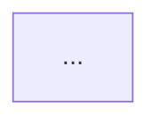
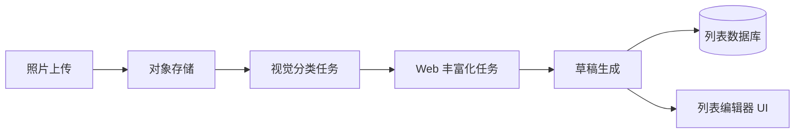
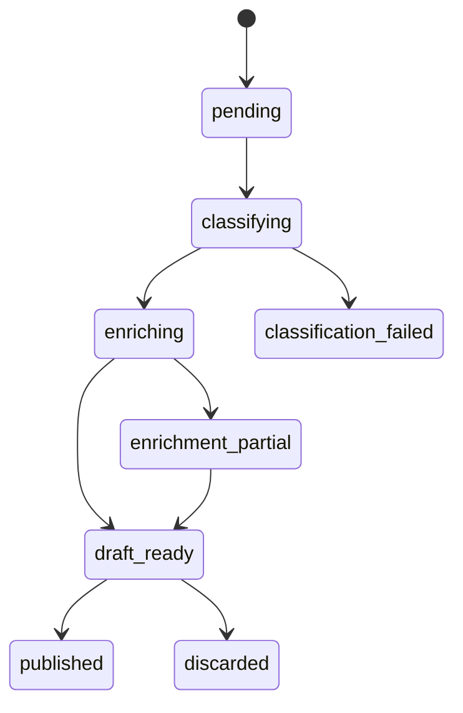

> 📚 **AI Spark Wiki** · Claude Code 知识库

---
name: plan-pipeline-eng-review
description: 工程架构关卡 —— 在编写实现代码前锁定架构、图表、边界情况和测试矩阵
effort: medium
disable-model-invocation: true
---

# /plan-pipeline:eng-review — 工程架构关卡

方向确定后、实现开始前的命令。接收已验证的产品方向，返回可构建的技术规格说明（含图表）。强制系统在编写任何一行实现代码之前先思考架构。

**在 `/plan-pipeline:ceo-review` 锁定方向后使用。仍处于计划模式。**

---

## 解决的问题

产品方向一旦锁定，下一个失败模式就是架构模糊。"系统会处理它"不是计划。这个命令强制在问题变成生产事故之前，先明确回答那些棘手的技术问题。

关键突破：**强制生成图表**。图表能暴露文字叙述中隐藏的假设。时序图让你明确谁调用什么；状态机让你枚举所有失败模式。

---

## 何时使用

- 产品方向已验证之后（`/plan-pipeline:ceo-review` 或同等流程完成后）
- 非琐碎功能开始任何实现工作之前
- 功能涉及异步组件、外部依赖或多步骤流程时
- 任何需要证明（而非假设）"架构已清晰"的时候

---

## 应产出的内容

| 产出 | 重要性 |
|--------|----------------|
| 架构图（Mermaid） | 明确组件边界 |
| 数据流图 | 展示数据在哪里转换、谁负责什么 |
| 核心流程的状态机 | 强制枚举所有状态（包括失败状态） |
| 同步与异步边界决策 | 防止没有理由地"直接做成异步" |
| 失败模式清单 | 每条失败路径，不只是正常路径 |
| 信任边界图 | 在哪里接受外部输入？验证什么？ |
| 测试矩阵 | 需要测试什么以及在哪一层测试 |

---

## 提示词模板

```markdown
# /plan-pipeline:eng-review

你处于工程经理 / 技术负责人模式。方向已锁定。
你的任务是让它可构建 —— 将产品方向转化为
工程师无需临时做架构决策就能实现的技术规格说明。

不要质疑产品方向。不要建议范围变更。
不要实现任何内容。返回技术规格说明。

## 第 1 步：重述功能

1-2 句话：正在构建什么。确认你是在基于正确的需求说明工作。

## 第 2 步：架构图

用 Mermaid 绘制组件架构：
- 涉及的所有组件（前端、后端、任务、存储、外部 API）
- 组件之间的边界
- 数据流方向



## 第 3 步：核心流程 —— 时序图

将正常路径绘制为时序图：
- 哪些组件调用哪些组件，按什么顺序
- 每一步传递什么数据
- 异步交接发生在哪里

```mermaid
sequenceDiagram
    ...
```

## 第 4 步：状态机

绘制核心领域对象的状态机：
- 所有有效状态
- 所有转换及其触发条件
- 终止状态（成功与失败）


## 第 5 步：同步与异步决策

对流程中的每个操作，决定：
- **同步**（阻塞请求）：原因，以及延迟预算是多少
- **异步**（后台任务）：原因，什么触发重试，调用方如何知道成功

## 第 6 步：失败模式清单

对流程中的每一步，枚举：
- 什么可能失败
- 如何失败（静默？明显？部分成功？）
- 恢复路径是什么
- 用户看到什么

标记任何当前静默失败的情况。

## 第 7 步：信任边界

对每个外部输入（用户上传、API 响应、Webhook 载荷）：
- 你信任什么？你验证什么？
- 恶意输入在哪里可能造成危害？
- 是否有外部数据流入进一步处理（提示词注入风险）？

## 第 8 步：测试矩阵

| 层级 | 测试内容 | 原因 |
|-------|-------------|-----|
| 单元 | ... | ... |
| 集成 | ... | ... |
| E2E | ... | ... |

找出第 6 步中没有对应测试的失败模式。

## 第 9 步：待解问题

列出任何真正不清楚、需要人工决策才能开始实现的架构决策。不是全面清单 —— 只列阻塞项。
```

---

## 示例

**功能**：从照片智能创建列表（`/plan-pipeline:ceo-review` 完成后）

**产出摘录**：


状态机：


失败模式：
- 分类失败 → 降级为手动列表（非静默失败）
- 丰富化部分失败 → 使用已成功的部分，标记缺失字段
- 上传成功但分类任务从未启动 → 孤立文件，需要清理任务
- Web 数据进入草稿生成 → 提示词注入向量，传给 LLM 前须清洗

---

## 流水线位置

```
/plan-pipeline:ceo-review    → 产品方向锁定
/plan-pipeline:eng-review    → 架构锁定        ← 当前位置
/plan-pipeline:start         → 生成实现计划
/plan-pipeline:validate      → 执行前验证
/plan-pipeline:execute       → 执行至 PR 合并
```
