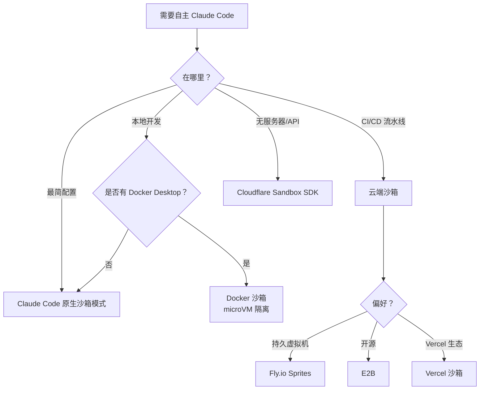

> 📚 **AI Spark Wiki** · Claude Code 知识库

---
title: "编码智能体的沙箱隔离"
description: "在 Docker、原生沙箱和云方案的隔离环境中安全运行 Claude Code"
tags: [security, sandbox, devops, guide]
---

# 编码智能体的沙箱隔离

> **置信度**：第二级——官方 Docker 文档 + 已验证的供应商文档
> **阅读时间**：约 10 分钟
> **范围**：在隔离环境中安全运行 Claude Code

---

## 速览

| 方案 | 隔离级别 | 本地/云端 | 最适合 |
|----------|-----------|-------------|----------|
| **Docker 沙箱** | microVM（虚拟机监控程序） | 本地 | 最高安全性，需要 Docker-in-Docker |
| **Claude Code 原生沙箱** | 进程（Seatbelt/bubblewrap） | 本地 | 轻量级日常开发，受信任代码 |
| **Fly.io Sprites** | Firecracker microVM | 云端 | API 驱动的智能体工作流 |
| **E2B** | Firecracker microVM | 云端 | 多框架 AI 应用 |
| **Vercel 沙箱** | Firecracker microVM | 云端 | Next.js / Vercel 生态系统 |
| **Cloudflare Sandbox SDK** | 容器 | 云端 | 基于 Workers 的无服务器架构 |

快速开始：

```bash
docker sandbox run claude ~/my-project
```

---

## 1. 问题：安全自主性

Claude Code 的权限系统可以保护您免受意外操作的影响，但它产生了一个矛盾：

- **`--dangerously-skip-permissions`** 移除所有护栏——Claude 可以不经询问执行 `rm -rf`、`git push --force` 或 `DROP TABLE`。在裸机上，这很危险。
- **权限疲劳**——批准每个文件编辑和 shell 命令会拖慢自主工作流。对于大型重构或 CI 流水线，交互式审批是不切实际的。
- **差距**：如何在自主且安全的情况下运行 Claude Code？

**答案**：隔离执行环境。让智能体在沙箱内自由运行，在那里影响范围是受控的。沙箱是安全边界，而非权限系统。

---

## 2. 隔离方式



---

## 3. Docker 沙箱

> **来源**：[docs.docker.com/ai/sandboxes/](https://docs.docker.com/ai/sandboxes/)
> **要求**：Docker Desktop 4.58+（macOS 或 Windows）

Docker 沙箱在您本地机器上以基于 microVM 的隔离运行 AI 编码智能体。每个沙箱有自己独立的 Docker 守护进程和文件系统。沙箱**不会**出现在 `docker ps` 中——它们是虚拟机，不是容器。

### 快速开始

```bash
# 创建并运行带有您项目的沙箱
docker sandbox run claude ~/my-project

# 以自主模式运行（在沙箱内安全）
docker sandbox run claude ~/my-project -- --dangerously-skip-permissions

# 直接传入提示词
docker sandbox run claude ~/my-project -- "将 auth 模块重构为使用 JWT"

# 继续之前的会话
docker sandbox run my-sandbox -- --continue
```

### 架构

```
┌──────────────────────────────────────────────────────────┐
│                       主机                               │
│                                                          │
│  ┌────────────────────────────────────────────────────┐  │
│  │             Docker 沙箱（microVM）                  │  │
│  │                                                    │  │
│  │  ┌──────────────┐  ┌───────────────────────────┐  │  │
│  │  │  Claude Code  │  │  独立 Docker 守护进程      │  │  │
│  │  │  (--dsp 模式) │  │  （与主机隔离）             │  │  │
│  │  └──────────────┘  └───────────────────────────┘  │  │
│  │                                                    │  │
│  │  ┌──────────────────────────────────────────────┐  │  │
│  │  │  工作区：~/my-project（与主机同步）            │  │  │
│  │  │  与主机相同的绝对路径                          │  │  │
│  │  └──────────────────────────────────────────────┘  │  │
│  │                                                    │  │
│  │  基础环境：Ubuntu、Node.js、Python 3、Go、Git、    │  │
│  │            Docker CLI、GitHub CLI、ripgrep、jq     │  │
│  │  用户：拥有 sudo 权限的非 root 'agent'             │  │
│  └────────────────────────────────────────────────────┘  │
│                                                          │
│  主机 Docker 守护进程：沙箱内不可访问                    │
│  主机文件系统：不可访问（工作区除外）                    │
└──────────────────────────────────────────────────────────┘
```

关键特性：
- **工作区同步**：主机目录在沙箱内以相同绝对路径挂载
- **完全隔离**：智能体无法访问主机 Docker 守护进程、主机容器或工作区外的文件
- **独立 Docker**：每个沙箱拥有自己的 Docker 守护进程用于构建/运行容器
- **Claude 以 `--dangerously-skip-permissions` 运行**：这是有意为之——沙箱是安全边界

### 网络策略

控制沙箱可以访问的网络资源。

```bash
# 查看网络活动
docker sandbox network log my-sandbox

# 设置拒绝列表模式（阻断所有，允许特定）
docker sandbox network proxy my-sandbox \
  --policy deny \
  --allow-host api.anthropic.com \
  --allow-host "*.npmjs.org" \
  --allow-host "*.pypi.org" \
  --allow-host github.com

# 设置允许列表模式（允许所有，阻断特定）
docker sandbox network proxy my-sandbox \
  --policy allow \
  --block-host "*.malicious-domain.com" \
  --block-cidr "192.168.0.0/16"
```

| 模式 | 默认行为 | 使用场景 |
|------|-----------------|----------|
| **允许列表**（默认） | 允许大多数流量，阻断特定目标 | 一般开发 |
| **拒绝列表** | 阻断所有流量，仅允许指定目标 | 高安全性环境 |

**默认阻断范围**：私有 CIDR（`10.0.0.0/8`、`127.0.0.0/8`、`172.16.0.0/12`、`192.168.0.0/16`、`169.254.0.0/16`）及其 IPv6 等效地址。

**模式匹配**：精确（`example.com`）、指定端口（`example.com:443`）、通配符（`*.example.com` 仅匹配子域名）。最具体的模式优先。

**安全注意事项**：域名过滤不会检查流量内容。宽泛的允许（如 `github.com`）会允许访问用户生成内容。旁路模式下不进行 HTTPS 检查。

**配置存储**：每个沙箱存储于 `~/.docker/sandboxes/vm/[name]/proxy-config.json`。策略在重启后持久保存。

### 自定义模板

对于需要特定工具的可复现环境的团队：

```dockerfile
FROM docker/sandbox-templates:claude-code

USER root

# 安装项目特定依赖
RUN apt-get update && apt-get install -y \
    postgresql-client \
    redis-tools

# 安装全局 npm 包
RUN npm install -g pnpm turbo

USER agent
```

构建和使用：

```bash
# 构建模板
docker build -t my-team-sandbox:v1 .

# 使用自定义模板创建沙箱
docker sandbox create my-sandbox \
  --template my-team-sandbox:v1 \
  --load-local-template ~/my-project
```

适合使用自定义模板的场景：团队环境、特定工具版本、重复配置、复杂配置。简单的一次性工作请使用默认设置，让智能体安装所需内容。

### 命令参考

| 命令 | 说明 |
|---------|-------------|
| `docker sandbox run <agent> <path>` | 创建并启动沙箱 |
| `docker sandbox create <name>` | 创建不启动 |
| `docker sandbox ls` | 列出所有沙箱 |
| `docker sandbox run <name> -- "提示词"` | 传入提示词 |
| `docker sandbox run <name> -- --continue` | 继续上次会话 |
| `docker sandbox run <name> -- --dsp` | --dangerously-skip-permissions 的简写 |
| `docker sandbox network proxy <name>` | 配置网络策略 |
| `docker sandbox network log <name>` | 查看网络活动 |

### 认证

**方式 1：API 密钥（推荐用于无头模式）**

在 `~/.bashrc` 或 `~/.zshrc` 中设置 `ANTHROPIC_API_KEY`。沙箱守护进程从这些文件读取，而非当前 shell 会话。更改后重启守护进程，沙箱重建后仍持久保存。

**方式 2：交互式登录（每次会话）**

未找到凭证时自动触发。在 Claude Code 中使用 `/login` 手动触发。沙箱销毁时认证**不会**持久保存。

### 支持的智能体

| 智能体 | 提供商 | 状态 |
|-------|----------|--------|
| Claude Code | Anthropic | 完全支持 |
| Codex CLI | OpenAI | 支持 |
| Gemini CLI | Google | 支持 |
| cagent | Docker | 支持 |
| Kiro | AWS | 支持 |

### 限制

- **仅支持 macOS 和 Windows** 的 microVM 模式。Linux 使用基于容器的旧版沙箱（Docker Desktop 4.57+）。
- **需要 Docker Desktop**——标准 Docker Engine 不支持。社区替代方案如 [dclaude](https://github.com/jedi4ever/dclaude)（Patrick Debois）将 Claude Code 包装在标准 Docker 容器中，适用于仅有 Docker Engine 的环境，但使用容器隔离（非 microVM），且挂载主机 Docker socket——安全边界较弱。
- **沙箱内尚不支持 MCP Gateway**。
- **无 GPU 直通**——不适用于 ML 训练工作负载。
- **工作区同步是单向的**：沙箱内的变更会传播到主机，但同时在主机上编辑可能产生冲突。

---

## 4. Claude Code 原生沙箱

> **来源**：[code.claude.com/docs/en/sandboxing](https://code.claude.com/docs/en/sandboxing)
> **要求**：macOS（内置）或 Linux/WSL2（bubblewrap + socat）
> **功能**：Claude Code v2.1.0+

Claude Code 内置**原生沙箱**，使用操作系统级原语进行进程级隔离。无需 Docker。

### 架构

```
┌──────────────────────────────────────────────────────┐
│                       主机                           │
│                                                      │
│  Claude Code（主进程）                               │
│       │                                              │
│       ├─ 派生 bash 命令                              │
│       │                                              │
│       ▼                                              │
│  沙箱包装器（Seatbelt/bubblewrap）                   │
│       │                                              │
│       ├─ 文件系统：读取全部，仅写入当前工作目录       │
│       ├─ 网络：SOCKS5 代理、域名过滤                 │
│       ├─ 进程：隔离环境                              │
│       │                                              │
│       ▼                                              │
│  命令在限制下执行                                    │
│       │                                              │
│       └─ 违规在操作系统级别被阻断                    │
│                                                      │
└──────────────────────────────────────────────────────┘
```

**与 Docker 沙箱的关键区别**：

| 方面 | 原生沙箱 | Docker 沙箱 |
|--------|---------------|------------------|
| **隔离级别** | 进程（Seatbelt/bubblewrap） | microVM（虚拟机监控程序） |
| **内核** | 与主机共享 | 每个沙箱独立内核 |
| **配置** | 0 依赖（macOS），2 个包（Linux） | Docker Desktop 4.58+ |
| **开销** | 极小（约 1-3% CPU） | 中等（约 5-10% CPU，+200MB 内存） |
| **Docker-in-Docker** | ❌ 不支持 | ✅ 独立 Docker 守护进程 |
| **使用场景** | 日常开发、受信任代码 | 不受信任代码、最高隔离性 |

### 操作系统原语

**macOS**：使用 Seatbelt（TrustedBSD 强制访问控制）
- 内置，开箱即用
- 内核级系统调用过滤

**Linux/WSL2**：使用 bubblewrap（Linux 命名空间 + seccomp）
- 需要安装：`sudo apt-get install bubblewrap socat`
- 为每个命令创建隔离命名空间

**WSL1**：❌ 不支持（bubblewrap 需要 WSL1 转换层中不可用的内核功能）

**Windows 原生**：⏳ 计划中（尚未可用）

### 快速开始

```bash
# 启用沙箱（交互菜单）
/sandbox

# 仅 Linux/WSL2：先安装依赖
sudo apt-get install bubblewrap socat  # Ubuntu/Debian
sudo dnf install bubblewrap socat      # Fedora
```

**两种模式**：

1. **自动允许模式**：Bash 命令在沙箱内自动批准（推荐用于日常开发）
2. **常规权限模式**：所有命令需要审批（用于高安全性场景）

### 配置示例

```json
{
  "sandbox": {
    "autoAllowMode": true,
    "network": {
      "policy": "deny",
      "allowedDomains": [
        "api.anthropic.com",
        "registry.npmjs.com",
        "github.com"
      ]
    }
  },
  "permissions": {
    "deny": [
      "Read(~/.ssh/**)", "Read(~/.aws/**)",
      "Edit(~/.ssh/**)", "Edit(~/.aws/**)"
    ]
  }
}
```

### 何时使用原生沙箱 vs Docker 沙箱

**使用原生沙箱的场景**：
- ✅ 受信任团队的日常开发
- ✅ 轻量级配置（无 Docker Desktop）
- ✅ 优先考虑低开销
- ✅ 代码基本可信
- ✅ 不需要 Docker-in-Docker

**使用 Docker 沙箱的场景**：
- ✅ 运行不受信任的代码
- ✅ 最高安全隔离（防内核漏洞利用）
- ✅ 需要沙箱内的独立 Docker 守护进程
- ✅ 测试 AI 生成的脚本
- ✅ 处理敏感工作负载的生产 CI/CD

**决策树**：

```
日常开发？
├─ 受信任代码 + 团队 → 原生沙箱（轻量）
└─ 不受信任脚本 → Docker 沙箱（最高隔离性）

需要 Docker-in-Docker？
├─ 是 → Docker 沙箱（唯一选择）
└─ 否 → 两者均可，简单起见选原生沙箱

最高安全性？
├─ 是（防内核漏洞利用）→ Docker 沙箱
└─ 标准（进程隔离足够）→ 原生沙箱
```

### 安全局限性

**⚠️ 原生沙箱局限性**（详情参见 [guide/sandbox-native.md](./sandbox-native.md)）：

1. **共享内核**：易受内核漏洞利用（Docker microVM 可防护）
2. **域名前置**：基于 CDN 的绕过可行（Cloudflare、Akamai）
3. **Unix 套接字**：配置不当可能授予意外权限
4. **文件系统**：过于宽泛的写权限可能导致权限提升

**对于不受信任的代码**，Docker 沙箱提供更强的隔离性。

### 开源运行时

沙箱实现作为开源 npm 包提供：

```bash
# 直接使用沙箱运行时
npx @anthropic-ai/sandbox-runtime <要沙箱化的命令>

# 示例：沙箱化一个 MCP 服务器
npx @anthropic-ai/sandbox-runtime node mcp-server.js
```

**仓库**：[github.com/anthropic-experimental/sandbox-runtime](https://github.com/anthropic-experimental/sandbox-runtime)

### 深入了解

完整技术细节、配置示例、故障排除和安全分析：

→ **[原生沙箱指南](./sandbox-native.md)**

涵盖：操作系统原语、网络代理架构、沙箱模式、逃生舱、安全局限性、最佳实践。

---

## 5. 云端沙箱概览

### Fly.io Sprites

> **来源**：[sprites.dev](https://sprites.dev)

基于 Firecracker microVM 构建的硬件隔离执行环境，由 Fly.io 提供。

- **隔离性**：Firecracker microVM，完全硬件隔离
- **持久性**：完全可变的 ext4 文件系统，自动 100GB 分区
- **检查点/恢复**：约 300ms 实时检查点（写时复制），1 秒内恢复
- **HTTP 访问**：每个 Sprite 独立 URL，按请求自动激活（冷启动 < 1 秒）
- **网络**：第 3 层出口策略，公有/私有切换
- **资源**：每个 Sprite 最多 8 个 CPU、16GB 内存
- **API**：CLI（`sprite` 命令）、REST API、JavaScript 和 Go 客户端库
- **定价**：按使用量付费（CPU 0.07 美元/小时，内存 0.04 美元/GB/小时）。30 美元试用积分。

### Cloudflare Sandbox SDK

> **来源**：[developers.cloudflare.com/sandbox/](https://developers.cloudflare.com/sandbox/)

基于 Cloudflare Workers 平台构建的安全代码执行隔离容器。

- **隔离性**：Cloudflare 无服务器运行时上的容器（非 microVM）
- **语言**：Python、JavaScript/TypeScript、shell 命令
- **持久性**：R2 存储桶作为本地文件系统路径挂载
- **API**：TypeScript SDK（`getSandbox()`、`exec()`、`runCode()`、文件操作、WebSocket）
- **集成**：Claude 生成代码，沙箱执行，结果以文本/可视化形式返回
- **定价**：需要 Workers 付费计划，基于容器平台定价。
- **教程**：[developers.cloudflare.com/sandbox/tutorials/claude-code/](https://developers.cloudflare.com/sandbox/tutorials/claude-code/)

### Vercel 沙箱

> **来源**：[vercel.com/docs/vercel-sandbox/](https://vercel.com/docs/vercel-sandbox/)

用于 AI 智能体和代码生成的临时 Linux microVM，2026-01-30 正式发布（GA）。

- **隔离性**：Firecracker microVM，与环境变量、数据库和云资源隔离
- **性能**：亚秒级初始化，任务完成后自动终止
- **超时**：默认 5 分钟，Hobby 最长 45 分钟，Pro/Enterprise 最长 5 小时
- **SDK**：`Sandbox`、`Command`、`Snapshot` 类。文件系统快照可加速重复运行。
- **认证**：Vercel OIDC 令牌（推荐）或外部 CI/CD 的访问令牌
- **集成**：与 Claude Agent SDK 配合，用于自主智能体任务

### E2B

> **来源**：[e2b.dev](https://e2b.dev)

用于 AI 智能体和大语言模型应用的开源沙箱平台。

- **隔离性**：Firecracker microVM（与 AWS Lambda 相同的技术）
- **性能**：约 150ms 冷启动，25ms 以内备用恢复
- **自定义镜像**：最大 10GB，2 秒内启动（Blueprints）
- **快照**：捕获和恢复完整虚拟机状态
- **语言**：Python、JavaScript、Ruby、C++，Linux 上任何语言。与大语言模型无关。
- **集成**：LangChain、LangGraph、LlamaIndex、Vercel/Next.js、Ollama
- **部署**：云托管、BYOC（AWS/GCP/Azure）、本地/VPC 自托管
- **定价**：免费层（100 美元积分，最长 1 小时），Pro 起价 150 美元/月（最长 24 小时）

### Claude Code 原生沙箱模式

> **来源**：[code.claude.com/docs/en/sandboxing](https://code.claude.com/docs/en/sandboxing)

Claude Code 内置的进程级沙箱（[架构](../core/architecture.md)中的第 4 层）。

- **无外部依赖**：开箱即用
- **进程隔离**：限制 Claude 可以执行的命令
- **可配置**：通过 settings 中的 `allowedTools` 配置
- **局限性**：非完整虚拟机隔离——与主机共享内核和文件系统

适用场景：Docker 不可用、轻量级隔离足够，或希望配合沙箱实现纵深防御。

---

## 6. 对比矩阵

| 标准 | Docker 沙箱 | 原生 Claude Code | Fly.io Sprites | Cloudflare SDK | E2B | Vercel 沙箱 |
|-----------|-----------------|-----------|----------------|----------------|-----|-----------------|
| **隔离级别** | microVM（虚拟机监控程序） | 进程（Seatbelt/bubblewrap） | Firecracker microVM | 容器 | Firecracker microVM | Firecracker microVM |
| **内核隔离** | ✅ 独立内核 | ❌ 共享内核 | ✅ 独立内核 | 部分 | ✅ 独立内核 | ✅ 独立内核 |
| **本地运行** | 是 | 是 | 否（云端） | 否（云端） | 否（云端） | 否（云端） |
| **配置** | Docker Desktop 4.58+ | 0 依赖（macOS），2 个包（Linux） | API 密钥 | Workers 付费 | API 密钥 | SDK |
| **Docker-in-Docker** | ✅ 独立守护进程 | ❌ 不支持 | 支持 | 不支持 | 支持 | 支持 |
| **网络控制** | 允许/拒绝列表 | 允许/拒绝列表（SOCKS5） | 第 3 层出口策略 | 未详细说明 | 未详细说明 | 未详细说明 |
| **平台** | macOS、Windows（WSL2） | macOS、Linux、WSL2 | 任意（API） | 任意（Workers） | 任意（API/SDK） | 任意（SDK） |
| **开销** | 中等（约 5-10% CPU） | 极小（约 1-3% CPU） | 云端 | 云端 | 云端 | 云端 |
| **免费层** | Docker Desktop | 免费 | 30 美元积分 | Workers 付费 | 100 美元积分 | 是（有限） |
| **最适合** | 最高安全性，需要 Docker | 日常开发，受信任代码 | API 驱动智能体 | 无服务器架构 | 多框架 | Next.js/Vercel |

---

## 7. 安全自主工作流

### 模式：Docker 沙箱 + --dangerously-skip-permissions

推荐的本地自主开发模式：

```bash
# 1. 为您的项目创建沙箱
docker sandbox create my-feature ~/my-project

# 2. 配置网络（可选，推荐用于安全）
docker sandbox network proxy my-feature \
  --policy deny \
  --allow-host api.anthropic.com \
  --allow-host "*.npmjs.org" \
  --allow-host github.com

# 3. 自主运行 Claude（在沙箱内安全）
docker sandbox run my-feature -- --dangerously-skip-permissions \
  "重构 auth 模块以使用 JWT。完成前运行所有测试。"

# 4. 在主机上审查变更（工作区自动同步）
cd ~/my-project && git diff

# 5. 如果满意则提交，否则丢弃或重新运行
git add -A && git commit -m "feat: JWT 认证（沙箱生成）"
```

### 模式：使用沙箱的 CI/CD 流水线

GitHub Actions 示例草图：

```yaml
jobs:
  agent-task:
    runs-on: ubuntu-latest
    steps:
      - uses: actions/checkout@v4

      - name: 在 E2B 沙箱中运行 Claude
        uses: e2b-dev/e2b-github-action@v1
        with:
          api-key: ${{ secrets.E2B_API_KEY }}
          command: |
            claude --dangerously-skip-permissions \
              -p "运行完整测试套件并修复任何失败"
```

对于 CI/CD，云端沙箱（E2B、Vercel、Sprites）通常比 Docker 沙箱更好，因为它们不需要 Docker Desktop。

---

## 8. 反模式

| 反模式 | 危险原因 | 应该怎么做 |
|-------------|-------------------|------------|
| 无沙箱使用 `--dangerously-skip-permissions` | 智能体对主机文件系统、网络和 Docker 有不受限制的访问 | 使用沙箱作为安全边界 |
| 假设容器 = 虚拟机 | 容器共享主机内核，容器逃逸会暴露主机 | 对强隔离使用基于 microVM 的方案（Docker 沙箱、E2B、Sprites） |
| 将整个文件系统挂载到沙箱 | 破坏隔离目的，智能体可访问凭证、SSH 密钥等 | 仅挂载项目工作区目录 |
| 在网络策略中允许 `*` | 智能体可以向任何端点外泄数据 | 使用拒绝列表模式并明确指定允许项 |
| 沙箱运行后跳过 `git diff` 审查 | 自主智能体可能做出意外变更 | 提交沙箱生成的代码前始终审查差异 |
| 以沙箱为借口跳过代码审查 | 隔离保护主机，不保证代码质量 | 沙箱 + 代码审查是互补的，不是替代关系 |

---

## 另见

- [architecture.md](../core/architecture.md) — 第 4 层（子智能体架构）和权限模型
- [security-hardening.md](./security-hardening.md) — MCP 审查、注入防御、CVE 跟踪
- [code.claude.com/docs/en/sandboxing](https://code.claude.com/docs/en/sandboxing) — Claude Code 官方沙箱文档
- [docs.docker.com/ai/sandboxes/](https://docs.docker.com/ai/sandboxes/) — Docker 沙箱文档
