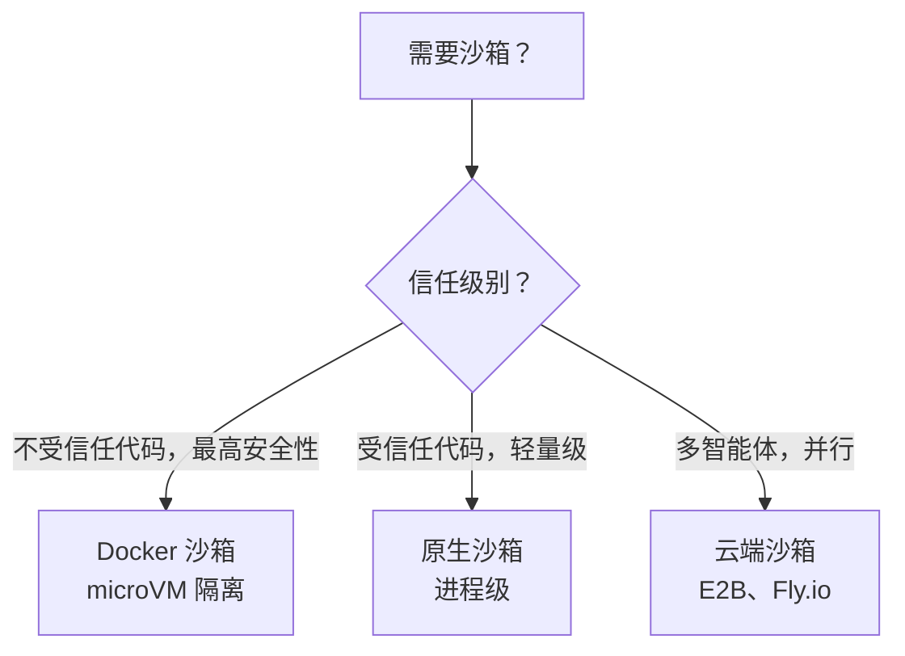
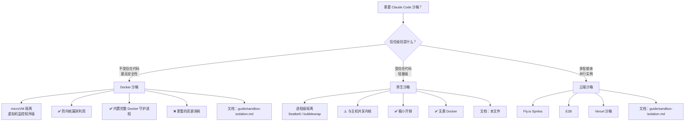

> 📚 **AI Spark Wiki** · Claude Code 知识库

---
title: "Claude Code 原生沙箱"
description: "理解和配置 Claude Code 的原生进程级沙箱"
tags: [security, sandbox, guide]
---

# Claude Code 原生沙箱

> **置信度**：第一级——Anthropic 官方文档
> **阅读时间**：约 15 分钟
> **范围**：理解和配置 Claude Code 的原生进程级沙箱
> **最后更新**：2026-02-02

---

## 速览

Claude Code 内置**原生沙箱**（v2.1.0+），使用操作系统级原语隔离 bash 命令：

| 方面 | 详情 |
|--------|---------|
| **macOS** | Seatbelt（内置，开箱即用） |
| **Linux/WSL2** | bubblewrap + socat（需要安装） |
| **文件系统** | 读取全部（可配置），仅写入工作区 |
| **网络** | SOCKS5 代理，域名允许/拒绝列表 |
| **模式** | 自动允许（bash 自动批准） vs 常规权限 |
| **逃生舱** | `dangerouslyDisableSandbox`，用于不兼容的工具 |
| **平台支持** | ✅ macOS、Linux、WSL2 • ❌ WSL1 • ⏳ Windows（计划中） |

**快速开始**：

```bash
# 启用沙箱
/sandbox

# Linux/WSL2 依赖
sudo apt-get install bubblewrap socat  # Ubuntu/Debian
sudo dnf install bubblewrap socat      # Fedora
```

**何时使用原生沙箱 vs Docker 沙箱**：



---

## 1. 为什么需要原生沙箱？

### 自主性与安全性的矛盾

Claude Code 的权限系统产生了一个根本性矛盾：

- **`--dangerously-skip-permissions`** 移除所有护栏 → 快速、自主，但在裸机上危险
- **交互式权限** → 安全，但缓慢，对于大型重构不切实际

**原生沙箱解决了这个问题**：让 Claude 在操作系统强制的边界内自由运行。沙箱成为安全边界，而非权限系统。

### 优势

1. **减少审批疲劳** - 沙箱内安全命令自动批准
2. **自主工作流** - 大型重构、CI 流水线无需持续提示
3. **提示注入防护** - 恶意提示无法逃出沙箱边界
4. **依赖安全** - 被攻击的 npm 包被限制在工作区内
5. **透明运行** - 沙箱违规立即触发通知

---

## 2. 操作系统原语

原生沙箱使用操作系统安全机制来强制隔离：

### macOS：Seatbelt

**内置，开箱即用**——无需安装。

- **机制**：macOS 沙箱框架（TrustedBSD 强制访问控制）
- **强制方式**：内核级系统调用过滤
- **范围**：对文件系统、网络、IPC 施加每进程限制
- **性能**：极小开销（典型工作负载约 1-2% CPU）

**工作原理**：

```
┌─────────────────────────────────────────────────────┐
│              macOS Seatbelt 架构                    │
├─────────────────────────────────────────────────────┤
│                                                     │
│  Claude Code 进程                                   │
│       │                                             │
│       ├─ 派生 bash 命令                             │
│       │                                             │
│       ▼                                             │
│  应用 Seatbelt 策略                                 │
│       │                                             │
│       ├─ 文件系统规则：读取全部，写入当前工作目录   │
│       ├─ 网络规则：代理所有连接                     │
│       ├─ IPC 规则：有限的进程通信                   │
│       │                                             │
│       ▼                                             │
│  内核强制执行限制                                   │
│       │                                             │
│       ├─ 允许：边界内的操作                         │
│       ├─ 阻断：边界外的操作                         │
│       └─ 通知：用户收到警报                         │
│                                                     │
└─────────────────────────────────────────────────────┘
```

### Linux/WSL2：bubblewrap

**需要安装**——必须安装 `bubblewrap` 和 `socat` 包。

- **机制**：Linux 命名空间 + seccomp-bpf 系统调用过滤
- **强制方式**：内核命名空间隔离（挂载、网络、PID、IPC）
- **范围**：为每个命令创建类似容器的隔离环境
- **性能**：极小开销（约 2-3% CPU，每命令 <10ms 启动）

**依赖安装**：

```bash
# Ubuntu/Debian
sudo apt-get install bubblewrap socat

# Fedora
sudo dnf install bubblewrap socat

# Arch Linux
sudo pacman -S bubblewrap socat
```

**工作原理**：

```
┌─────────────────────────────────────────────────────┐
│           Linux bubblewrap 架构                     │
├─────────────────────────────────────────────────────┤
│                                                     │
│  Claude Code 进程（主机命名空间）                   │
│       │                                             │
│       ├─ 派生 bash 命令                             │
│       │                                             │
│       ▼                                             │
│  bubblewrap 创建隔离命名空间                        │
│       │                                             │
│       ├─ 挂载命名空间：自定义文件系统视图           │
│       ├─ 网络命名空间：通过 socat 代理              │
│       ├─ PID 命名空间：隔离进程树                   │
│       ├─ IPC 命名空间：无共享内存访问               │
│       │                                             │
│       ▼                                             │
│  命令在隔离环境中执行                               │
│       │                                             │
│       ├─ 文件系统：仅看到允许的路径                 │
│       ├─ 网络：所有连接经过代理                     │
│       ├─ 进程：看不到主机进程                       │
│       │                                             │
│       ▼                                             │
│  结果返回给 Claude Code                             │
│                                                     │
└─────────────────────────────────────────────────────┘
```

### WSL2 vs WSL1

- **WSL2**：✅ 支持（使用 bubblewrap，与 Linux 相同）
- **WSL1**：❌ **不支持** - bubblewrap 需要 WSL1 转换层中不可用的内核功能（命名空间、cgroups）

**需要迁移**：如果您使用 WSL1，请[升级到 WSL2](https://learn.microsoft.com/en-us/windows/wsl/install) 以使用原生沙箱。

---

## 3. 文件系统隔离

### 默认行为

- **读取访问**：整台计算机（明确拒绝的目录除外）
- **写入访问**：仅限当前工作目录（CWD）及其子目录
- **阻断**：未经明确权限在 CWD 之外修改

### 为什么是"读取全部，写入 CWD"？

这种非对称策略在可用性和安全性之间取得了平衡：

- **读取全部**：Claude 需要搜索/分析整个代码库、读取系统配置、检查依赖
- **写入 CWD**：大多数开发工作在项目目录内进行；限制写入防止意外/恶意的系统修改

### 配置文件系统限制

文件系统限制同时使用**权限规则**（用于阻断读取）和**`sandbox.filesystem` 设置块**（用于扩展写入和细粒度读取覆盖）。

**阻断对敏感目录的读取**（权限拒绝规则）：

```json
{
  "permissions": {
    "deny": [
      "Read(~/.ssh/**)",
      "Read(~/.aws/**)",
      "Read(~/.kube/**)",
      "Edit(~/.ssh/**)",
      "Edit(~/.aws/**)",
      "Edit(~/.kube/**)"
    ]
  }
}
```

**扩展写入访问或微调读取权限**（`sandbox.filesystem`）：

```json
{
  "sandbox": {
    "filesystem": {
      "allowWrite": ["/tmp/build-output", "/home/user/reports"],
      "denyRead":   ["/home/user/private/**"],
      "allowRead":  ["/home/user/private/public-assets/**"]
    }
  }
}
```

| 设置 | 用途 | 备注 |
|---------|---------|-------|
| `allowWrite` | 扩展 CWD 以外的写入访问 | 使用绝对路径（v2.1.78+） |
| `denyRead` | 阻断对特定路径的读取访问 | 支持 Glob 模式 |
| `allowRead` | 在 `denyRead` 区域内重新允许读取（v2.1.77+） | 用于在不扩大拒绝规则的情况下对子树设置白名单 |

> **`allowRead` 使用场景**：您阻断了 `/home/user/private/**` 但需要 Claude 读取 `/home/user/private/public-assets/**`。与其重新组织目录，不如添加 `allowRead` 来开辟例外。

写入访问在沙箱中本质上限制为 CWD。要阻断对敏感目录的读取，使用权限拒绝规则或 `sandbox.filesystem.denyRead`。

**⚠️ 安全警告**：过于宽泛的写权限会导致权限提升：

- ❌ **绝不允许写入**：`$PATH` 目录（`/usr/local/bin`）、shell 配置（`~/.bashrc`、`~/.zshrc`）、系统目录（`/etc`）
- ✅ **安全允许写入**：项目目录、临时目录（`/tmp`）、构建输出目录

---

## 4. 网络隔离

### 代理架构

沙箱命令的所有网络连接都通过运行在沙箱**外部**的 SOCKS5 代理路由。代理限制进程可以连接的域名，但**不会检查通过它的流量内容**（隐私注意事项：无深度包检测）。

```
┌──────────────────────────────────────────────────────────┐
│                      网络流                              │
├──────────────────────────────────────────────────────────┤
│                                                          │
│  沙箱 bash 命令                                          │
│       │                                                  │
│       ├─ 尝试连接 api.anthropic.com:443                 │
│       │                                                  │
│       ▼                                                  │
│  SOCKS5 代理（沙箱外部）                                 │
│       │                                                  │
│       ├─ 检查域名允许/拒绝列表                           │
│       │                                                  │
│       ├─ 允许？→ 转发连接                               │
│       ├─ 阻断？→ 拒绝 + 通知用户                        │
│       │                                                  │
│       ▼                                                  │
│  外部网络（如果允许）                                    │
│                                                          │
└──────────────────────────────────────────────────────────┘
```

### 域名过滤

**两种模式**：

1. **允许列表（默认）**：允许大多数流量，阻断特定目标
2. **拒绝列表**：阻断所有流量，仅允许指定目标

**配置**：

```json
{
  "sandbox": {
    "network": {
      "policy": "deny",
      "allowedDomains": [
        "api.anthropic.com",
        "*.npmjs.org",
        "*.pypi.org",
        "github.com",
        "registry.yarnpkg.com"
      ]
    }
  }
}
```

**模式匹配**：

- **精确**：`example.com`（精确匹配）
- **指定端口**：`example.com:443`（仅 HTTPS）
- **通配符**：`*.example.com`（匹配 `sub.example.com`，**不**匹配 `example.com` 本身）

**⚠️ 默认阻断范围**：私有 CIDR（`10.0.0.0/8`、`127.0.0.0/8`、`172.16.0.0/12`、`192.168.0.0/16`、`169.254.0.0/16`）

### 自定义代理

用于高级使用场景（HTTPS 检查、企业代理）：

```json
{
  "sandbox": {
    "network": {
      "httpProxyPort": 8080,
      "socksProxyPort": 8081
    }
  }
}
```

---

## 5. 沙箱模式

### 自动允许模式

**行为**：

- Bash 命令在沙箱内运行时**自动批准**
- 与沙箱不兼容的命令（例如需要不允许的域名）→ 回退到常规权限流程
- 显式询问/拒绝规则**始终受到尊重**

**⚠️ 重要**：自动允许模式与权限模式（默认/自动接受/计划）**相互独立**。即使在"默认"模式下，沙箱内的 bash 命令也无需提示即可运行。

**内置阻断列表**：即使在自动允许模式下，`curl` 和 `wget` 等命令默认也会被阻断，以防止任意网络内容获取。

**适用场景**：日常开发、自主重构、CI/CD 流水线

### 常规权限模式

**行为**：

- 所有 bash 命令需要明确审批，即使在沙箱内也如此
- 沙箱仍然强制执行文件系统/网络限制
- 更多控制，但工作流更慢

**适用场景**：高安全性环境、不受信任的代码库、学习 Claude Code 行为

### 切换模式

```bash
# 交互菜单
/sandbox

# 或编辑 settings.json
{
  "sandbox": {
    "autoAllowMode": true  # 或 false 用于常规权限
  }
}
```

---

## 6. 逃生舱

### `dangerouslyDisableSandbox` 参数

有些工具与沙箱**不兼容**（例如 `docker`、`watchman`）。Claude Code 提供了逃生舱：

**工作原理**：

1. 命令因沙箱限制而失败
2. Claude 分析失败原因
3. Claude 以 `dangerouslyDisableSandbox` 参数重试
4. 用户收到权限提示（正常的 Claude Code 流程）
5. 如果批准，命令在**沙箱外**运行

**不兼容工具示例**：

- `docker`（需要访问 `/var/run/docker.sock`）
- `watchman`（需要文件系统 watch API）
- `jest` with watchman（请改用 `jest --no-watchman`）

### 禁用逃生舱

为获得最高安全性，完全禁用逃生舱：

```json
{
  "sandbox": {
    "allowUnsandboxedCommands": false
  }
}
```

禁用后：

- `dangerouslyDisableSandbox` 参数**完全被忽略**
- 所有命令必须在沙箱内运行，或明确列在 `excludedCommands` 中

**推荐用于**：生产 CI/CD、不受信任的环境、高安全性场景

### `excludedCommands`

对于**永远无法**在沙箱中运行的工具，永久排除它们：

```json
{
  "sandbox": {
    "excludedCommands": ["docker", "kubectl", "vagrant"]
  }
}
```

被排除的命令始终在沙箱外运行（附带正常权限提示）。

---

## 7. 安全局限性

### 域名前置

**风险**：CDN（Cloudflare、Akamai）允许在受信任域名上托管用户内容。

**攻击场景**：

1. 攻击者将 `cloudflare.com` 加入白名单
2. 攻击者将恶意载荷上传至 Cloudflare Workers（`cloudflare.com` 的子域名）
3. 被攻击的智能体通过白名单域名下载载荷
4. 数据外泄成功

**缓解措施**：

- ❌ **避免宽泛的 CDN 域名**：`*.cloudflare.com`、`*.akamai.net`、`*.fastly.net`
- ✅ **将特定子域名加入白名单**：`my-app.pages.dev`、`my-workers.workers.dev`
- ✅ **对不受信任环境使用拒绝列表模式**

**无法完美阻断**：域名前置[很难防止](https://en.wikipedia.org/wiki/Domain_fronting)，除非进行 HTTPS 检查。

### Unix 套接字权限提升

**风险**：`allowUnixSockets` 配置可能授予对强大系统服务的访问权限。

**攻击场景**：

1. 用户允许 `/tmp/*.sock`（认为这是安全的）
2. 被攻击的智能体连接到 `/tmp/supervisor.sock`（进程管理器）
3. 智能体在沙箱外派生特权进程
4. 完整系统被攻陷

**常见的易受攻击套接字**：

- `/var/run/docker.sock`（Docker 守护进程——完整主机访问）
- `/run/containerd/containerd.sock`（containerd——容器控制）
- `/tmp/supervisor.sock`（supervisord——进程管理）
- `~/.config/systemd/user/bus`（systemd 用户总线——服务控制）

**缓解措施**：

- ❌ **绝不允许宽泛模式**：`/tmp/*.sock`、`/var/run/*.sock`
- ✅ **审计后将特定套接字加入白名单**：`/run/postgresql/.s.PGSQL.5432`（PostgreSQL）
- ✅ **默认**：除非明确允许，否则 Unix 套接字**被阻断**

### 文件系统权限提升

**风险**：过于宽泛的写权限导致权限提升。

**攻击场景**：

1. 用户允许写入 `/usr/local/bin`
2. 被攻击的智能体创建 `/usr/local/bin/sudo`（恶意二进制文件）
3. 下次用户运行 `sudo` 时，恶意二进制文件执行
4. 系统被攻陷

**易受攻击的目录**：

- `$PATH` 目录（`/usr/local/bin`、`~/bin`）
- Shell 配置文件（`~/.bashrc`、`~/.zshrc`、`~/.profile`）
- 系统目录（`/etc`、`/opt`、`/Library`）
- Cron 目录（`/etc/cron.d`、`/var/spool/cron`）

**缓解措施**：

- ✅ **仅限制写入项目目录**（沙箱默认行为）
- ✅ **使用权限拒绝规则阻断敏感读取**
- ✅ **监控沙箱违规日志**

### Linux：嵌套沙箱弱化

**风险**：`enableWeakerNestedSandbox` 模式削弱隔离性。

**何时使用**：在没有特权命名空间的 Docker 容器内运行 Claude Code。

**安全影响**：将沙箱强度降低至兼容模式（减少命名空间隔离）。

**缓解措施**：

- ✅ **仅在有额外隔离保障时使用**（Docker 沙箱、云端沙箱）
- ✅ **绝不在裸机上对不受信任的代码使用**
- ✅ **尽可能在 Docker 外运行 Claude Code**

---

## 8. 开源运行时

沙箱运行时作为**开源 npm 包**提供：

```bash
# 直接使用沙箱运行时
npx @anthropic-ai/sandbox-runtime <要沙箱化的命令>

# 示例：沙箱化一个 MCP 服务器
npx @anthropic-ai/sandbox-runtime node mcp-server.js
```

**优势**：

- **社区审计**：安全研究人员可以检查实现
- **自定义使用场景**：沙箱化任何 AI 智能体，不仅仅是 Claude Code
- **贡献**：社区可以改进沙箱强度

**仓库**：[github.com/anthropic-experimental/sandbox-runtime](https://github.com/anthropic-experimental/sandbox-runtime)

**许可证**：开源（查看仓库获取具体许可证）

---

## 9. 平台支持

| 平台 | 支持状态 | 备注 |
|----------|---------|-------|
| **macOS** | ✅ 完全支持 | Seatbelt 内置，开箱即用 |
| **Linux** | ✅ 完全支持 | 需要安装 `bubblewrap` + `socat` |
| **WSL2** | ✅ 完全支持 | 与 Linux 相同（使用 bubblewrap） |
| **WSL1** | ❌ 不支持 | bubblewrap 需要 WSL1 中不可用的内核功能 |
| **Windows（原生）** | ⏳ 计划中 | 尚不可用，目前请[升级到 WSL2](https://learn.microsoft.com/en-us/windows/wsl/install) |

---

## 10. 决策树：原生沙箱 vs Docker 沙箱



### 对比矩阵

| 方面 | 原生沙箱 | Docker 沙箱 |
|--------|---------------|------------------|
| **隔离级别** | 进程（Seatbelt/bubblewrap） | microVM（虚拟机监控程序） |
| **内核隔离** | ❌ 共享内核 | ✅ 每个沙箱独立内核 |
| **开销** | 极小（约 1-3% CPU） | 中等（约 5-10% CPU，+200MB 内存） |
| **配置** | 0 依赖（macOS），2 个包（Linux） | Docker Desktop 4.58+ |
| **使用场景** | 日常开发、受信任代码、轻量级 | 不受信任代码、最高安全性、隔离 Docker |
| **平台支持** | macOS、Linux、WSL2 | macOS、Windows（通过 WSL2） |

**经验法则**：

- **日常开发，受信任团队** → 原生沙箱（轻量，足够安全）
- **运行不受信任的代码，AI 生成的脚本** → Docker 沙箱（最高隔离性）
- **多智能体编排** → 云端沙箱（并行，可扩展）

---

## 11. 配置示例

### 严格安全（拒绝列表模式）

```json
// settings.json — 沙箱设置
{
  "sandbox": {
    "autoAllowMode": true,
    "allowUnsandboxedCommands": false,
    "network": {
      "policy": "deny",
      "allowedDomains": [
        "api.anthropic.com",
        "registry.npmjs.com",
        "registry.yarnpkg.com",
        "files.pythonhosted.org",
        "github.com"
      ]
    },
    "excludedCommands": []
  },
  "permissions": {
    "deny": [
      "Read(~/.ssh/**)", "Read(~/.aws/**)",
      "Read(~/.kube/**)", "Read(~/.gnupg/**)",
      "Edit(~/.ssh/**)", "Edit(~/.aws/**)"
    ]
  }
}
```

### 均衡（允许列表模式 + 逃生舱）

```json
{
  "sandbox": {
    "autoAllowMode": true,
    "allowUnsandboxedCommands": true,
    "network": {
      "policy": "allow",
      "blockedDomains": [
        "*.malicious-domain.com"
      ]
    },
    "excludedCommands": ["docker", "kubectl"]
  },
  "permissions": {
    "deny": [
      "Read(~/.ssh/**)", "Read(~/.aws/**)",
      "Edit(~/.ssh/**)", "Edit(~/.aws/**)"
    ]
  }
}
```

### 开发（宽松）

```json
{
  "sandbox": {
    "autoAllowMode": true,
    "allowUnsandboxedCommands": true,
    "network": {
      "policy": "allow"
    },
    "excludedCommands": ["docker", "podman", "kubectl", "vagrant"]
  }
}
```

---

## 12. 最佳实践

1. **从严格开始，按需扩展** - 从拒绝列表模式开始，逐步将域名/路径加入白名单
2. **监控沙箱违规** - 查看日志了解 Claude 的访问模式
3. **审计权限拒绝规则** - 使用读取/编辑拒绝规则阻断对敏感目录（`~/.ssh`、`~/.aws`、`~/.kube`）的访问
4. **避免宽泛的 CDN 域名** - 将特定子域名（`my-app.pages.dev`）加入白名单，而非 `*.cloudflare.com`
5. **在生产环境禁用逃生舱** - 对 CI/CD、不受信任的环境设置 `allowUnsandboxedCommands: false`
6. **与 IAM 策略结合** - 将沙箱与[权限设置](https://code.claude.com/docs/en/iam)**一起**使用，实现纵深防御
7. **测试配置** - 部署到团队前验证沙箱不会阻断合法工作流
8. **记录允许的域名** - 注释每个域名列入白名单的原因（`github.com # 用于 git 操作`）

---

## 13. 故障排除

### 沙箱未激活

**症状**：`/sandbox` 显示"沙箱不可用"

**原因**：

- **Linux/WSL2**：`bubblewrap` 或 `socat` 未安装
- **WSL1**：不支持（需要升级到 WSL2）
- **Windows 原生**：尚不支持（使用 WSL2）

**解决方案**：

```bash
# Linux/WSL2
sudo apt-get install bubblewrap socat

# 验证
which bubblewrap socat
```

### 命令因"网络错误"失败

**症状**：`npm install` 因连接超时失败

**原因**：域名未加入白名单

**解决方案**：

1. 检查沙箱日志（Claude 显示被拒绝域名的通知）
2. 将域名添加到 `allowedDomains`：

```json
{
  "sandbox": {
    "network": {
      "allowedDomains": [
        "registry.npmjs.com",
        "registry.yarnpkg.com"
      ]
    }
  }
}
```

### Docker 命令总是需要权限

**症状**：`docker ps` 每次都触发权限提示

**原因**：Docker 与沙箱不兼容，回退到常规流程

**解决方案**：添加到 `excludedCommands`：

```json
{
  "sandbox": {
    "excludedCommands": ["docker"]
  }
}
```

### jest 出现 watchman 错误失败

**症状**：`jest` 因"watchman 不可用"失败

**原因**：watchman 与沙箱不兼容

**解决方案**：使用 `jest --no-watchman`

---

## 14. 另见

- [沙箱隔离（Docker、云端）](./sandbox-isolation.md) - 基于 microVM 的最高隔离沙箱
- [架构：权限模型](../core/architecture.md#5-permission--security-model) - 权限与沙箱如何交互
- [官方文档：沙箱](https://code.claude.com/docs/en/sandboxing) - Anthropic 官方参考
- [官方文档：安全](https://code.claude.com/docs/en/security) - 全面的安全功能
- [官方文档：IAM](https://code.claude.com/docs/en/iam) - 权限配置
- [开源运行时](https://github.com/anthropic-experimental/sandbox-runtime) - 查看/贡献沙箱实现

---

**问题或建议？** 请在 [github.com/anthropics/claude-code/issues](https://github.com/anthropics/claude-code/issues) 提交
