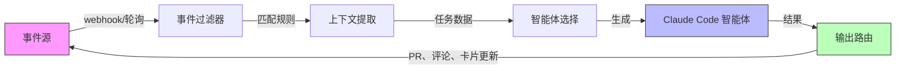
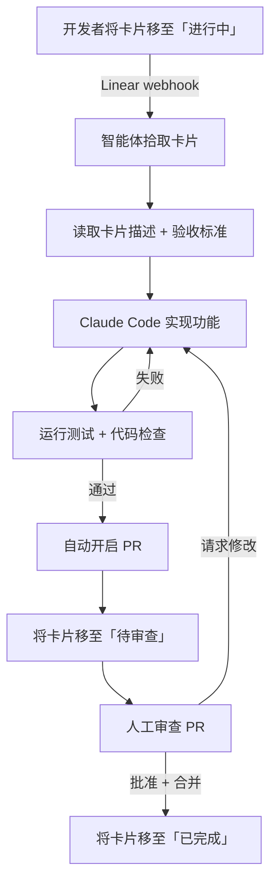

> 📚 **AI Spark Wiki** · Claude Code 知识库

---
title: "事件驱动的智能体自动化"
description: "通过 Kanban 卡片移动、GitHub Issue 和 Jira 流转等外部事件触发 Claude Code 智能体"
tags: [workflow, agents, automation, event-driven, kanban]
---

# 事件驱动的智能体自动化

> **可信度**：Tier 3 — 新兴模式，早期采用者反馈积极，但工具生态仍在成熟中。

不再手动为每个任务调用 Claude Code，而是让外部事件驱动工作。在 Linear 中将一张卡片移至「进行中」，Claude 会自动拾取。为 GitHub Issue 添加 `claude-fix` 标签，智能体在几秒内开始处理。

这是从拉取式（「嘿 Claude，做这个」）到推送式（「事件触发智能体」）的转变。

---

## 目录

1. [核心概念](#核心概念)
2. [Linear 驱动的智能体循环](#linear-驱动的智能体循环)
3. [通用事件到智能体模式](#通用事件到智能体模式)
4. [实现示例](#实现示例)
5. [事件源兼容性](#事件源兼容性)
6. [防护机制](#防护机制)
7. [反模式](#反模式)
8. [工具与资源](#工具与资源)
9. [延伸阅读](#延伸阅读)

---

## 核心概念

传统的 Claude Code 使用是交互式的：你打开终端，输入提示词，迭代。事件驱动的自动化将人从触发步骤中移除。人仍然审查输出（PR、代码变更），但启动通过你现有的项目管理工作流发生。



循环是自我强化的：智能体的输出（一个 PR、一个状态更新）反馈到事件源，可以触发下一步。

---

## Linear 驱动的智能体循环

最有文档记录的模式来自 Damian Galarza 的工作流（damiangalarza.com，2026 年 2 月）。Linear 作为待完成工作的单一真相来源，Claude Code 端到端处理实现。

### 流程



### 有效的原因

卡片描述充当提示词。有清晰验收标准的好卡片产生好代码。模糊的卡片产生模糊的代码，与人类开发者一样。你的工单质量直接决定自动化的质量。

Linear 的结构化字段（描述、验收标准、标签、优先级）天然映射到 Claude Code 的需求：构建什么、如何验证，以及适用哪些约束。

### 关键要求

- 卡片必须有清晰的验收标准（不仅仅是标题）
- 仓库需要可靠的测试套件用于自动验证
- 分支命名约定应确定性（例如 `feat/LINEAR-123-card-title`）
- PR 模板有助于标准化智能体的输出

---

## 通用事件到智能体模式

Linear 示例是具体的，但该模式可推广到任何事件源。五个组件构成流水线：

### 1. 事件源

触发器的来源。可以是项目管理工具、CI 系统、监控告警或自定义 webhook。

### 2. 事件过滤器

并非每个事件都应该生成一个智能体。过滤器决定哪些事件是可操作的：

```bash
# 示例：仅处理带有「claude-auto」标签的卡片
if [[ "$CARD_LABELS" != *"claude-auto"* ]]; then
    echo "跳过：无 claude-auto 标签"
    exit 0
fi
```

### 3. 上下文提取

从事件载荷中提取相关数据，并将其格式化为 Claude Code 提示词。这是将工具 schema 转换为自然语言指令的地方。

### 4. 智能体选择

不同的事件类型可能需要不同的智能体配置。Bug 报告需要与功能请求不同的 CLAUDE.md 上下文。你可能使用不同的允许工具、不同的模型或不同的安全约束。

### 5. 输出路由

结果输出到哪里？通常是以下组合：
- Git 分支 + PR（代码变更）
- 原始 Issue/卡片上的评论（状态更新）
- 卡片上的状态转换（移动到下一列）
- Slack 通知（让人知晓）

---

## 实现示例

一个最小化的 bash 循环，轮询 Linear 中「进行中」的卡片并生成 Claude Code 智能体：

```bash
#!/bin/bash
# linear-agent-loop.sh
# 轮询 Linear 中「进行中」状态的卡片并生成 Claude 智能体

LINEAR_API_KEY="${LINEAR_API_KEY:?缺少 LINEAR_API_KEY}"
TEAM_ID="${LINEAR_TEAM_ID:?缺少 LINEAR_TEAM_ID}"
PROCESSED_FILE="/tmp/linear-agent-processed.txt"
MAX_CONCURRENT=3

touch "$PROCESSED_FILE"

poll_linear() {
    curl -s -X POST https://api.linear.app/graphql \
        -H "Authorization: $LINEAR_API_KEY" \
        -H "Content-Type: application/json" \
        -d '{
            "query": "query { team(id: \"'"$TEAM_ID"'\") { issues(filter: { state: { name: { eq: \"In Progress\" } }, labels: { name: { eq: \"claude-auto\" } } }) { nodes { id title description } } } }"
        }' | jq -r '.data.team.issues.nodes[] | "\(.id)|\(.title)|\(.description)"'
}

spawn_agent() {
    local issue_id="$1"
    local title="$2"
    local description="$3"

    echo "[$(date)] 为以下内容生成智能体：$title ($issue_id)"

    claude --print --dangerously-skip-permissions \
        "实现以下 Linear 卡片：
        标题：$title
        描述：$description

        要求：
        1. 创建名为 feat/$issue_id 的功能分支
        2. 实现所描述的功能
        3. 运行测试并修复所有失败
        4. 创建带有卡片标题的 PR" \
        2>&1 | tee "/tmp/agent-$issue_id.log"

    echo "$issue_id" >> "$PROCESSED_FILE"
}

while true; do
    active_agents=$(jobs -r | wc -l)
    if [ "$active_agents" -ge "$MAX_CONCURRENT" ]; then
        echo "[$(date)] 已达到最大并发智能体数（$MAX_CONCURRENT），等待中……"
        sleep 30
        continue
    fi

    poll_linear | while IFS='|' read -r id title description; do
        if grep -q "$id" "$PROCESSED_FILE"; then
            continue  # 已处理
        fi
        spawn_agent "$id" "$title" "$description" &
    done

    sleep 60  # 轮询间隔
done
```

这是一个起点，不是生产代码。真实部署需要适当的错误处理、持久化状态存储（而非文本文件），以及基于 webhook 的触发器而非轮询。

---

## 事件源兼容性

| 事件源 | 触发事件 | 智能体使用场景 | 集成方式 |
|-------------|----------------|----------------|-------------------|
| **Linear** | 卡片状态变更、添加标签 | 功能实现、Bug 修复 | GraphQL API / MCP 服务器 |
| **GitHub Issues** | Issue 创建、打标签 | Bug 分类、调查、修复 PR | GitHub Actions / webhook |
| **GitHub PR** | PR 创建、请求审查 | 代码审查、自动修复 | GitHub Actions |
| **Jira** | 流转、Sprint 分配 | 功能开发、技术债务清理 | REST API / webhook |
| **Slack** | 频道消息、表情回应 | 快速修复、调查 | Slack API / 机器人 |
| **PagerDuty** | 事件创建 | 诊断脚本、初始分类 | webhook |
| **自定义 webhook** | 任何 HTTP POST | 任何场景 | 直接 HTTP 端点 |

---

## 防护机制

事件驱动的智能体设计上减少了人工监督，因此防护机制变得至关重要。

### 幂等性

智能体可能处理同一事件两次（网络重试、重复 webhook）。智能体必须在开始之前检查工作是否已存在：

```bash
# 检查此卡片的分支是否已存在
if git ls-remote --heads origin "feat/$ISSUE_ID" | grep -q "feat/$ISSUE_ID"; then
    echo "分支已存在，跳过"
    exit 0
fi
```

### 速率限制

不要让一批事件同时生成 50 个智能体。设置硬性限制：

- **最大并发智能体数**：大多数团队 3-5 个
- **冷却期**：智能体生成之间最少 30 秒
- **每日预算上限**：每天设置最大 Token 支出

### 熔断器

如果智能体持续在某类任务上失败，停止尝试：

```bash
FAILURE_COUNT=$(grep -c "FAILED" "/tmp/agent-failures.log" 2>/dev/null || echo 0)
if [ "$FAILURE_COUNT" -gt 5 ]; then
    echo "熔断器触发：失败次数过多"
    # 通知人工，暂停自动化
    exit 1
fi
```

### 人工审核检查点

即使在完全自动化的流程中，也在关键点保留人工参与：

- PR 审查保持人工操作（智能体创建 PR，人工批准）
- 数据库迁移绝不自动应用
- 部署是单独的人工触发步骤
- 任何涉及认证、计费或 PII 的卡片需要明确的人工批准

---

## 反模式

| 反模式 | 问题 | 解决方案 |
|-------------|---------|----------|
| **激进轮询** | 每 5 秒锤击 API 浪费资源，会被限流 | 有 webhook 时使用 webhook，轮询不超过每 60 秒 |
| **无熔断器** | 智能体在同一任务上反复失败，持续消耗 Token | 追踪每任务失败次数，3 次后停止，提醒人工 |
| **无死信队列** | 失败事件消失，没人知道工作被遗漏 | 将失败事件记录到持久化存储供人工审查 |
| **无限并发** | 20 张卡片同时移动，20 个智能体生成，机器崩溃 | 并发智能体硬性上限（3-5 个合理） |
| **模糊卡片作为提示词** | 「修复那个问题」产生垃圾代码 | 执行卡片质量标准，跳过没有验收标准的卡片 |
| **无状态持久化** | 脚本重启，从头重新处理所有内容 | 将已处理的事件 ID 存储在数据库中，而非内存中 |
| **跳过 PR 审查** | 智能体直接推送到主分支 | 始终走 PR 流程，人工审查输出 |

---

## 工具与资源

### MCP 服务器

- **linear-kanban-mcp**（GitHub 上的 0xikarus）：直接在 Claude Code 中暴露 Linear API 用于 Kanban 看板管理。支持读取卡片、更新状态和管理标签，无需离开智能体上下文。

### Skills（技能模块）与平台

- **skillsllm.com**：提供从 Linear 卡片启动完整规划、验证和执行周期的 Skills（技能模块）。处理从卡片元数据到结构化 Claude Code 提示词的转换。

### 智能体模板

- **Scrum Master 智能体**（lobehub.com）：自动检测是否在 Claude Desktop 或 Claude Code 中运行，并相应调整行为。可作为上下文感知智能体设计的起点。

---

## 延伸阅读

- [agent-teams.md](./agent-teams.md) — 多智能体并行协调
- [iterative-refinement.md](./iterative-refinement.md) — 核心提示-观察-再提示循环
- [plan-driven.md](./plan-driven.md) — 执行前先规划
- [../../examples/agents/](../../examples/agents/) — 即用型智能体模板
